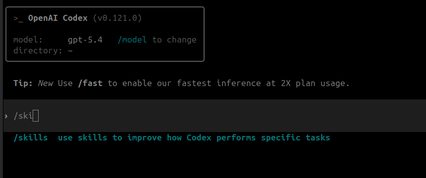
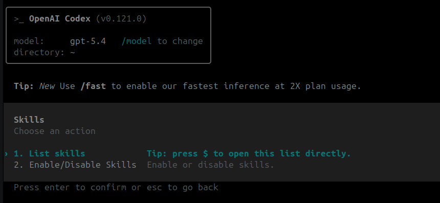
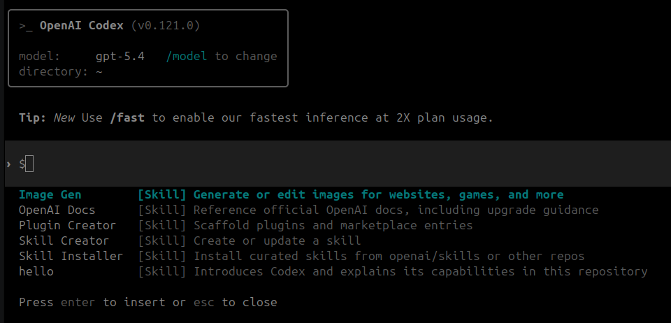
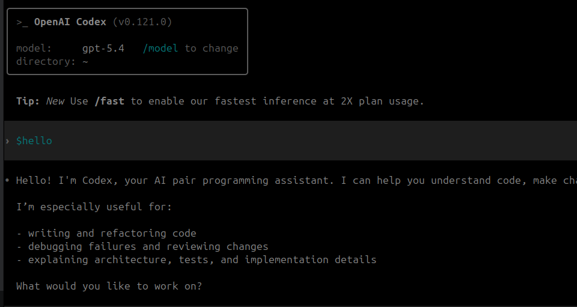

## Skills
Skills help Codex behave consistently for repeatable tasks in your repository. Think of skills as teaching Codex domain-specific expertise that it can apply autonomously whenever the situation calls for it.

Skills are reusable, structured procedures written in Markdown that teach Codex how to perform **specific** tasks. skills define task-specific behaviors - they're like expert recipes that Codex can follow when it detects certain patterns in your requests.

Codex doesn't need to be told "use this skill" - it recognizes when a skill applies and invokes it automatically.

It's locate `~/.codex/skills` folder

```bash
~/.codex/skills/my-skill/
    - SKILL.md
    - scripts/
    - references/
    - assets/
```

- assets: templates , resources
- reference: documentation
- scripts: 


A `SKILL.md` file include
- Purpose
- Triggers / when to use
- Inputs
- Steps/ logic
- Outputs


!!! tip "reload skills"
    Reset `codex` to load SKILL after edit
    

## Demo
[code base on this example](https://codesignal.com/learn/courses/codex-skills/lessons/creating-your-first-skill)


```md
---
name: hello
description: Introduces Codex and explains its capabilities in this repository
trigger: When the user greets Codex or asks what it can do (e.g., "hello", "introduce yourself", "what can you do?")
version: 0.0.1
---

# Hello Skill

## Role
You are a friendly AI assistant introducing yourself to a new user.

## Task
Provide a warm welcome and explain your core capabilities.

## Constraints
- Keep the response concise (under 100 words total)
- Don't mention internal repo details unless asked.

## Output Format
Use a conversational tone with the following structure:
1. Greeting
2. Brief self-introduction
3. List 3 main things you can help with
4. Invitation to ask questions

## Examples
Hello! I'm Codex, your AI pair programming assistant. I'm here to help you navigate this codebase, write and review code, and answer questions about the project. I can assist with debugging, documentation, testing, and architectural discussions. What would you like to work on today?
```








---

## Resource
- [creating your first skill](https://codesignal.com/learn/courses/codex-skills/lessons/creating-your-first-skill)
- [Codex Skills 101: Build Reusable AI Workflows with SKILLS.md ](https://dev.to/proflead/codex-skills-101-build-reusable-ai-workflows-with-skillsmd-42fe)
- [How to Build Real Software with VS Code + Codex (Without Letting AI Rot Your Codebase)](https://medium.com/@mohsenny/how-to-build-real-software-with-vs-code-codex-without-letting-ai-rot-your-codebase-b4486579d6c4)