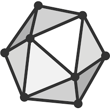

# AI ML and what inside

    

        <a href="math">
        
        
Math
</a>
    

    

        <a href="onnx">
        
        
ONNX
</a>
    

    

        <a href="nnfs">
        
        
Neural Networks From Scratch in Python
</a>
    

     

        <a href="reinforcement_learning">
        
        
Reinforcement Learning
</a>
    

## Resources
- [Neural Networks From Scratch](https://www.youtube.com/playlist?list=PL1u-h-YIOL0u7R6dg_d5O5M9HUj0SFjHE)
- [Deep Learning with PyTorch Step-by-Step](https://github.com/GPrathap/PyTorchStepByStep)
Official repository of my book: "Deep Learning with PyTorch Step-by-Step: A Beginner's Guide" 