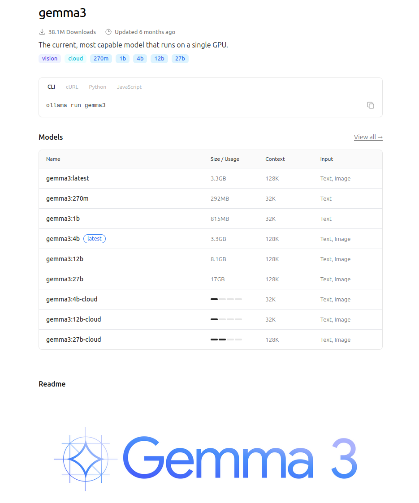
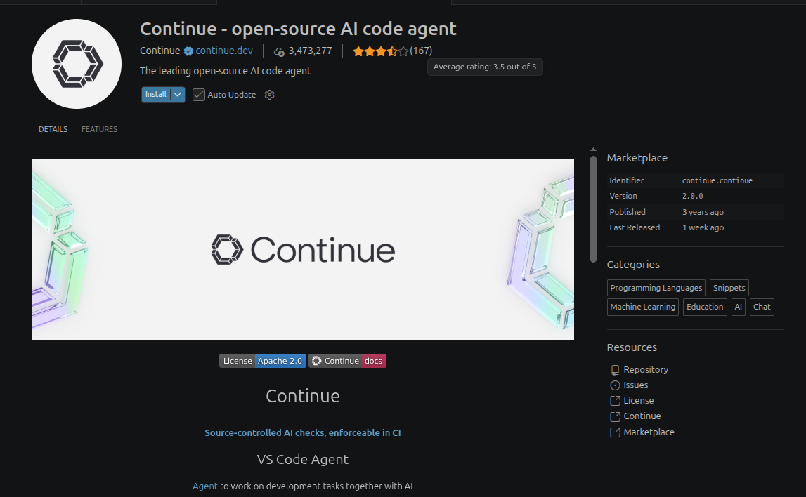

## llmfit
llmfit helps choose which local LLM fits your CPU/RAM/GPU/VRAM. It detects NVIDIA cards using nvidia-smi and supports runtimes like Ollama, llama.cpp, LM Studio, Docker Model Runner, etc.

```bash title="install"
curl -fsSL https://llmfit.axjns.dev/install.sh | sh -s -- --local
```

```bash title="usage"
llmfit recommend --use-case coding
llmfit recommend --use-case chat
```

---

## Ollama

```bash
curl -fsSL https://ollama.com/install.sh | sh
```

### usgae

```
ollama --help
```

!!! tip "Model size"
    As a role of thumb : model size == GPU memory
    

```bash
ollama list

# pull
ollama pull gemma4:12b

# list 
ollama list
NAME          ID              SIZE      MODIFIED           
gemma4:12b    4eb23ef187e2    7.6 GB    About a minute ago   

# run 
ollama run gemma4:12b
```

Download model



```bash
ollama pull gemma3

ollama list
NAME             ID              SIZE      MODIFIED    
gemma3:latest    a2af6cc3eb7f    3.3 GB    2 hours ago    
gemma4:12b       4eb23ef187e2    7.6 GB    2 hours ago
```

```bash title="run"
ollama run gemma3
>>> hello
Hello there! How’s your day going so far? 😊 

Is there anything I can help you with today, or were you just saying hello?

>>>/exit
```


### VSCode



#### Config

```yaml title="~/.continue/config.yaml"
name: Local Assistant
version: 1.0.0
schema: v1

models:
  - name: Gemma 3 12B
    provider: ollama
    model: gemma3:latest
    apiBase: http://localhost:11434
    roles:
      - chat
      - edit
      - apply
    defaultCompletionOptions:
      contextLength: 4096
```