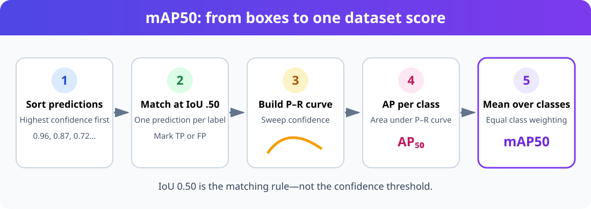
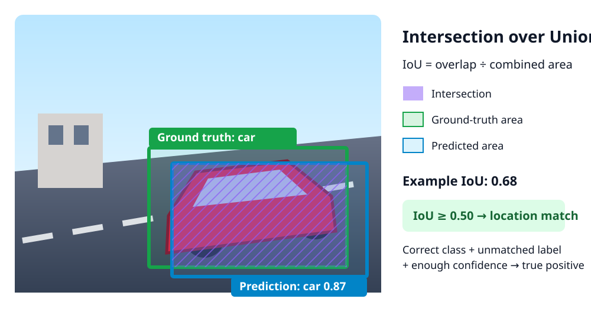
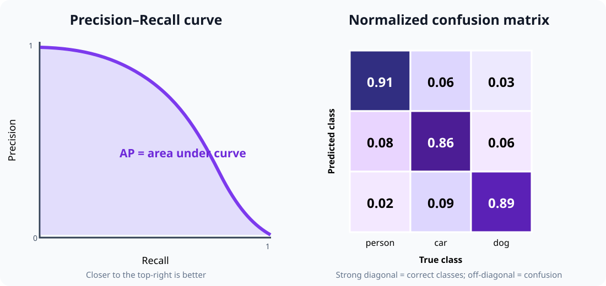

Training a YOLO detector creates many numbers, curves, matrices, and annotated images. None of them tells the whole story alone. This guide explains how to read them together, beginning with `mAP50` and the IoU matching rule underneath it.

The exact filenames can vary by Ultralytics version and task. Detection plots commonly use the `Box` prefix, such as `BoxPR_curve.png`; segmentation and pose runs also produce `Mask` or `Pose` curves.

## What is mAP50?

`mAP50` means **mean Average Precision at an IoU threshold of 0.50**.

It answers this question:

> Across all classes, how well does the model rank correct detections ahead of false detections when a predicted box needs at least 50% IoU with a ground-truth box to match it?

It is not ordinary classification accuracy, and `50` is not a confidence threshold.



The calculation has five conceptual steps:

1. Gather predictions for one class across the validation set.
2. Sort them from highest to lowest confidence.
3. Match predictions to ground-truth objects using `IoU ≥ 0.50`.
4. Sweep down the ranked predictions to build a precision–recall curve and calculate its area, `AP50`.
5. Average `AP50` equally over the evaluated classes to get `mAP50`.

For three classes:

```text
person AP50 = 0.92
car    AP50 = 0.81
dog    AP50 = 0.67

mAP50 = (0.92 + 0.81 + 0.67) / 3 = 0.80
```

The class mean gives each class equal weight. A rare class can therefore reduce mAP as much as a common class.

---

## IoU: does the predicted box match?

Intersection over Union compares a predicted box with a ground-truth box:

$$
IoU = \frac{\text{area of intersection}}{\text{area of union}}
$$



Interpretation:

| IoU | Meaning |
| ---: | --- |
| `0.00` | No overlap |
| `0.25` | Weak localization |
| `0.50` | Passes the matching rule used by mAP50 |
| `0.75` | Good localization |
| `1.00` | Identical boxes |

At IoU 0.50, a predicted detection becomes a true positive only if:

- its class is correct;
- its confidence passes the current confidence point in the evaluation sweep;
- its IoU with an unmatched label is at least 0.50; and
- that label has not already been assigned to a higher-confidence prediction.

A duplicate box around an already matched object is a false positive. A correct class with IoU below 0.50 is also a false positive for mAP50, while the unmatched label contributes a false negative.

---

## Confidence and IoU are different

These thresholds answer different questions:

| Threshold | Question |
| --- | --- |
| Confidence | How certain must the model be before keeping a prediction? |
| IoU evaluation threshold | How closely must a prediction overlap a label to count as localized correctly? |
| NMS IoU threshold | How much may two predictions overlap before suppression treats them as duplicates? |

Do not interpret `mAP50` as “mAP with confidence set to 0.50.” The evaluator sweeps confidence to create the precision–recall curve; `0.50` describes the box-matching IoU.

---

## TP, FP, and FN for object detection

Assume an image contains two labeled cars.

- A correct car prediction matching the first label: **true positive (TP)**.
- A second prediction on the same first car: **false positive (FP)**.
- A predicted truck on the second car: **false positive for truck** and the car remains missed.
- The unmatched second car: **false negative (FN)**.

Object detection normally does not count true negatives in a useful way because an image contains an enormous number of possible background boxes.

## Precision, recall, and F1

### Precision

$$
Precision = \frac{TP}{TP + FP}
$$

High precision means most reported detections are correct. Low precision means the model produces too many false alarms.

### Recall

$$
Recall = \frac{TP}{TP + FN}
$$

High recall means the model finds most labeled objects. Low recall means it misses many objects.

### F1 score

$$
F1 = 2 \cdot \frac{Precision \cdot Recall}{Precision + Recall}
$$

F1 summarizes the balance between precision and recall at a particular confidence threshold. The best F1 point is a useful initial operating threshold, not automatically the correct deployment threshold.

---

## AP, mAP50, and mAP50–95

`AP` is the area under a class's precision–recall curve. `mAP` is the mean AP across classes.



| Metric | Matching rule | What it emphasizes |
| --- | --- | --- |
| `mAP50` | IoU = 0.50 | Finding and roughly localizing objects |
| `mAP75` | IoU = 0.75 | More accurate box placement |
| `mAP50-95` | Mean over IoU 0.50, 0.55, …, 0.95 | Overall detection and localization quality |

`mAP50` is usually higher because its location requirement is forgiving. A large gap between `mAP50` and `mAP50-95` often means the model recognizes objects but places loose or inconsistent boxes.

Do not compare mAP values unless the dataset split, label policy, image size, evaluator, class list, and IoU convention are the same.

## Read the annotated images first

Before studying curves, inspect the actual training and validation images.

### Training batches

`train_batch*.jpg` shows labels after augmentations such as scaling, flipping, color changes, and mosaic composition.

Check for:

- missing boxes;
- boxes shifted away from objects;
- boxes that include too much background;
- wrong class names;
- objects cut into unrealistic fragments;
- augmentations that change the meaning of a class; and
- tiny objects becoming impossible to see.

If labels are wrong here, longer training will teach the model the wrong problem.

### Validation labels and predictions

Compare corresponding files:

```text
val_batch0_labels.jpg
val_batch0_pred.jpg
```

The label image is the expected answer. The prediction image is the model output.

For every object, ask:

1. Is there a ground-truth box?
2. Did the model produce a box?
3. Is the predicted class correct?
4. Is the box tight enough to achieve useful IoU?
5. Is the confidence sensible?
6. Are duplicate predictions present?
7. Does the model detect background patterns as objects?

Review easy and difficult samples: small objects, occlusion, clutter, unusual viewpoints, blur, bright sunlight, darkness, and rare classes.

---

## Understand `results.png`

`results.png` plots values stored per epoch in `results.csv`. A detection run commonly includes training and validation losses plus precision, recall, mAP50, and mAP50-95.

### Training losses

| Plot | Meaning | Healthy pattern |
| --- | --- | --- |
| `train/box_loss` | Bounding-box localization error | Falls and then levels off |
| `train/cls_loss` | Class prediction error | Falls and then levels off |
| `train/dfl_loss` | Distribution Focal Loss used for box coordinates | Falls and then levels off |

Lower loss is useful only relative to the same model, configuration, and dataset. A low training loss does not prove good validation performance.

### Validation losses

Validation losses measure the same kinds of error on data not used for weight updates.

| Pattern | Likely interpretation |
| --- | --- |
| Train and validation losses both improve | Learning useful patterns |
| Train improves while validation worsens | Possible overfitting or train/validation mismatch |
| Both remain high | Underfitting, label problems, inadequate model, or poor settings |
| Curves are very noisy | Small validation set, unstable labels, difficult data, or aggressive training |

### Metric curves by epoch

- Precision rising: fewer false positives among retained detections.
- Recall rising: fewer labeled objects missed.
- mAP50 rising: better ranking and matching at IoU 0.50.
- mAP50-95 rising: better performance across strict localization thresholds.

The best epoch is not necessarily the last epoch. Ultralytics saves `best.pt` according to its validation fitness calculation.

## Read the precision–recall curve

`BoxPR_curve.png` shows precision against recall while confidence changes.

- A curve near the top-right is strong.
- A sharp precision collapse at moderate recall indicates many false positives.
- A curve that ends at low recall means the model cannot find many objects even with a permissive confidence threshold.
- One weak class curve hidden by a strong mean curve needs class-specific investigation.

The area under each class curve is AP. The mean of those areas at IoU 0.50 is mAP50.

## Read the F1, precision, and recall curves

| File | Axes | How to use it |
| --- | --- | --- |
| `BoxF1_curve.png` | F1 vs confidence | Find a balanced initial confidence threshold |
| `BoxP_curve.png` | Precision vs confidence | See how false alarms change as confidence increases |
| `BoxR_curve.png` | Recall vs confidence | See how missed detections increase as confidence increases |

A safety-monitoring application may prefer recall and accept more false alarms. An automated action with an expensive false trigger may prioritize precision. Select the threshold from application costs, then validate it on representative test data.

## Read the confusion matrix

`confusion_matrix.png` contains counts. `confusion_matrix_normalized.png` uses proportions, making classes with different instance counts easier to compare.

First verify the axis labels printed on the actual file; plotting conventions can differ between libraries and versions.

Look for:

- strong diagonal cells: correct classifications;
- off-diagonal cells: one class confused with another;
- true class → background errors: missed objects;
- background → predicted class errors: false detections; and
- a class with few examples: percentages that may look dramatic but represent few objects.

A confusion matrix answers “which classes are confused?” It does not show whether a correct-class box is precisely localized, so use it with IoU-based metrics and prediction images.

---

## Dataset and label plots

Depending on the Ultralytics version, training may create files such as `labels.jpg` or `labels_correlogram.jpg`.

Use them to inspect:

- instances per class;
- box-center distribution;
- width and height distribution;
- class imbalance;
- labels concentrated near image borders; and
- suspicious repeated sizes or locations.

These plots describe the dataset, not model quality. A balanced histogram also does not guarantee visual diversity.

---

## A practical review order

Use this order after every training run:

1. Inspect `train_batch*.jpg` for label and augmentation errors.
2. Compare `val_batch*_labels.jpg` with `val_batch*_pred.jpg`.
3. Check instances per class and validation-set size.
4. Read `results.png` for convergence and overfitting.
5. Compare mAP50 with mAP50-95.
6. Inspect per-class PR curves.
7. Inspect raw and normalized confusion matrices.
8. Choose a confidence threshold from F1, precision, recall, and application costs.
9. Run inference on a separate test set and real deployment scenes.
10. Review failures individually before changing the model.

## Symptom-to-action guide

| Observation | Possible cause | What to inspect next |
| --- | --- | --- |
| High mAP50, much lower mAP50-95 | Loose or inconsistent boxes | Label tightness, image resolution, small objects |
| High precision, low recall | Conservative predictions | Recall curve, missed labels, confidence threshold |
| Low precision, high recall | Many false positives | Background examples, class ambiguity, confidence threshold |
| Good metrics, poor real-world inference | Validation leakage or domain mismatch | Dataset split and deployment images |
| One class has low AP | Too few examples or class confusion | Per-class PR curve and confusion matrix |
| Training loss falls, validation loss rises | Overfitting | Dataset size, diversity, augmentation, stopping epoch |
| Metrics jump strongly between epochs | Small/noisy validation set | Instance counts and label consistency |
| Duplicate boxes | NMS behavior or overlapping labels | Prediction images and NMS IoU setting |

These are investigation directions, not automatic fixes. Change one factor at a time and keep the same test set for comparison.

## Validate and print the metrics

```python
from ultralytics import YOLO

model = YOLO("runs/detect/train/weights/best.pt")
metrics = model.val(data="data.yaml", split="val", plots=True)

print(f"mAP50:    {metrics.box.map50:.4f}")
print(f"mAP50-95: {metrics.box.map:.4f}")
print(f"mAP75:    {metrics.box.map75:.4f}")
print(f"precision: {metrics.box.mp:.4f}")
print(f"recall:    {metrics.box.mr:.4f}")
print("per-class mAP50-95:", metrics.box.maps)
print("speed, ms/image:", metrics.speed)
```

Always evaluate `best.pt` on a held-out test set before deployment. The validation set influenced model selection, so its score is not a final unbiased estimate.

## Common mistakes

- Treating mAP50 as accuracy.
- Thinking `50` means confidence `0.50`.
- Reporting only the overall mean and hiding weak classes.
- Comparing runs that use different validation splits.
- Tuning the deployment threshold on the test set.
- Assuming low loss means good detection.
- Ignoring prediction images because the headline metric is high.
- Training longer before checking label quality.
- Using validation images that also appear in training.
- Choosing a confidence threshold without considering the cost of FP and FN.

## References

- [Ultralytics YOLO performance metrics](https://docs.ultralytics.com/guides/yolo-performance-metrics/){:target="_blank"}
- [Ultralytics model evaluation and metric access](https://docs.ultralytics.com/guides/model-evaluation-insights/){:target="_blank"}
- [Ultralytics training-result and dataset-quality guidance](https://docs.ultralytics.com/yolov5/tutorials/tips-for-best-training-results/){:target="_blank"}
