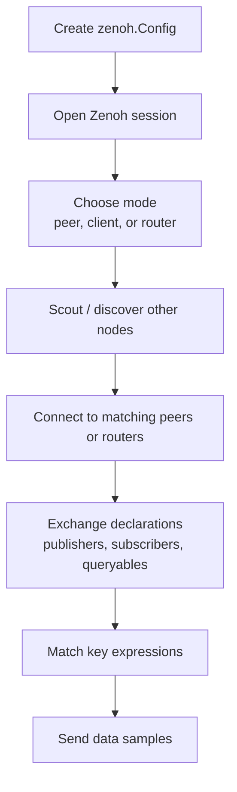

# Zenoh Config

`zenoh.Config()` controls how a Zenoh session starts, discovers other Zenoh
nodes, opens network connections, and communicates.

In the simple examples, this is enough:

```python
with zenoh.open(zenoh.Config()) as session:
    ...
```

That means: use the default Zenoh configuration.

The default is useful for local demos because Zenoh can discover other peers
automatically on the local network.

## Discovery to communication flow



The flow:

1. Your application creates a `zenoh.Config`.
2. `zenoh.open(config)` starts a Zenoh session.
3. Zenoh decides the session mode: `peer`, `client`, or `router`.
4. Zenoh discovers or connects to other nodes.
5. Nodes exchange declarations, such as publishers and subscribers.
6. Zenoh matches key expressions.
7. Published samples are delivered to subscribers.

Example:

```text
publisher key:  demo/robot/counter
subscriber key: demo/robot/**
```

The subscriber receives the data because `demo/robot/counter` matches
`demo/robot/**`.

## Important configuration fields

Important fields to learn first:

- `mode`: how this process participates in the Zenoh network
- `connect/endpoints`: remote endpoints this session should connect to
- `listen/endpoints`: local endpoints this session should listen on
- `scouting/multicast/enabled`: enable or disable multicast discovery
- `scouting/multicast/address`: multicast group used for discovery
- `scouting/multicast/interface`: network interface used for discovery
- `transport/link/protocols`: protocols allowed by the transport layer
- `timestamping/enabled`: attach timestamps to samples

Common modes:

| Mode | Meaning |
| --- | --- |
| `peer` | Talks directly with other peers or routers. Good for simple distributed systems. |
| `client` | Connects to a Zenoh router. Common when you want controlled routing. |
| `router` | Routes data between clients, peers, networks, or storage/plugins. |

## Create config in Python

Start from default config:

```python
import zenoh

config = zenoh.Config()
```

Insert values:

```python
config.insert_json5("mode", '"peer"')
```

Read values:

```python
print(config.get_json("mode"))
```

Create config from JSON5 text:

```python
import zenoh

config = zenoh.Config.from_json5("""
{
  mode: "peer",
  scouting: {
    multicast: {
      enabled: true,
    },
  },
}
""")
```

Open a session:

```python
with zenoh.open(config) as session:
    ...
```

## Default peer discovery

In peer mode, Zenoh can discover other peers using scouting.

The common local-network flow is:

```text
peer A starts
peer A scouts for other Zenoh nodes
peer B starts
peer B scouts too
peers discover each other
peers connect
publishers and subscribers are matched
data starts flowing
```

Default multicast scouting uses the multicast address:

```text
224.0.0.224:7446
```

This is discovery traffic. It is not the same as the application data key, such
as `demo/robot/counter`.

## Configure peer mode

Explicit peer config:

```python
import zenoh

config = zenoh.Config.from_json5("""
{
  mode: "peer",
  scouting: {
    multicast: {
      enabled: true,
    },
  },
}
""")

with zenoh.open(config) as session:
    ...
```

Use this when peers are on the same network and multicast discovery is allowed.

## Disable discovery and connect manually

Sometimes multicast discovery is blocked by the network, container setup, VPN,
or firewall.

In that case, disable multicast scouting and configure explicit endpoints.

Peer 1 listens on a UDP endpoint:

```python
import time

import zenoh


config = zenoh.Config.from_json5("""
{
  mode: "peer",
  listen: {
    endpoints: ["udp/127.0.0.1:7447"],
  },
  scouting: {
    multicast: {
      enabled: false,
    },
  },
}
""")

with zenoh.open(config) as session:
    publisher = session.declare_publisher("demo/udp/message")

    for i in range(5):
        publisher.put(f"hello over udp {i}")
        time.sleep(1)
```

Peer 2 connects to that UDP endpoint:

```python
import time

import zenoh


def listener(sample):
    print(f"{sample.key_expr}: {sample.payload.to_string()}")


config = zenoh.Config.from_json5("""
{
  mode: "peer",
  connect: {
    endpoints: ["udp/127.0.0.1:7447"],
  },
  scouting: {
    multicast: {
      enabled: false,
    },
  },
}
""")

with zenoh.open(config) as session:
    session.declare_subscriber("demo/udp/**", listener)
    time.sleep(10)
```

The important part is the endpoint:

```text
udp/127.0.0.1:7447
```

This tells Zenoh to use a UDP transport endpoint.

For two machines, replace `127.0.0.1` with the real IP address of the peer that
is listening.

Example:

```text
udp/192.168.1.50:7447
```

## Combined UDP peer demo

This demo starts both peers from one Python file.

```python
import multiprocessing
import time

import zenoh


def run_peer_a():
    config = zenoh.Config.from_json5("""
    {
      mode: "peer",
      listen: {
        endpoints: ["udp/127.0.0.1:7447"],
      },
      scouting: {
        multicast: {
          enabled: false,
        },
      },
    }
    """)

    with zenoh.open(config) as session:
        publisher = session.declare_publisher("demo/udp/message")

        for i in range(5):
            message = f"hello over udp {i}"
            print(f"peer A publish: {message}")
            publisher.put(message)
            time.sleep(1)


def run_peer_b():
    def listener(sample):
        payload = sample.payload.to_string()
        print(f"peer B received {sample.key_expr}: {payload}")

    config = zenoh.Config.from_json5("""
    {
      mode: "peer",
      connect: {
        endpoints: ["udp/127.0.0.1:7447"],
      },
      scouting: {
        multicast: {
          enabled: false,
        },
      },
    }
    """)

    with zenoh.open(config) as session:
        session.declare_subscriber("demo/udp/**", listener)
        time.sleep(8)


def main():
    peer_b = multiprocessing.Process(target=run_peer_b)
    peer_a = multiprocessing.Process(target=run_peer_a)

    peer_b.start()
    time.sleep(1)
    peer_a.start()

    peer_a.join()
    peer_b.join()


if __name__ == "__main__":
    main()
```

Run:

```bash
python3 udp_peer_demo.py
```

Expected idea:

```text
peer A publish: hello over udp 0
peer B received demo/udp/message: hello over udp 0
```

## Discovery vs configured endpoints

Use discovery when:

- peers are on the same LAN
- multicast is allowed
- you want simple setup

Use configured endpoints when:

- multicast is blocked
- peers run in containers
- peers run across subnets
- you need deterministic topology
- you want to connect clients to a known router

## Client and router idea

Peer-to-peer is simple, but larger systems often use a router.

Client config:

```json
{
  mode: "client",
  connect: {
    endpoints: ["tcp/192.168.1.10:7447"]
  }
}
```

Router:

```bash
zenohd
```

The client connects to the router. The router helps route data between clients,
peers, storages, and plugins.

## Practical notes

- Use `peer` mode for simple local experiments.
- Use `client` mode when connecting to a known router.
- Use explicit `connect/endpoints` when discovery does not work.
- Use `listen/endpoints` when other nodes should connect to this process.
- Use `tcp/...` first if you need the simplest reliable setup.
- Use `udp/...` when you specifically want UDP transport behavior.
- Check firewall rules when peers do not discover or connect.
- In containers, multicast discovery may not work unless networking is
  configured for it.

## Reference

- [Zenoh configuration](https://zenoh.io/docs/manual/configuration/)
- [Zenoh deployment](https://zenoh.io/docs/manual/deployment/)
- [Zenoh Python API](https://zenoh-python.readthedocs.io/)
