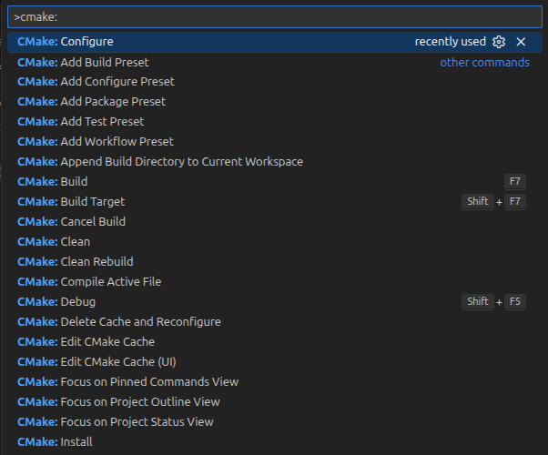

{{ page_folder_links() }}

CMakePresets.json is a project-root JSON file that stores repeatable CMake workflows: configure, build, test, package, and workflow settings. Instead of remembering:

- CMake: Build system generator create Make/Ninja files describer how the project should be built
- Make/Ninja: build tools run the compiler and linker to create binary from source code
- GCC/Clang: compiler toolchain

## Demo: Run build system and Build tools from cli

```bash
cmake -S . -B build
cmake --build build
./build/app
```

```bash
cmake -S . -B build -DUSE_FAST_MODE=ON
cmake --build build
./build-fast/app
```

```bash
# List cache variables after configuration.
cmake -S . -B build -LA

# first time clean cache
# CMAKE_STRIP:FILEPATH=/usr/bin/strip
# ...
# CMAKE_VERBOSE_MAKEFILE:BOOL=FALSE
# USE_FAST_MODE:BOOL=OFF
```

```bash title="set variable"
cmake -S . -B build -DUSE_FAST_MODE=ON -LA

# CMAKE_STRIP:FILEPATH=/usr/bin/strip
# ...
# CMAKE_VERBOSE_MAKEFILE:BOOL=FALSE
# USE_FAST_MODE:BOOL=ON
```

```bash title="reset variable to default"
cmake -S . -B build -U USE_FAST_MODE
```

Create `CMakePresets.json` in the project root:

```json title="CMakePresets.json"
{
  "version": 3,
  "configurePresets": [
    {
      "name": "default",
      "generator": "Ninja",
      "binaryDir": "${sourceDir}/build/default",
      "cacheVariables": {
        "CMAKE_BUILD_TYPE": "Release",
        "USE_FAST_MODE": "OFF"
      }
    },
    {
      "name": "fast",
      "inherits": "default",
      "binaryDir": "${sourceDir}/build/fast",
      "cacheVariables": {
        "USE_FAST_MODE": "ON"
      }
    }
  ],
  "buildPresets": [
    {
      "name": "default",
      "configurePreset": "default"
    },
    {
      "name": "fast",
      "configurePreset": "fast"
    }
  ]
}
```

Use the preset instead of repeating `-S`, `-B`, and `-D` arguments:

```bash
cmake --list-presets

cmake --preset default
cmake --build --preset default
./build/default/app

cmake --preset fast
cmake --build --preset fast
./build/fast/app
```


---

CMake presets by creating a file named `CMakePresets.json` in your **project root directory**. The basic format for this file is:

```json
{
  "version": 3,
  "cmakeMinimumRequired": {
    "major": 3,
    "minor": 23,
    "patch": 0
  },
  "configurePresets": [
    {
      // ...
    }
  ],
  "buildPresets": [
    {
      // ...
    }
  ],
  "testPresets": [
    {
      // ...
    }
  ]
}
```

### Preset types

| Section                         | Used by                  | Purpose                     |
| ------------------------------- | ------------------------ | --------------------------- |
| `"configurePresets"`            | `cmake --preset`         | How to generate build files |
| `"buildPresets"`                | `cmake --build --preset` | How to compile              |
| `"testPresets"`                 | `ctest --preset`         | How to run tests            |
| `"packagePresets"` _(optional)_ | `cpack --preset`         | How to create installers (support cmake>3.24)   |

!!! note "version field"

    - version: 2 → CMake ≥ 3.20
    - version: 3 → CMake ≥ 3.21
    - version: 4 → CMake ≥ 3.23
    - version: 5 → CMake ≥ 3.24
    - version: 6 → CMake ≥ 3.25

    ubuntu 22.04 default cmake : 3.22.1
    ubuntu 24.04 default cmake : 3.28.3

---

### Preset definition

| Field              | Description                                                |
| ------------------ | ---------------------------------------------------------- |
| `"name"`           | Unique identifier (used in commands)                       |
| `"displayName"`    | Friendly label shown in IDE                                |
| `"generator"`      | Build tool (“Ninja”, “Unix Makefiles”, etc.)               |
| `"binaryDir"`      | Output directory for this preset                           |
| `"cacheVariables"` | Key-value pairs (like `-D` arguments)                      |
| `"inherits"`       | Reuse another preset’s settings                            |
| `"environment"`    | Environment variables set for this preset                  |
| `"hidden"`         | If true, not shown in IDE list but usable as a base preset |

```json
"configurePresets": [
        {
            "name": "default",
            "hidden": false,
            "generator": "Ninja",
            "description": "Default configure preset",
            "binaryDir": "${sourceDir}/build",
            "cacheVariables": {
                "CMAKE_BUILD_TYPE": "Release"
            }
        }
]
```

#### Using inheritance

Avoid repeating common options using inheritance

```json
{
  "name": "base",
  "hidden": true,
  "generator": "Ninja",
  "cacheVariables": {
    "CMAKE_EXPORT_COMPILE_COMMANDS": "ON"
  }
},
{
  "name": "debug",
  "inherits": "base",
  "binaryDir": "${sourceDir}/build/debug",
  "cacheVariables": {
    "CMAKE_BUILD_TYPE": "Debug"
  }
}

```

---

### Commands

```bash
cmake --list-presets
```

```bash
cmake --preset <name>
```


--- 

## Demo


### VSCode tips
- Install [cmake tools](https://marketplace.visualstudio.com/items?itemName=ms-vscode.cmake-tools)
- Config extension to use presets

```json title=".vscode/settings.json"
"cmake.useCMakePresets": "always"
```

- Run:
  -  cmake: configure
  -  cmake: build
  -  cmake: install




```
.
├── CMakeLists.txt
├── CMakePresets.json
├── include
│   └── demo
│       └── lib.hpp
├── src
│   ├── lib.cpp
│   └── main.cpp
└── test
   └── test_add.cpp

```

```cpp title="src/main.cpp"
--8<-- "docs/Programming/cpp/cmake/cmake_preset/code/src/main.cpp"
```

```cpp title="src/lib.cpp"
--8<-- "docs/Programming/cpp/cmake/cmake_preset/code/src/lib.cpp"
```

```cpp title="include/demo/lib.hpp"
--8<-- "docs/Programming/cpp/cmake/cmake_preset/code/include/demo/lib.hpp"
```


```cpp title="test/test_add.cpp"
--8<-- "docs/Programming/cpp/cmake/cmake_preset/code/test/test_add.cpp"
```

```json title="CMakePresets.json"
--8<-- "docs/Programming/cpp/cmake/cmake_preset/code/CMakePresets.json"
```


```cmake
cmake_minimum_required(VERSION 3.22)

# Project setup
project(DemoApp VERSION 0.1.0 LANGUAGES CXX)

# Options
option(DEMO_BUILD_TESTS "Build tests" ON)

# Library
add_library(demolib src/lib.cpp)
add_library(demo::demolib ALIAS demolib)

target_include_directories(demolib
    PUBLIC
        $<BUILD_INTERFACE:${CMAKE_CURRENT_SOURCE_DIR}/include>
        $<INSTALL_INTERFACE:include>
)

set_target_properties(demolib PROPERTIES
    CXX_STANDARD 17
    CXX_STANDARD_REQUIRED YES
    CXX_EXTENSIONS NO
)

# Executable
add_executable(demo_app src/main.cpp)

target_link_libraries(demo_app PRIVATE demo::demolib)
set_target_properties(demo_app PROPERTIES
    CXX_STANDARD 17
    CXX_STANDARD_REQUIRED YES
    CXX_EXTENSIONS NO
)

# Testing
include(CTest)
if (DEMO_BUILD_TESTS AND BUILD_TESTING)
    include(FetchContent)
    # Avoid overriding parent project's compiler/linker settings in gtest
    set(BUILD_GMOCK OFF CACHE BOOL "Disable gmock" FORCE)
    set(INSTALL_GTEST OFF CACHE BOOL "Disable gtest install" FORCE)
    FetchContent_Declare(
        googletest
        URL https://github.com/google/googletest/archive/refs/tags/v1.14.0.zip
    )
    FetchContent_MakeAvailable(googletest)
    enable_testing()
    add_executable(test_add test/test_add.cpp)
    target_link_libraries(test_add PRIVATE demo::demolib GTest::gtest_main)
    add_test(NAME test_add COMMAND test_add)
endif()
```

```bash
# configure
cmake --preset debug

# build
cmake --build --preset debug-build

# test
ctest --preset test-debug

```

---

## Reference
- [cmake-preset](https://cmake.org/cmake/help/latest/manual/cmake-presets.7.html)
- [about CMake Presets](https://martin-fieber.de/blog/cmake-presets/)
