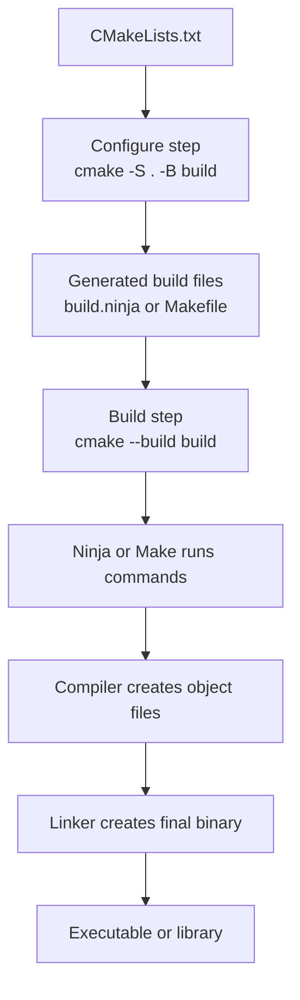

# CMake

<div class="grid-container">
    <div class="grid-item">
        <a href="cmake_preset">
        <p>CMakePresets.json</p>
        </a>
    </div>
    <div class="grid-item">
        <a href="gtest">
            <p>gtest</p>
        </a>
    </div>
    <div class="grid-item">
        <a href="">
        <p></p>
        </a>
    </div>
     
</div>


---

## The CMake idea

CMake is a build system generator.

It does not usually compile your C++ code by itself. Instead, you describe your
project in `CMakeLists.txt`, and CMake generates files for a real build tool,
such as Makefiles, Ninja files, Visual Studio projects, or Xcode projects.

The main idea is:

```text
CMakeLists.txt -> cmake configure -> build files -> cmake build -> executable/library
```

This lets the same C++ project build on different operating systems and with
different compilers.

## Main functionality

CMake is mainly used to:

- define executables with `add_executable`
- define libraries with `add_library`
- connect files, include folders, and compiler options to targets
- find external packages with `find_package`
- link libraries with `target_link_libraries`
- create build configurations such as Debug and Release
- organize tests, install rules, and generated files

Modern CMake focuses on targets.

A target is something CMake can build, like an executable or a library.

Example:

```cmake
cmake_minimum_required(VERSION 3.20)
project(hello_cmake)

set(CMAKE_CXX_STANDARD 17)
set(CMAKE_CXX_STANDARD_REQUIRED ON)

add_executable(hello
    main.cpp
)
```

Build it:

```bash
cmake -S . -B build
cmake --build build
```

Meaning:

- `-S .` means the source folder is the current folder
- `-B build` means put generated build files in the `build` folder
- `cmake --build build` asks CMake to run the real build tool

## Responsibility: CMake, Ninja, Make, compiler

CMake, Ninja, Make, and the compiler have different jobs.



Short responsibility split:

- `CMakeLists.txt`: describes the project
- `cmake`: configures the project and generates build files
- `Ninja` or `Make`: executes the build steps in the correct order
- compiler: turns `.cpp` files into object files
- linker: connects object files and libraries into the final binary

CMake is the planner.

Ninja or Make is the worker that follows the generated plan.

The compiler and linker are the tools that actually create the binary.

## Configure step vs build step

CMake usually has two main steps: configure and build.

### Configure step

Configure means: read the project description and prepare the build folder.

Command:

```bash
cmake -S . -B build
```

During configure, CMake:

- reads `CMakeLists.txt`
- checks which compiler is available
- checks project options
- finds dependencies with `find_package`
- creates generated build files, such as `build.ninja` or `Makefile`
- writes cache values into `build/CMakeCache.txt`

Configure does not normally compile your `.cpp` files.

### Build step

Build means: use the generated build files to compile and link the program.

Command:

```bash
cmake --build build
```

During build, Ninja or Make:

- checks which source files changed
- compiles `.cpp` files into object files
- links object files into an executable or library
- runs only the commands needed for the current changes

The short difference:

```text
configure = create the build plan
build     = execute the build plan
```

## What Ninja or Makefile does

Ninja and Make are build tools.

They read generated build files and decide which commands must run.

Their main jobs are:

- compile only files that changed
- run build steps in the correct dependency order
- run multiple compile jobs in parallel when possible
- call the compiler with the right flags
- call the linker to create the final executable or library

For example, if only `robot.cpp` changed, Ninja or Make should rebuild
`robot.cpp`, then relink the final executable. It should not rebuild every file
in the project.

With CMake, you usually do not call Ninja or Make directly.

Use:

```bash
cmake --build build
```

CMake will call the correct generated build tool for that build folder.

## How to learn CMake

Learn CMake in this order:

1. Build one executable from one `main.cpp`.
2. Add more `.cpp` and `.h` files to the same executable.
3. Create a library with `add_library`.
4. Link the library to an executable with `target_link_libraries`.
5. Add include folders with `target_include_directories`.
6. Learn Debug and Release builds.
7. Learn `find_package` for external dependencies.
8. Learn testing with CTest or GoogleTest.
9. Learn `CMakePresets.json` after the basics are clear.

For normal projects, focus first on these commands:

```cmake
cmake_minimum_required()
project()
add_executable()
add_library()
target_include_directories()
target_link_libraries()
target_compile_features()
find_package()
```

Avoid learning old global commands first, such as `include_directories()` and
`link_libraries()`. Modern CMake usually prefers target-based commands because
they keep settings attached to the library or executable that needs them.

---

## Reference
- [More Modern CMake](https://hsf-training.github.io/hsf-training-cmake-webpage/aio/index.html)
