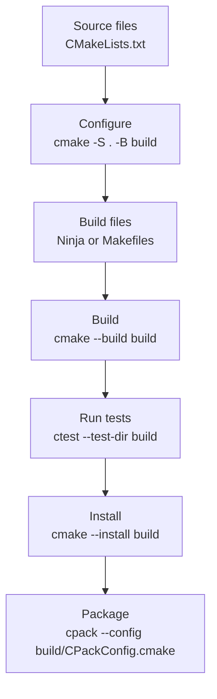

# CMake zero to hero

This path starts with one C++ file and ends with a project that can build,
test, install, package, configure options, handle versions, copy non-C++ files,
and cross-compile.

The goal is to learn modern CMake.

Modern CMake means:

- think in targets
- prefer `target_*` commands
- keep dependencies attached to the target that needs them
- avoid global project settings when possible
- keep source files and generated build files separate

## Big picture



## Stage 1: one executable

Start with the smallest useful project.

Project layout:

```text
hello/
├── CMakeLists.txt
└── main.cpp
```

`CMakeLists.txt`:

```cmake
cmake_minimum_required(VERSION 3.20)
project(hello VERSION 0.1.0 LANGUAGES CXX)

add_executable(hello
    main.cpp
)

target_compile_features(hello PRIVATE cxx_std_17)
```

Build:

```bash
cmake -S . -B build
cmake --build build
./build/hello
```

Learn here:

- `cmake_minimum_required`
- `project`
- `add_executable`
- `target_compile_features`
- configure step vs build step

---

## Stage 2: use a clean build folder

Always keep generated files outside the source tree.

Good:

```bash
cmake -S . -B build
```

Avoid:

```bash
cmake .
```

The `build/` folder can be deleted and recreated. Your source files should not
depend on anything inside it.

---

## Stage 3: split code into a library

Large projects should not put everything in one executable.

Project layout:

```text
robot_app/
├── CMakeLists.txt
├── include/
│   └── robot/
│       └── motor.hpp
├── src/
│   └── motor.cpp
└── app/
    └── main.cpp
```

`CMakeLists.txt`:

```cmake
cmake_minimum_required(VERSION 3.20)
project(robot_app VERSION 0.1.0 LANGUAGES CXX)

add_library(robot_core
    src/motor.cpp
)

target_include_directories(robot_core
    PUBLIC
        include
)

target_compile_features(robot_core PUBLIC cxx_std_17)

add_executable(robot_app
    app/main.cpp
)

target_link_libraries(robot_app
    PRIVATE
        robot_core
)
```

Learn here:

- `add_library`
- `target_include_directories`
- `target_link_libraries`
- `PUBLIC`, `PRIVATE`, and `INTERFACE`

---

## Stage 4: understand PUBLIC, PRIVATE, INTERFACE

These keywords control how settings move between targets.

`PRIVATE` means only this target needs it.

```cmake
target_link_libraries(robot_app PRIVATE robot_core)
```

`PUBLIC` means this target needs it, and users of this target need it too.

```cmake
target_include_directories(robot_core PUBLIC include)
```

`INTERFACE` means this target does not need it for itself, but users need it.

Common rule:

- use `PRIVATE` for implementation details
- use `PUBLIC` for headers or libraries exposed by your public API
- use `INTERFACE` for header-only libraries or usage requirements

---

## Stage 5: add project options

Use `option()` to let the user configure the build.

```cmake
option(BUILD_TESTING "Build tests" ON)
option(ENABLE_WARNINGS "Enable compiler warnings" ON)
option(ENABLE_TOOLS "Build command-line tools" ON)
```

Use the option:

```cmake
if(ENABLE_WARNINGS)
    target_compile_options(robot_core
        PRIVATE
            -Wall
            -Wextra
            -Wpedantic
    )
endif()
```

Configure with parameters:

```bash
cmake -S . -B build -DENABLE_WARNINGS=ON -DBUILD_TESTING=ON
```

Learn here:

- `option`
- `if`
- cache variables
- `-DNAME=value`

---

## Stage 6: handle project version

Put the version in the `project()` command.

```cmake
project(robot_app VERSION 1.2.3 LANGUAGES CXX)
```

CMake creates variables:

```cmake
PROJECT_VERSION
PROJECT_VERSION_MAJOR
PROJECT_VERSION_MINOR
PROJECT_VERSION_PATCH
```

Generate a version header:

`cmake/version.hpp.in`:

```cpp
#pragma once

#define ROBOT_APP_VERSION "@PROJECT_VERSION@"
#define ROBOT_APP_VERSION_MAJOR @PROJECT_VERSION_MAJOR@
#define ROBOT_APP_VERSION_MINOR @PROJECT_VERSION_MINOR@
#define ROBOT_APP_VERSION_PATCH @PROJECT_VERSION_PATCH@
```

`CMakeLists.txt`:

```cmake
configure_file(
    cmake/version.hpp.in
    ${CMAKE_CURRENT_BINARY_DIR}/generated/robot/version.hpp
    @ONLY
)

target_include_directories(robot_core
    PUBLIC
        include
        ${CMAKE_CURRENT_BINARY_DIR}/generated
)
```

Learn here:

- `project(... VERSION ...)`
- `configure_file`
- generated headers
- build directory include paths

---

## Stage 7: include non-C++ files

Projects often need config files, shaders, YAML files, launch files, or other
runtime assets.

For development, copy files next to the executable:

```cmake
add_custom_command(
    TARGET robot_app POST_BUILD
    COMMAND ${CMAKE_COMMAND} -E copy_directory
        ${CMAKE_CURRENT_SOURCE_DIR}/config
        $<TARGET_FILE_DIR:robot_app>/config
)
```

For install/package, install the files:

```cmake
install(DIRECTORY config/
    DESTINATION share/robot_app/config
)
```

Learn here:

- `add_custom_command`
- `${CMAKE_COMMAND} -E`
- `install(DIRECTORY ...)`
- runtime file location

---

## Stage 8: add tests

CMake uses CTest for running tests.

Minimal test:

```cmake
include(CTest)

if(BUILD_TESTING)
    add_executable(robot_core_test
        tests/robot_core_test.cpp
    )

    target_link_libraries(robot_core_test
        PRIVATE
            robot_core
    )

    add_test(NAME robot_core_test COMMAND robot_core_test)
endif()
```

Run:

```bash
cmake -S . -B build -DBUILD_TESTING=ON
cmake --build build
ctest --test-dir build --output-on-failure
```

Learn here:

- `include(CTest)`
- `BUILD_TESTING`
- `add_test`
- `ctest`
- test output on failure

---

## Stage 9: use external dependencies

Prefer imported targets from `find_package`.

Example:

```cmake
find_package(fmt REQUIRED)

target_link_libraries(robot_core
    PRIVATE
        fmt::fmt
)
```

Good modern dependency usage usually looks like:

```cmake
target_link_libraries(my_target PRIVATE SomePackage::SomeTarget)
```

Learn here:

- `find_package`
- imported targets
- package config files
- system dependencies vs vendored dependencies

---

## Stage 10: install the project

Install rules describe what should be copied to an install prefix.

```cmake
install(TARGETS robot_app robot_core
    RUNTIME DESTINATION bin
    LIBRARY DESTINATION lib
    ARCHIVE DESTINATION lib
)

install(DIRECTORY include/
    DESTINATION include
)
```

Run:

```bash
cmake --install build --prefix install
```

Learn here:

- `install(TARGETS ...)`
- `install(DIRECTORY ...)`
- install prefix
- executable, shared library, and static library destinations

---

## Stage 11: package with CPack

CPack creates archives or install packages from install rules.

```cmake
set(CPACK_PACKAGE_NAME "robot_app")
set(CPACK_PACKAGE_VENDOR "my-team")
set(CPACK_PACKAGE_VERSION ${PROJECT_VERSION})
set(CPACK_GENERATOR "TGZ")

include(CPack)
```

Run:

```bash
cmake -S . -B build
cmake --build build
cpack --config build/CPackConfig.cmake
```

Common generators:

- `TGZ`: `.tar.gz`
- `ZIP`: zip archive
- `DEB`: Debian package
- `RPM`: RPM package

Learn here:

- `CPack`
- package metadata
- package generators
- how install rules become package contents

---

## Stage 12: use CMakePresets.json

Presets save common configure, build, and test commands.

`CMakePresets.json`:

```json
{
  "version": 6,
  "configurePresets": [
    {
      "name": "debug",
      "generator": "Ninja",
      "binaryDir": "${sourceDir}/build/debug",
      "cacheVariables": {
        "CMAKE_BUILD_TYPE": "Debug",
        "BUILD_TESTING": "ON"
      }
    }
  ],
  "buildPresets": [
    {
      "name": "debug",
      "configurePreset": "debug"
    }
  ],
  "testPresets": [
    {
      "name": "debug",
      "configurePreset": "debug",
      "output": {
        "outputOnFailure": true
      }
    }
  ]
}
```

Run:

```bash
cmake --preset debug
cmake --build --preset debug
ctest --preset debug
```

Learn here:

- configure presets
- build presets
- test presets
- repeatable local and CI builds

---

## Stage 13: cross compile

Cross-compiling means building for a different target system than the machine
running CMake.

Example: build on x86 Linux, target ARM Linux.

Use a toolchain file.

`cmake/toolchains/arm-linux.cmake`:

```cmake
set(CMAKE_SYSTEM_NAME Linux)
set(CMAKE_SYSTEM_PROCESSOR arm)

set(CMAKE_C_COMPILER arm-linux-gnueabihf-gcc)
set(CMAKE_CXX_COMPILER arm-linux-gnueabihf-g++)

set(CMAKE_FIND_ROOT_PATH /opt/arm-sysroot)

set(CMAKE_FIND_ROOT_PATH_MODE_PROGRAM NEVER)
set(CMAKE_FIND_ROOT_PATH_MODE_LIBRARY ONLY)
set(CMAKE_FIND_ROOT_PATH_MODE_INCLUDE ONLY)
set(CMAKE_FIND_ROOT_PATH_MODE_PACKAGE ONLY)
```

Configure:

```bash
cmake -S . -B build-arm \
  -DCMAKE_TOOLCHAIN_FILE=cmake/toolchains/arm-linux.cmake
```

Build:

```bash
cmake --build build-arm
```

Learn here:

- toolchain files
- sysroot
- target compiler
- host tools vs target libraries
- `CMAKE_SYSTEM_NAME`
- `CMAKE_FIND_ROOT_PATH`

---

## Stage 14: grow into a large project

A larger project should be split into directories and targets.

Example layout:

```text
robot_app/
├── CMakeLists.txt
├── cmake/
│   ├── version.hpp.in
│   └── toolchains/
├── include/
├── src/
├── apps/
├── tests/
├── config/
└── docs/
```

Top-level `CMakeLists.txt`:

```cmake
cmake_minimum_required(VERSION 3.20)
project(robot_app VERSION 1.2.3 LANGUAGES CXX)

option(BUILD_TESTING "Build tests" ON)
option(ENABLE_TOOLS "Build tools" ON)

add_subdirectory(src)
add_subdirectory(apps)

include(CTest)
if(BUILD_TESTING)
    add_subdirectory(tests)
endif()

install(DIRECTORY config/
    DESTINATION share/robot_app/config
)

set(CPACK_PACKAGE_VERSION ${PROJECT_VERSION})
set(CPACK_GENERATOR "TGZ")
include(CPack)
```

Learn here:

- `add_subdirectory`
- one target per library or executable
- small focused `CMakeLists.txt` files
- keeping install and package rules near the targets they describe

---

## Important issues to know

- Do not put generated files in the source tree.
- Do not use `file(GLOB ...)` for source files when learning. List sources
  explicitly so changes are clear.
- Prefer `target_compile_features(my_target PRIVATE cxx_std_17)` over global
  C++ standard variables.
- Prefer imported targets like `fmt::fmt` over raw include paths and library
  variables.
- Use `PRIVATE` unless the dependency is part of your public API.
- Do not make every include directory global.
- Keep build options few and meaningful.
- Use presets when command lines become long.
- Run tests from the build folder with `ctest --test-dir build`.
- Make install rules before packaging. CPack packages what you install.
- Cross-compiling is mostly about the toolchain file and dependency locations.

## Recommended learning order

1. executable
2. clean build folder
3. library target
4. include directories
5. link libraries
6. options and cache variables
7. version header
8. non-C++ runtime files
9. tests with CTest
10. dependencies with `find_package`
11. install rules
12. packages with CPack
13. presets
14. cross-compiling
15. multi-directory project structure

## Final target

At the end, you should be able to build a project with commands like:

```bash
cmake --preset debug
cmake --build --preset debug
ctest --preset debug
cmake --install build/debug --prefix install
cpack --config build/debug/CPackConfig.cmake
```

That means your project can be configured, built, tested, installed, and
packaged in a repeatable way.
