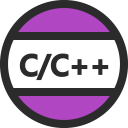

---
tags:
    - cpp
    - vscode
    - settings
    - dev environment
---

# VSCode CPP dev environment

|   |   |
|---|---|
|   | C/C++ IntelliSense, debugging, and code browsing.  |
|  | Interfacing with the build process  |


## Build

### Using CMake presets
CMake Presets are a standardized, version-controlled way to define build configurations (compiler, build dir, flags, generator, cache vars) so everyone builds the project the same way — from CLI or IDE.

CMake Presets contain information how to:
- configure, 
- build, 
- test 
- package a project. 
 
 
Preset information is stored in a JSON files:

```json
{
  "version": 6,
  "cmakeMinimumRequired": {
    "major": 3,
    "minor": 23,
    "patch": 0
  },
  "configurePresets": [
    {
      // ...
    }
  ],
  "buildPresets": [
    {
      // ...
    }
  ],
  "testPresets": [
    {
      // ...
    }
  ]
}
```

#### Preset Types

1️⃣ Configure presets

Define how CMake configures the project

```json
"configurePresets": [
  {
    "name": "debug",
    "generator": "Ninja",
    "binaryDir": "build/debug",
    "cacheVariables": {
      "CMAKE_BUILD_TYPE": "Debug"
    }
  }
]
```

Equivalent to:

```bash
cmake -S . -B build/debug -DCMAKE_BUILD_TYPE=Debug
```

```bash title="run from cli"
#cmake --preset <preset name>
cmake --preset debug
```

2️⃣ Build presets

Define how to build after configuration

```json
"buildPresets": [
  {
    "name": "debug",
    "configurePreset": "debug"
  }
]
```

Equivalent to:

```bash
cmake --build build/debug
```

```bash
#cmake --build --preset <preset name>
cmake --build --preset debug
```

#### VSCode

```json
{
  "cmake.useCMakePresets": "always"
}
```

---

### Demo: cmake presets with debug and release

```json
{
  "version": 6,
  "cmakeMinimumRequired": {
    "major": 3,
    "minor": 23,
    "patch": 0
  },
  "configurePresets": [
    {
      "name": "debug",
      "generator": "Ninja",
      "binaryDir": "build/debug",
      "cacheVariables": {
        "CMAKE_BUILD_TYPE": "Debug"
      }
    },
    {
      "name": "release",
      "generator": "Ninja",
      "binaryDir": "build/release",
      "cacheVariables": {
        "CMAKE_BUILD_TYPE": "Release"
      }
    }
  ],
  "buildPresets": [
    {
      "name": "debug",
      "configurePreset": "debug"
    },
    {
      "name": "release",
      "configurePreset": "release"
    }
  ]
}

```

VSCode preset commnads

- cmake: Configure
- cmake: Build
- cmake: Clean
- cmake: select configure preset
- cmake: select build preset

---

### Compilers
## Clang

| Ubuntu Version | Default Clang | Default GCC | Default C++ Standard Usable  |
| -------------- | ------------- | ----------- | ---------------------------- |
| 22.04 (Jammy)  | 14            | 11          | C++20 (usable)               |
| 24.04 (Noble)  | 18            | 13          | C++20 / C++23 (good support) |


```bash
sudo apt install -y  \
  clang     \
  clangd \
  lldb \
  lld \
  cmake \
  ninja-build \
  build-essential \
  pkg-config

```
| Tool            | Purpose                     |
| --------------- | --------------------------- |
| clang           | Compiler                    |
| clangd          | IDE integration             |
| lldb            | Debugger                    |
| lld             | Fast linker                 |
| cmake           | Build system                |
| ninja           | Fast build backend          |
| build-essential | System headers + base tools |
| pkg-config      | Library detection           |


---

### Clangd

Language Server Protocol (LSP) server for C++.
Provides:

- Autocomplete
- Jump to definition
- Error diagnostics
- Refactoring

#### VSCode

##### Install clangd ext.
install [clangd by LLVM](https://marketplace.visualstudio.com/items?itemName=llvm-vs-code-extensions.vscode-clangd)
  
!!! tip "don't forget"
    To install `clangd` binary

    ```bash
    sudo apt install clangd
    ```
    
Disabled microsoft intellisense 

```json
"C_Cpp.intelliSenseEngine": "disabled"
```

##### compile_command.json
It is a database of exact compiler commands used to build every .cpp file in your project.

**The ground truth of how your project is compiled.**

Generate `compile_command.json`

```bash
cmake -S . -B build -DCMAKE_EXPORT_COMPILE_COMMANDS=ON
```

- Include paths
- Defines
- Compiler flags
- C++ standard version

Without this file → clangd guesses → incorrect IntelliSense.

```json title=".vscode/settings.json"
"clangd.arguments": [
        "--compile-commands-dir=build"
    ]
```

##### Using LLDB
Install [CodeLLDB](https://marketplace.visualstudio.com/items?itemName=vadimcn.vscode-lldb)

using it with `launch.json"

```json title=".vscode/launch.json"
{
  "version": "0.2.0",
  "configurations": [
    {
      "name": "Debug with LLDB",
      "type": "lldb",
      "request": "launch",
      "program": "${workspaceFolder}/build/debug/my_app",
      "args": [],
      "cwd": "${workspaceFolder}",
      "stopOnEntry": false
    }
  ]
}
---

#### VSCode project
- using clang
- using cmake
- using cmake presets

VSCode ext.
- clangd
- CodeLLDB
- cmake tools

```c title="CMakeLists.txt"
cmake_minimum_required(VERSION 3.22)

project(MyApp VERSION 1.0 LANGUAGES CXX)

set(CMAKE_CXX_STANDARD 20)
set(CMAKE_CXX_STANDARD_REQUIRED ON)

set(CMAKE_C_COMPILER clang)
set(CMAKE_CXX_COMPILER clang++)

set(CMAKE_EXPORT_COMPILE_COMMANDS ON)

add_executable(my_app
    src/main.cpp
)
```

```json title=".vscode/settings.json"
{
    "cmake.useCMakePresets": "always",
    "C_Cpp.intelliSenseEngine": "disabled",
    "clangd.arguments": [
        "--compile-commands-dir=build"
    ]
}
```

```json title=".vscode/launch.json"
{
  "version": "0.2.0",
  "configurations": [
    {
      "name": "Debug with LLDB",
      "type": "lldb",
      "request": "launch",
      "program": "${workspaceFolder}/build/debug/my_app",
      "args": [],
      "cwd": "${workspaceFolder}",
      "stopOnEntry": false
    }
  ]
}
```

```json title=".vscode/task/json"
{
  "version": "2.0.0",
  "tasks": [
    {
      "label": "CMake: Configure (debug preset)",
      "type": "shell",
      "command": "cmake --preset debug",
      "problemMatcher": []
    },
    {
      "label": "CMake: Build (debug preset)",
      "type": "shell",
      "command": "cmake --build --preset debug",
      "group": {
        "kind": "build",
        "isDefault": true
      },
      "dependsOn": "CMake: Configure (debug preset)",
      "problemMatcher": "$gcc"
    },
    {
      "label": "CMake: Configure (release preset)",
      "type": "shell",
      "command": "cmake --preset release",
      "problemMatcher": []
    },
    {
      "label": "CMake: Build (release preset)",
      "type": "shell",
      "command": "cmake --build --preset release",
      "group": "build",
      "dependsOn": "CMake: Configure (release preset)",
      "problemMatcher": "$gcc"
    }
  ]
}

```


```json title="CMakePresets.json"
{
  "version": 3,
  "cmakeMinimumRequired": {
    "major": 3,
    "minor": 21,
    "patch": 0
  },
  "configurePresets": [
    {
      "name": "debug",
      "displayName": "Debug",
      "generator": "Ninja",
      "binaryDir": "${sourceDir}/build/debug",
      "cacheVariables": {
        "CMAKE_BUILD_TYPE": "Debug"
      }
    },
    {
      "name": "release",
      "displayName": "Release",
      "generator": "Ninja",
      "binaryDir": "${sourceDir}/build/release",
      "cacheVariables": {
        "CMAKE_BUILD_TYPE": "Release"
      }
    }
  ],
  "buildPresets": [
    {
      "name": "debug",
      "configurePreset": "debug"
    },
    {
      "name": "release",
      "configurePreset": "release"
    }
  ]
}
```