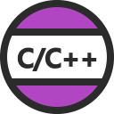

---
tags:
    - cpp
    - vscode
    - settings
    - dev environment
---

# VSCode CPP dev environment

|   |   |
|---|---|
|   | C/C++ IntelliSense, debugging, and code browsing.  |
|  | Interfacing with the build process  |


## Build

### Using CMake presets
CMake Presets are a standardized, version-controlled way to define build configurations (compiler, build dir, flags, generator, cache vars) so everyone builds the project the same way — from CLI or IDE.

CMake Presets contain information how to:
- configure, 
- build, 
- test 
- package a project. 
 
 
Preset information is stored in a JSON files:

```json
{
  "version": 6,
  "cmakeMinimumRequired": {
    "major": 3,
    "minor": 23,
    "patch": 0
  },
  "configurePresets": [
    {
      // ...
    }
  ],
  "buildPresets": [
    {
      // ...
    }
  ],
  "testPresets": [
    {
      // ...
    }
  ]
}
```

#### Preset Types

1️⃣ Configure presets

Define how CMake configures the project

```json
"configurePresets": [
  {
    "name": "debug",
    "generator": "Ninja",
    "binaryDir": "build/debug",
    "cacheVariables": {
      "CMAKE_BUILD_TYPE": "Debug"
    }
  }
]
```

Equivalent to:

```bash
cmake -S . -B build/debug -DCMAKE_BUILD_TYPE=Debug
```

```bash title="run from cli"
#cmake --preset <preset name>
cmake --preset debug
```

2️⃣ Build presets

Define how to build after configuration

```json
"buildPresets": [
  {
    "name": "debug",
    "configurePreset": "debug"
  }
]
```

Equivalent to:

```bash
cmake --build build/debug
```

```bash
#cmake --build --preset <preset name>
cmake --build --preset debug
```

#### VSCode

```json
{
  "cmake.useCMakePresets": "always"
}
```

---

### Demo: cmake presets with debug and release

```json
{
  "version": 6,
  "cmakeMinimumRequired": {
    "major": 3,
    "minor": 23,
    "patch": 0
  },
  "configurePresets": [
    {
      "name": "debug",
      "generator": "Ninja",
      "binaryDir": "build/debug",
      "cacheVariables": {
        "CMAKE_BUILD_TYPE": "Debug"
      }
    },
    {
      "name": "release",
      "generator": "Ninja",
      "binaryDir": "build/release",
      "cacheVariables": {
        "CMAKE_BUILD_TYPE": "Release"
      }
    }
  ],
  "buildPresets": [
    {
      "name": "debug",
      "configurePreset": "debug"
    },
    {
      "name": "release",
      "configurePreset": "release"
    }
  ]
}

```

VSCode preset commnads

- cmake: Configure
- cmake: Build
- cmake: Clean
- cmake: select configure preset
- cmake: select build preset

---

### Compilers
## Clang
- Install clang version 19 support cpp-20
- Config `update-alternative`
- Install clang libstd


```bash title="install"
wget https://apt.llvm.org/llvm.sh
chmod +x llvm.sh
sudo ./llvm.sh 19
#
sudo apt install libstdc++-12-dev
# work after fix update-alternatives
clang++ --version

```


```bash title="config clang using update alternative"
# sudo update-alternatives --install <symlink> <name> <path-to-binary> <priority>
sudo update-alternatives --install /usr/bin/clang clang /usr/bin/clang-19 100
sudo update-alternatives --install /usr/bin/clang++ clang++ /usr/bin/clang++-19 100

sudo update-alternatives --install /usr/bin/clang clang /usr/bin/clang-14 50
sudo update-alternatives --install /usr/bin/clang++ clang++ /usr/bin/clang++-149 50

# switch
sudo update-alternatives --config clang
sudo update-alternatives --config clang++
```

---

## VSCode

### c_cpp

```json title="c_cpp_properties.json"
{
    "configurations": [
        {
            "name": "Clang",
            "includePath": [
                "${workspaceFolder}/**",
                "${default}"
            ],
            "defines": [],
            "compilerPath": "/usr/bin/clang++",
            "cStandard": "c17",
            "cppStandard": "c++20",
            "intelliSenseMode": "linux-clang-x64"
        }
    ],
    "version": 4
}
```

### Tasks
- Add task that build current file using `clang` compiler


```json title="tasks.json"
{
  "version": "2.0.0",
  "tasks": [
    {
      "label": "build with clang",
      "type": "shell",
      "command": "clang++",
      "args": [
        "-std=c++20",
        "${file}",
        "-o",
        "${fileDirname}/${fileBasenameNoExtension}"
      ],
      "group": {
        "kind": "build",
        "isDefault": true
      },
      "problemMatcher": [
        "$gcc"
      ]
    }
  ]
}
```