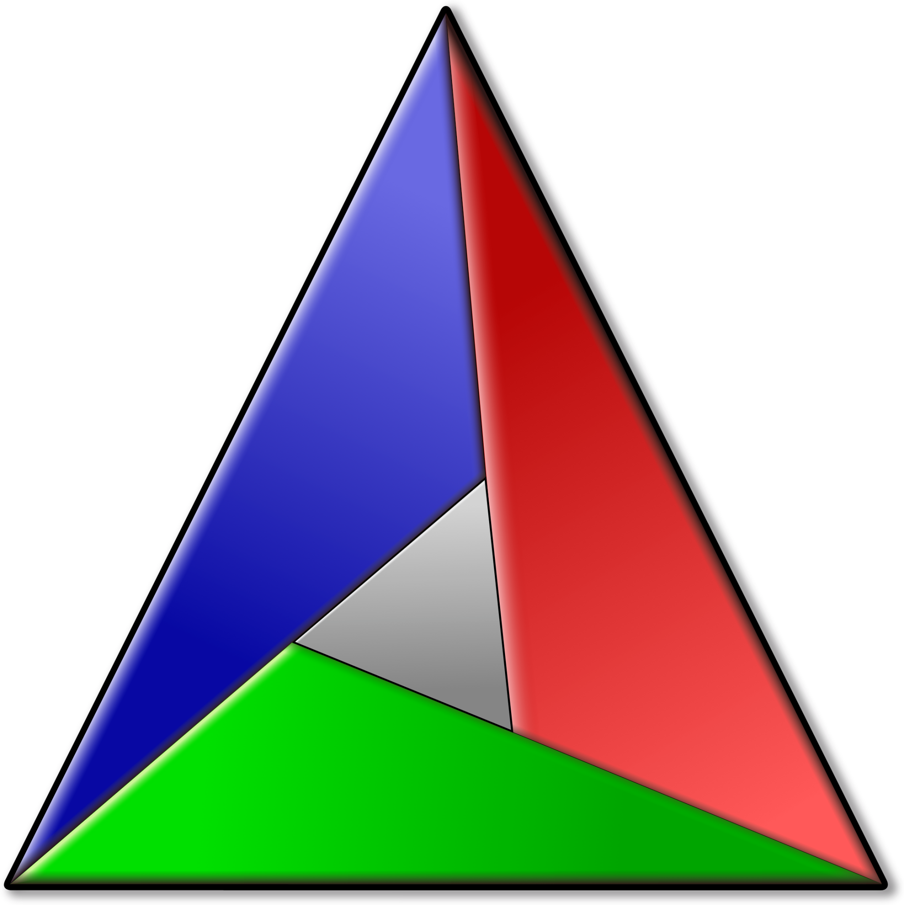
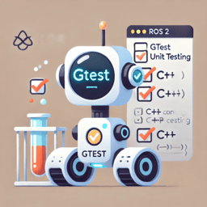

{{ page_folder_links() }}

    

        <a href="dev_env">
        
        
VSCode dev env.

        </a>
    

    

        <a href="cmake">
            
            
CMake

        </a>
    

    

        <a href="gtest">
            
            
gtest

        </a>
    

    

        <a href="learn_cpp">
        
Zero to Hero

        </a>
    

    

---

## Libraries

    

        <a href="libraries/fmt/">
        
fmt

        </a>
    

    

    <a href="libraries/msgpack/">
        
msgpack

        </a>
    

    

        <a href="">
        
---

        </a>
    

    

---
## Compilers

| C++  | GCC  | Clang  | ubuntu  | Notes  |
|---|---|---|---|---|
| C++17  | 7  |  5 |   |   |
| C++20  | 11  |  14 | 22.04  |   |
| C++23  | 13  |  18 | 24.04  |   |

---

## Courses
- [Modern C++ Programming](https://federico-busato.github.io/Modern-CPP-Programming/)