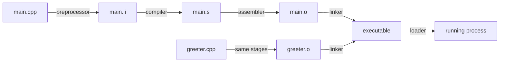

A C++ source file is not executed directly. It passes through several tools
that transform text into machine code, combine multiple translation units, and
load the resulting executable into memory. Understanding that path makes
compiler, linker, and debugger errors much less mysterious.

## Prerequisites and goals

Prerequisites:

- basic variables and functions;
- a terminal on Ubuntu 24.04;
- GCC, CMake, and GDB.

Install the required tools with:

```bash
sudo apt update
sudo apt install build-essential cmake gdb
```

After this lesson, you should be able to:

- explain preprocessing, compilation, assembly, linking, and loading;
- divide a program into headers and source files;
- distinguish declarations from definitions;
- recognize common One Definition Rule mistakes;
- build and test a multi-target CMake project;
- stop inside a function and inspect program state with GDB or VS Code.

---

## The complete toolchain



### 1. Preprocessor

The preprocessor handles directives beginning with `#`. For example:

- `#include` inserts declarations from another file;
- `#define` creates a macro;
- `#if`, `#ifdef`, and `#endif` select source conditionally.

[Download `preprocessor_demo.cpp`](code/preprocessor_demo.cpp).

```cpp title="preprocessor_demo.cpp"
--8<-- "docs/Programming/cpp/learn_cpp/mastery/01_toolchain_and_debugging/code/preprocessor_demo.cpp"
```

View the preprocessed source without compiling it:

```bash
g++ -std=c++20 -E preprocessor_demo.cpp -o preprocessor_demo.ii
```

The `.ii` file is large because it contains the expanded standard-library
headers. `APPLICATION_NAME` has been replaced by its macro value, and only the
selected conditional branch remains.

!!! warning "Macros are text substitution"
    A macro has no C++ type or namespace. Prefer constants, functions, and
    templates for normal C++ logic. Macros remain useful for conditional
    compilation and build-generated values.

### 2. Compiler

The compiler parses and type-checks the preprocessed C++ program, diagnoses
language errors, optimizes it, and produces assembly language:

```bash
g++ -std=c++20 -S preprocessor_demo.ii -o preprocessor_demo.s
```

A compiler error normally points to invalid C++ in one translation unit: wrong
types, missing declarations, syntax mistakes, or inaccessible members.

### 3. Assembler

The assembler turns assembly instructions into an object file containing
machine code plus symbol and relocation information:

```bash
g++ -c preprocessor_demo.s -o preprocessor_demo.o
```

An object file is not normally runnable. Calls to functions in other object
files or libraries may still be unresolved.

### 4. Linker

The linker combines object files and libraries, resolves symbol references, and
creates an executable:

```bash
g++ preprocessor_demo.o -o preprocessor_demo
```

A linker error often means that something was declared and used but no matching
definition was linked:

```text
undefined reference to `greeter::make_greeting(...)`
```

The opposite error—multiple definitions—means more than one linked translation
unit supplied a forbidden duplicate definition.

### 5. Loader

When the executable starts, the operating-system loader maps it into memory,
loads required shared libraries, prepares the process, and transfers control to
the program startup code that eventually calls `main`.

Inspect dynamic dependencies with:

```bash
ldd ./preprocessor_demo
```

The loader works at runtime. The compiler and linker have already finished.

---

## Translation units and multi-file programs

After preprocessing, each `.cpp` file becomes one **translation unit** and is
compiled independently. A header shares declarations between translation units;
it is not usually compiled by itself.

The example uses this layout:

```text
code/
├── CMakeLists.txt
├── include/greeter/greeter.hpp
└── src/
    ├── greeter.cpp
    └── main.cpp
```

### Declaration in the header

[Download `greeter.hpp`](code/include/greeter/greeter.hpp).

```cpp title="include/greeter/greeter.hpp"
--8<-- "docs/Programming/cpp/learn_cpp/mastery/01_toolchain_and_debugging/code/include/greeter/greeter.hpp"
```

The function declaration tells each caller its name, parameters, return type,
and namespace. `#pragma once` prevents repeated inclusion within one translation
unit.

### Definition in one source file

[Download `greeter.cpp`](code/src/greeter.cpp).

```cpp title="src/greeter.cpp"
--8<-- "docs/Programming/cpp/learn_cpp/mastery/01_toolchain_and_debugging/code/src/greeter.cpp"
```

This definition contains the executable function body. The program provides it
in exactly one `.cpp` file.

### Use the declaration from another source file

[Download `main.cpp`](code/src/main.cpp).

```cpp title="src/main.cpp"
--8<-- "docs/Programming/cpp/learn_cpp/mastery/01_toolchain_and_debugging/code/src/main.cpp"
```

`main.cpp` can compile after seeing the declaration. The linker later connects
its function call to the definition compiled from `greeter.cpp`.

### Namespaces

Both declaration and definition use `namespace greeter`. Namespaces group names
and reduce collisions:

```cpp
greeter::make_greeting("Ada");
```

The declaration and definition must match, including their namespace, parameter
types, return type, and relevant qualifiers.

---

## The One Definition Rule

The One Definition Rule, usually shortened to **ODR**, controls which entities
may be defined more than once across a program.

A common mistake is defining a normal function in a header:

```cpp
// bad_header.hpp
std::string greeting()
{
    return "hello";
}
```

If two `.cpp` files include this header, the linker may see two definitions of
`greeting`. Prefer a declaration in the header and one definition in a `.cpp`
file.

Small header-defined functions may be marked `inline`:

```cpp
inline std::string greeting()
{
    return "hello";
}
```

Templates are also normally defined in headers because the compiler needs their
definitions when instantiating them.

!!! tip "First question for an undefined reference"
    Ask whether the definition exists, whether its signature exactly matches
    the declaration, and whether the object file or library containing it is
    part of the link command.

---

## Build targets with CMake

[Download `CMakeLists.txt`](code/CMakeLists.txt).

```cmake title="CMakeLists.txt"
--8<-- "docs/Programming/cpp/learn_cpp/mastery/01_toolchain_and_debugging/code/CMakeLists.txt"
```

Important target relationships are:

```cmake
add_library(greeter STATIC src/greeter.cpp)
target_include_directories(greeter PUBLIC include)
target_compile_features(greeter PUBLIC cxx_std_20)

add_executable(toolchain_demo src/main.cpp)
target_link_libraries(toolchain_demo PRIVATE greeter)
```

- `greeter` is a static-library target.
- `PUBLIC include` lets both the library and its consumers find
  `greeter/greeter.hpp`.
- Public C++20 usage propagates to consumers.
- Linking `toolchain_demo` to `greeter` supplies the compiled definition.

Configure a debug build, compile it, and run its tests:

```bash
cmake -S . -B build -DCMAKE_BUILD_TYPE=Debug
cmake --build build
ctest --test-dir build --output-on-failure
./build/toolchain_demo Ada
```

Expected output:

```text
Hello, Ada!
```

CTest verifies the default greeting, named greeting, preprocessor example, and
compiling exercise starter.

---

## Debug versus release builds

A debug build keeps source-level information and normally avoids aggressive
optimization:

```bash
cmake -S . -B build-debug -DCMAKE_BUILD_TYPE=Debug
```

A release build enables optimization and usually defines `NDEBUG`:

```bash
cmake -S . -B build-release -DCMAKE_BUILD_TYPE=Release
```

Optimization can reorder, combine, or remove operations, making source-level
stepping surprising. Begin diagnosis with a debug build.

!!! warning "Debug is not the same as safe"
    Compiler warnings, tests, and sanitizers still matter. Debug symbols help
    you observe a failure; they do not prevent one.

---

## Debug with GDB

Build the example in Debug mode, then start GDB:

```bash
gdb ./build/toolchain_demo
```

Useful commands:

```gdb
break greeter::make_greeting
run Ada
print name
backtrace
next
continue
quit
```

| Command | Purpose |
| --- | --- |
| `break` | Stop when a source line or function is reached. |
| `run` | Start the program with optional arguments. |
| `next` | Execute the next source line without entering called functions. |
| `step` | Execute the next source line and enter called functions. |
| `print` | Evaluate a variable or expression. |
| `backtrace` | Display the active call stack. |
| `continue` | Resume until another breakpoint or program exit. |

At the breakpoint, `name` is a `std::string_view`. Inspect its value and use
`backtrace` to see that `main` called `greeter::make_greeting`.

---

## Debug with VS Code

The example includes downloadable task and launch configurations:

- [`tasks.json`](code/vscode/tasks.json)
- [`launch.json`](code/vscode/launch.json)

Place both downloaded files in a `.vscode/` directory inside the downloaded
`code` directory, then open `code` as the VS Code workspace. Select
**Debug toolchain_demo** and press F5. The build task configures a debug build,
then the debugger launches the program with `Ada` as its argument.

Set a breakpoint on the return statement in `src/greeter.cpp`. Inspect `name`,
step back to `main`, and compare the editor's call-stack view with GDB's
`backtrace` output.

---

## Exercise

[Download `exercise_starter.cpp`](code/exercise_starter.cpp). It compiles but
does not yet meet its requirement.

Change `make_farewell` so this command:

```bash
./build/exercise_starter
```

prints:

```text
Goodbye, Ada!
```

Then add a CTest assertion for that output.

??? success "Exercise solution"
    Update the function:

    ```cpp
    std::string make_farewell(const std::string& name)
    {
        return "Goodbye, " + name + "!";
    }
    ```

    Add this after the existing exercise test:

    ```cmake
    set_tests_properties(exercise_starter_runs PROPERTIES
        PASS_REGULAR_EXPRESSION "Goodbye, Ada!"
    )
    ```

---

## Quiz

### 1. Predict the result

`main.cpp` calls a declared function, but `greeter.cpp` is removed from the
`greeter` target. Does the failure occur during compilation or linking?

??? success "Answer"
    Linking fails with an undefined reference. `main.cpp` can compile because
    it sees a valid declaration. No linked object file supplies the definition.

### 2. Concept check

What is the difference between a declaration and a definition?

??? success "Answer"
    A declaration introduces a name and its type so other code can use it. A
    definition provides the entity itself—for a function, its body. A
    definition is also a declaration, but a declaration is not always a
    definition.

### 3. Find the bug

Why can this header cause a multiple-definition linker error?

```cpp
#pragma once

int answer()
{
    return 42;
}
```

??? success "Answer"
    Every translation unit including the header defines a normal external
    function. Move the definition to one `.cpp` file and keep only a declaration
    in the header, or mark this small header-defined function `inline`.

### 4. Coding exercise

Create a `math` static library with a header declaring `int square(int)`, one
source file defining it, and an executable printing `square(5)`. Add a CTest
that expects `25`.

??? success "Answer outline"
    The header contains `int square(int value);` inside a namespace. The source
    includes that header and returns `value * value`. CMake creates a static
    library, publishes its include directory, links it to the executable, and
    adds a test with `PASS_REGULAR_EXPRESSION "25"`.

---

## Phase mission: multi-file hello application

Create a new program with one executable and one reusable library. Do not copy
the finished example unchanged.

Requirements:

- at least one public header and two `.cpp` translation units;
- a namespace for the library API;
- C++20 and `-Wall -Wextra -Wpedantic`;
- Debug and Release configurations;
- at least three CTest tests;
- one deliberate compiler error and one deliberate linker error recorded in a
  short `mistakes.md` with their fixes;
- a GDB breakpoint inside the library with the inspected variable and
  backtrace recorded in `debugging.md`.

Hints:

- Keep declarations in headers and ordinary definitions in source files.
- Make include directories part of the library target.
- Remove a source file from `add_library` to reproduce an undefined reference.

Acceptance criteria:

- A clean clone configures, builds, and passes CTest.
- Both Debug and Release executables run.
- The documentation correctly identifies which pipeline stage produced each
  deliberate error.
- No full mission solution is provided by this lesson.

## References

- [GCC overall options and compilation stages](https://gcc.gnu.org/onlinedocs/gcc/Overall-Options.html){:target="_blank" rel="noopener noreferrer"}
- [GDB documentation](https://sourceware.org/gdb/documentation/){:target="_blank" rel="noopener noreferrer"}
- [CMake tutorial](https://cmake.org/cmake/help/latest/guide/tutorial/index.html){:target="_blank" rel="noopener noreferrer"}

<!-- post-content-skill: 1.0.0 -->
