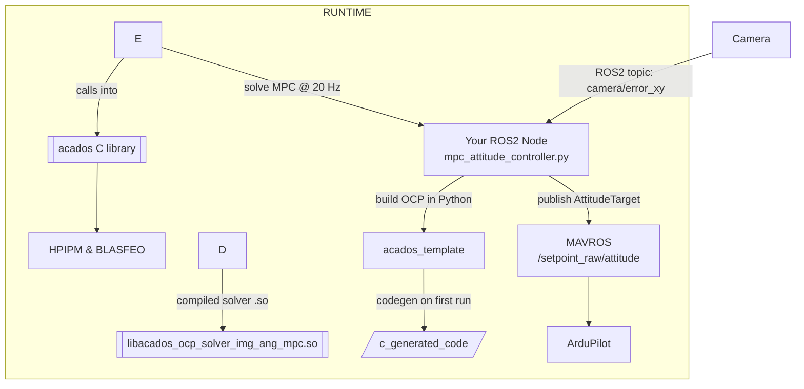

{{ page_folder_links() }}


## Encapsulation
- Use of private/protected fields
- Getters and setters (if needed)
- Const-correctness (const member functions)
- Immutable objects

## Inheritance
- Base and derived classes
- public, private, and protected inheritance
- Virtual functions
- Constructor chaining (Base(args))

## Polymorphism
- Function overriding
- Virtual destructors
- Pure virtual functions (= 0)
- Abstract base classes
- Runtime polymorphism via pointers or references
- The role of virtual and override

## Constructors and Object Lifecycle
- Default constructor, copy constructor, move constructor
- Copy assignment, move assignment
- The Rule of Three / Rule of Five
- Destructor
- RAII (Resource Acquisition Is Initialization)

## Operator Overloading
- Overload operators like +, ==, <<, [], etc.
- Understand which should be friend, member, or non-member
- Best practices and dangers

## Smart Pointers and Ownership (Modern C++)
- std::unique_ptr, std::shared_ptr, std::weak_ptr
- Ownership models
- Avoiding raw new and delete
- Avoiding memory leaks and dangling pointers

## Templates and Generic OOP (Advanced)
- Template classes and functions
- Combining OOP and templates
- CRTP (Curiously Recurring Template Pattern)
- Type traits (std::is_base_of, etc.)

## Composition over Inheritance
- Prefer combining objects over subclassing
- Delegation
- Aggregation vs composition


## Design Patterns (Optional, Practical)
- Singleton (with std::unique_ptr)
- Factory
- Strategy
- Observer
- Builder


## Modern C++ OOP Best Practices
- Favor composition and RAII
- Prefer = default / = delete over writing boilerplate
- Avoid unnecessary inheritance
- Use final to prevent further inheritance when needed
- Use explicit on single-arg constructors
- Don’t overuse setters/getters — prefer invariants

---

### Allocation
- Stack
- raw
- smart pointers

```cpp
#include <iostream>
#include <memory>


class Animal {
public:
    std::string name;
    virtual void speak() {
        std::cout << name << " speaks" << std::endl;
    }
};

int main() {
    // Using stack allocation
    Animal a;
    a.name = "Generic Animal";
    a.speak();

    
    // Using heap allocation with raw pointer
    auto dog = new Animal();
    dog->name = "Dog";
    dog->speak();
    // Clean up raw pointer
    delete dog;

    // Using smart pointer (unique_ptr)
    auto cat = std::make_unique<Animal>();
    cat->name = "Cat";
    cat->speak();

    std::cout << "Hello, OOP in C++!" << std::endl;
    return 0;
}
```

!!! tip "cmake debug symbols"
    ```cmake
    if(NOT CMAKE_BUILD_TYPE)
        set(CMAKE_BUILD_TYPE Debug)
    endif()
    ```


#### Using valgrind
     
```
sudo apt install valgrind
```

```bash title="minimal usage"
# build with debug symbols
valgrind --leak-check=full <path to binary>
```


##### Find leak 
For example comment the delete dog line (25) and run valgrind it found that dog object in line 21 not freed

```bash
==1079592== 
Generic Animal speaks
Dog speaks
Cat speaks
Hello, OOP in C++!
==1079592== 
==1079592== HEAP SUMMARY:
==1079592==     in use at exit: 40 bytes in 1 blocks
==1079592==   total heap usage: 4 allocs, 3 frees, 73,808 bytes allocated
==1079592== 
==1079592== 40 bytes in 1 blocks are definitely lost in loss record 1 of 1
==1079592==    at 0x4849013: operator new(unsigned long) (in /usr/libexec/valgrind/vgpreload_memcheck-amd64-linux.so)
==1079592==    by 0x109300: main (hello.cpp:21)
==1079592== 
==1079592== LEAK SUMMARY:
==1079592==    definitely lost: 40 bytes in 1 blocks
==1079592==    indirectly lost: 0 bytes in 0 blocks
==1079592==      possibly lost: 0 bytes in 0 blocks
==1079592==    still reachable: 0 bytes in 0 blocks
==1079592==         suppressed: 0 bytes in 0 blocks
==1079592== 
==1079592== For lists of detected and suppressed errors, rerun with: -s
==1079592== ERROR SUMMARY: 1 errors from 1 contexts (suppressed: 0 from 0)
```


