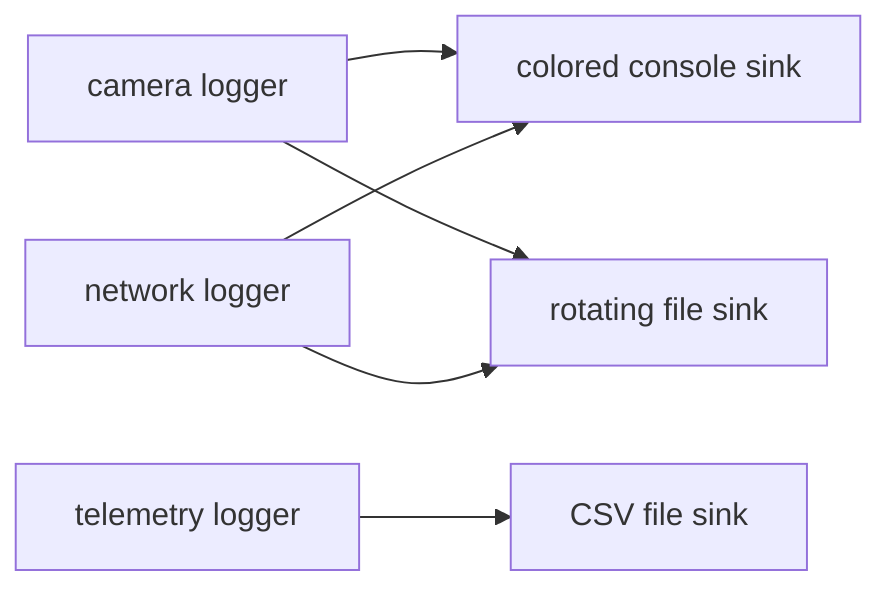

`spdlog` is a C++ logging library with `{fmt}`-style formatting, named loggers,
runtime log levels, multiple output sinks, rotating files, and synchronous or
asynchronous operation. This tutorial starts with a minimal Ubuntu 24.04
program, then builds a synchronous component logger controlled by environment
variables and a separate CSV telemetry writer.

## Install on Ubuntu 24.04

```bash
sudo apt update
sudo apt install build-essential cmake libspdlog-dev
```

Ubuntu 24.04 supplies spdlog `1.12.0` and its `{fmt}` dependency. Confirm the
installed version with:

```bash
dpkg-query -W libspdlog-dev
```

The examples use only the Ubuntu package. No manual installation is required.

---

## The four concepts to know

- A **log record** is one event: level, time, logger name, and message.
- A **logger** receives records from one application component, such as
  `camera` or `network`.
- A **sink** sends records to a destination, such as the console or a file.
- A **pattern** controls how a sink converts each record to text.

One logger can share several sinks:



The diagnostic log explains what the program is doing. Telemetry stores
fixed-schema measurements for analysis. They are related, but they are not the
same data product.

---

## Minimal CMake example

```cpp title="main.cpp"
#include <spdlog/spdlog.h>

int main()
{
    spdlog::set_level(spdlog::level::debug);
    spdlog::set_pattern("[%H:%M:%S.%e] [%^%l%$] %v");

    spdlog::debug("Connecting to camera {}", 0);
    spdlog::info("Application started");
    spdlog::warn("This is a warning");
    spdlog::error("Example error code: {}", 42);
}
```

```cmake title="CMakeLists.txt"
cmake_minimum_required(VERSION 3.16)
project(spdlog_minimal LANGUAGES CXX)

find_package(spdlog CONFIG REQUIRED)

add_executable(spdlog_minimal main.cpp)
target_compile_features(spdlog_minimal PRIVATE cxx_std_17)
target_link_libraries(spdlog_minimal PRIVATE spdlog::spdlog)

```

Build and run from the downloaded example directory:

```bash
cmake -S . -B build
cmake --build build
./build/spdlog_minimal
```

!!! tip "color section"
    `%^` and `%$` mark the colored portion of the console pattern. They have an
    effect only when the sink supports colors.

---

## Log levels

From most detailed to most severe, spdlog levels are:

| Level | Typical use |
| --- | --- |
| `trace` | Very detailed execution flow. |
| `debug` | Values useful while developing or diagnosing. |
| `info` | Normal lifecycle events. |
| `warn` | Unexpected condition from which the program can recover. |
| `error` | An operation failed. |
| `critical` | The process or an essential subsystem cannot continue safely. |
| `off` | Disable the logger. |

A logger emits a record only when its level is at least as severe as its
configured threshold. With an `info` threshold, `trace` and `debug` records are
filtered out.

!!! note "Runtime and compile-time filtering differ"
    The examples call logger methods such as `camera->debug(...)`, which remain
    available for runtime filtering. Projects using macros such as
    `SPDLOG_DEBUG` must also set `SPDLOG_ACTIVE_LEVEL` at compile time if they
    want lower-level macro calls compiled into the binary.

---

## Console and rotating-file sinks

The configured example creates one colored console sink and one rotating-file
sink. All three component loggers share them:

```text
camera  ─┬─> console
network ─┼─> console
control ─┘

camera  ─┬─> logs/application.log
network ─┼─> logs/application.log
control ─┘
```

The file rotates after `5 MiB` and retains three older files:

```text
application.log
application.1.log
application.2.log
application.3.log
```

Rotation limits storage growth. It does not archive logs permanently; the
oldest rotated file is deleted.

---

## Control levels from the environment

The configured program calls:

```cpp
spdlog::cfg::load_env_levels();
```

Set one global level:

```bash
SPDLOG_LEVEL=debug ./build/spdlog_configured
```

Set a global level and override individual components:

```bash
SPDLOG_LEVEL="info,camera=debug,network=warn,control=off" \
  ./build/spdlog_configured
```

This configuration means:

- `camera` emits `debug` and more severe records;
- `network` starts at `warn`;
- `control` emits nothing;
- every other diagnostic logger uses `info`.

!!! warning "Unlisted components inherit the global level"
    In `SPDLOG_LEVEL="info,camera=debug"`, `network` and `control` inherit
    `info`. A component is disabled only when it is explicitly assigned `off`
    or the global level is `off`.

The example validates configuration before passing it to spdlog. Unknown
components, duplicate entries, empty tokens, and invalid levels stop startup:

```bash
SPDLOG_LEVEL="info,camrea=debug" ./build/spdlog_configured
```

```text
Logging configuration error: unknown logging component: camrea
```

This validation matters because spdlog's native environment parser ignores
unrecognized levels instead of reporting them as errors.

---

## Control formatting per sink

The console should be compact and easy to scan. The file should preserve more
context. The program therefore reads two environment variables:

```bash
export APP_CONSOLE_LOG_PATTERN="[%H:%M:%S.%e] [%^%l%$] [%n] %v"
export APP_FILE_LOG_PATTERN="[%Y-%m-%d %H:%M:%S.%e] [%l] [%n] [thread %t] %v"
./build/spdlog_configured
```

Common flags are:

| Flag | Meaning |
| --- | --- |
| `%Y-%m-%d` | Date. |
| `%H:%M:%S` | Time. |
| `%e` | Milliseconds. |
| `%l` | Log level. |
| `%n` | Logger or component name. |
| `%t` | Thread ID. |
| `%v` | User message. |
| `%^ ... %$` | Start and end console color range. |

If a variable is unset, the application uses the pattern shown above as its
default. If a supplied pattern is invalid, `set_pattern` throws and the program
exits with a configuration error.

---

## Complete configured example

[Download `main.cpp`](code/configured/main.cpp) and
[`CMakeLists.txt`](code/configured/CMakeLists.txt).

```cmake title="CMakeLists.txt"
--8<-- "docs/Programming/cpp/libraries/log/spdlog/code/configured/CMakeLists.txt"
```

```cpp title="main.cpp"
--8<-- "docs/Programming/cpp/libraries/log/spdlog/code/configured/main.cpp"
```

Build and run:

```bash
cmake -S . -B build
cmake --build build
SPDLOG_LEVEL="info,camera=debug,control=off" \
  ./build/spdlog_configured
```

The example is synchronous: the calling thread formats each accepted record and
writes it to its sinks before returning.

---

## Use spdlog for CSV telemetry

spdlog can write CSV lines, but it is not a CSV database or schema library. The
application owns:

- the filename and schema;
- the header and column order;
- value formatting and units;
- quoting and escaping;
- flushing and retention.

The configured example creates one file per run:

```text
logs/telemetry_2026-08-08_14-32-10.csv
```

It uses a dedicated file-only logger whose pattern is `%v`, so spdlog does not
add a level or logger name around the CSV row:

```csv
timestamp,component,sequence,fps,latency_ms
2026-08-08T14:32:10,camera,0,29.97,8.40
2026-08-08T14:32:10,camera,1,29.97,9.40
2026-08-08T14:32:10,camera,2,29.97,10.40
```

The sequence column helps detect missing samples. The component column records
which subsystem produced the measurement.

!!! warning "CSV strings must be escaped"
    The example uses a fixed component name and numeric values, none of which
    contains commas, quotes, or newlines. General text fields require correct
    CSV quoting. A pattern such as `"{},{},{}"` does not escape arbitrary input
    safely.

The telemetry logger is intentionally separate from the registered diagnostic
loggers, so `SPDLOG_LEVEL` cannot accidentally disable measurement collection.
It writes the header once, appends data rows, and flushes before shutdown.

---

## Synchronous versus asynchronous logging

Synchronous flow:

```text
application thread -> format -> write sinks -> continue
```

Asynchronous flow:

```text
application thread -> queue -> continue
                              background worker -> format -> write sinks
```

### Asynchronous pros

- Reduces time spent doing file I/O on application threads.
- Can reduce latency spikes when the disk is temporarily slow.
- Helps applications producing many diagnostic records from several threads.

### Asynchronous cons

- Requires a thread pool, bounded queue, overflow policy, and careful shutdown.
- Queued records may be lost if the process crashes.
- Background errors are harder to report to the application.
- Queueing adds overhead and may not help at low log rates.
- More than one worker can complicate ordering.

When the queue is full, a blocking policy preserves records but can stall the
producer. `overrun_oldest` keeps the producer moving by discarding older
records.

!!! danger "Do not silently discard required telemetry"
    `overrun_oldest` may be acceptable for verbose diagnostic messages. It is a
    dangerous default for CSV telemetry because missing rows can invalidate
    analysis. Keep telemetry synchronous or use a blocking queue when every
    sample matters.

Start with synchronous logging. Move diagnostics to async only after measuring
a real logging bottleneck. Always flush important loggers and call
`spdlog::shutdown()` during normal application exit.

---

## Optional FetchContent setup

Ubuntu packages are the supported path for these examples. A project that must
pin and build another spdlog release can use CMake `FetchContent` instead:

```cmake
include(FetchContent)

FetchContent_Declare(
    spdlog
    GIT_REPOSITORY https://github.com/gabime/spdlog.git
    GIT_TAG v1.17.0
)
FetchContent_MakeAvailable(spdlog)

target_link_libraries(my_application PRIVATE spdlog::spdlog)
```

Pin a tag rather than following a moving branch. Do not combine the Ubuntu
spdlog target and a fetched spdlog target in the same executable.

## References

- [spdlog project and examples](https://github.com/gabime/spdlog){:target="_blank" rel="noopener noreferrer"}
- [spdlog formatting patterns](https://github.com/gabime/spdlog/wiki/3.-Custom-formatting){:target="_blank" rel="noopener noreferrer"}
- [Ubuntu 24.04 `libspdlog-dev` package](https://packages.ubuntu.com/noble/libspdlog-dev){:target="_blank" rel="noopener noreferrer"}

<!-- post-content-skill: 1.0.0 -->
