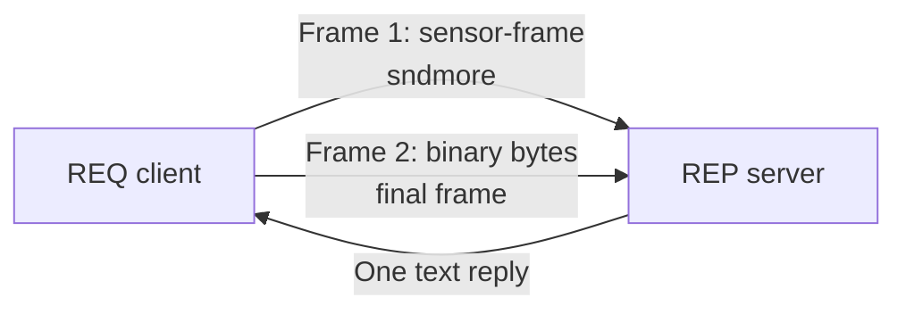

---

# ZeroMQ messages and multipart frames

ZeroMQ sends complete **messages**. A message is a sequence of bytes with a
known size; ZeroMQ does not know whether those bytes represent text, pixels, or
a C++ object.

## Learning goal

This lesson explains how to:

- send text and arbitrary binary bytes;
- preserve zero bytes inside a payload;
- group several frames into one multipart message;
- validate the number and order of received frames;
- avoid sending a C++ structure as raw memory.

Continue from the [REQ/REP lesson](../request_reply/index.md). This example uses
the same socket pattern so the focus remains on message representation.

## One frame is one sized byte sequence

```cpp
const std::string text{"Hello"};
socket.send(zmq::buffer(text), zmq::send_flags::none);
```

The receiver gets one frame containing five bytes. A binary frame works the
same way:

```cpp
const std::vector<std::uint8_t> bytes{0x10, 0x20, 0x00, 0xFF};
socket.send(zmq::buffer(bytes), zmq::send_flags::none);
```

Binary data may contain `0x00`, so never treat an arbitrary frame as a
null-terminated C string. Always use `message.data()` together with
`message.size()`, or use `message.to_string()` only when the protocol says the
frame contains text.

## Multipart messages

A multipart message combines several frames into one logical message. This
lesson uses:

```text
Frame 1: text header
Frame 2: binary payload
```



Set `sndmore` on every frame except the last:

```cpp
client.send(zmq::buffer(header), zmq::send_flags::sndmore);
client.send(zmq::buffer(payload), zmq::send_flags::none);
```

The peer receives the complete multipart message in the same frame order. The
`more()` flag tells it whether another frame belongs to that message:

```cpp
zmq::message_t header;
server.recv(header);

if (!header.more())
    // Error: the payload frame is missing.
```

## Why not send raw struct memory?

This is tempting but unsafe as a portable protocol:

```cpp
struct Reading
{
    std::uint32_t id;
    double value;
};

Reading reading{7, 22.5};
socket.send(zmq::buffer(&reading, sizeof(reading)), zmq::send_flags::none);
```

The memory may contain compiler padding, and integer or floating-point byte
order may differ between systems. Adding or reordering a field silently changes
the layout. A receiver in another language also needs that private C++ layout.

Use a serialization format such as MessagePack for structures. Large opaque
data such as image pixels can remain a separate raw frame.

## Hands-on example

The client sends a header followed by four bytes. The server verifies that the
request contains exactly two frames, prints them, and replies with a status.

=== "Client"

    ```cpp
    --8<-- "docs/Programming/cpp/libraries/zmq/messages/code/client.cpp"
    ```

=== "Server"

    ```cpp
    --8<-- "docs/Programming/cpp/libraries/zmq/messages/code/server.cpp"
    ```

The payload owns arbitrary bytes; printing each byte as an integer makes the
embedded zero visible.

## Build and run

```bash
cmake -S code -B code/build
cmake --build code/build
```

Start the server:

```bash
./code/build/message_server
```

Then run the client in another terminal:

```bash
./code/build/message_client
```

Server output:

```text
Header: sensor-frame
Payload bytes: 16 32 0 255
```

Client output:

```text
OK: received 4 bytes
```

## Common mistakes

- Forgetting `sndmore` causes the first frame to become a complete message.
- Setting `sndmore` on the final frame leaves the multipart message unfinished.
- Assuming a frame contains text can truncate or misinterpret binary data.
- Ignoring `more()` lets missing or unexpected frames pass unnoticed.
- Sending raw struct memory creates a fragile, language-specific protocol.

## What to remember

- ZeroMQ preserves message and frame boundaries.
- Every frame is bytes plus a size.
- Multipart messages keep related frames together and ordered.
- The application defines what each frame means.
- Structures need an explicit portable encoding.

Next: [pack structures and OpenCV images with MessagePack](../serialization/index.md).
title: ZeroMQ Messages and Multipart Frames
tags:
    - zmq
    - cpp
    - messages
    - multipart
---
