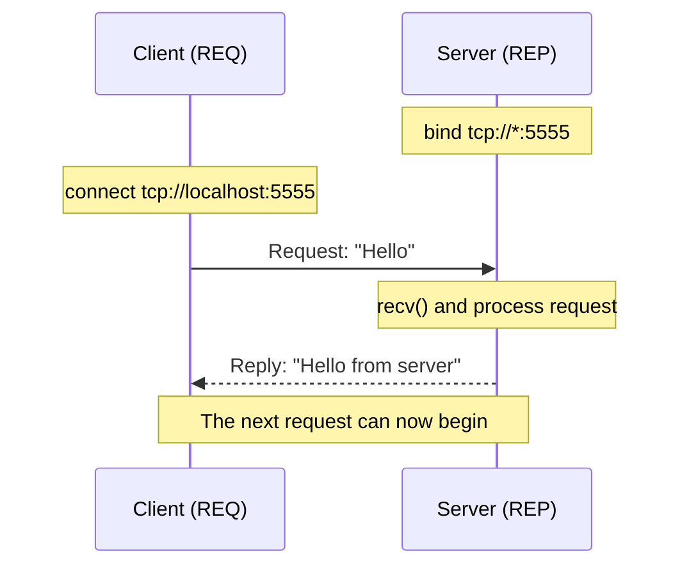

# ZeroMQ request-reply in C++

This first lesson creates a small client and server. The client sends `Hello`,
and the server returns `Hello from server`.

## Core ZeroMQ concepts

ZeroMQ is a messaging library. An application sends complete messages through
sockets instead of directly managing a stream of TCP bytes. ZeroMQ handles
details such as message boundaries, internal queues, and reconnecting.

### Context

A `zmq::context_t` owns ZeroMQ's internal communication resources and creates
the environment in which sockets operate:

```cpp
zmq::context_t context{1};
```

The value `1` requests one I/O thread, which is enough for this example. Create
the context before its sockets and keep it alive until all those sockets have
been destroyed.

### Socket

A ZeroMQ socket represents one endpoint in a messaging pattern:

```cpp
zmq::socket_t server{context, zmq::socket_type::rep};
zmq::socket_t client{context, zmq::socket_type::req};
```

Unlike a basic TCP socket, its type defines how messages may flow. Here, `req`
means request and `rep` means reply.

### Bind and connect

One side binds an address and the other connects to it:

```cpp
server.bind("tcp://*:5555");
client.connect("tcp://localhost:5555");
```

- `bind()` makes the server available on TCP port `5555`. The `*` selects all
  local network interfaces.
- `connect()` tells the client where to find the server. `localhost` means the
  same computer.

Bind and connect do not decide which side sends first; the socket pattern does.

## Request-reply pattern

The two sockets follow a strict alternating order:

```text
REQ client: send → receive → send → receive
REP server: receive → send → receive → send
```

The REQ client cannot send another request until it receives a reply. The REP
server cannot receive another request until it replies to the current one.
Breaking this order produces a socket state error.



REQ/REP is useful for simple operations where every request needs exactly one
response. Use another pattern when the server must send unsolicited messages or
handle an asynchronous conversation.

## Server

```cpp title="server.cpp"
#include <zmq.hpp>

#include <iostream>
#include <string>

int main()
{
    zmq::context_t context{1};

    zmq::socket_t socket{
        context,
        zmq::socket_type::rep
    };

    socket.bind("tcp://*:5555");

    std::cout << "Server listening...\n";

    while (true) {
        zmq::message_t request;

        const auto received = socket.recv(request);
        if (!received)
            continue;

        std::string text{
            static_cast<char*>(request.data()),
            request.size()
        };

        std::cout << "Received: " << text << '\n';

        socket.send(
            zmq::buffer("Hello from server"),
            zmq::send_flags::none
        );
    }
}
```

### How the server works

1. The context is created before the socket.
2. The `rep` socket binds TCP port `5555`.
3. `recv()` blocks until a request arrives; if it returns no result, the loop
   waits again.
4. The message bytes are copied into a `std::string` using their exact size.
5. `send()` returns one reply to the waiting client.
6. The loop returns to `recv()` for the next request.

A ZeroMQ message contains bytes and is not required to end with a null
character. That is why the string constructor receives both `request.data()`
and `request.size()`.

This server processes one request at a time. Later lessons introduce patterns
and worker designs for concurrent processing.

## Client

```cpp title="client.cpp"
#include <zmq.hpp>

#include <iostream>
#include <string>

int main()
{
    zmq::context_t context{1};

    zmq::socket_t socket{
        context,
        zmq::socket_type::req
    };

    socket.connect("tcp://localhost:5555");

    socket.send(
        zmq::buffer("Hello"),
        zmq::send_flags::none
    );

    zmq::message_t response;
    const auto received = socket.recv(response);
    if (!received)
    {
        std::cerr << "No response received\n";
        return 1;
    }

    std::string text{
        static_cast<char*>(response.data()),
        response.size()
    };

    std::cout << "Received: " << text << '\n';
}
```

The client creates a `req` socket, connects to the server, sends one message,
and blocks in `recv()` until the reply arrives.

## Build

Install the dependencies from the [course overview](../index.md#installation),
then place `server.cpp`, `client.cpp`, and this CMake file in one directory:

```cmake title="CMakeLists.txt"
cmake_minimum_required(VERSION 3.20)

project(zmq_request_reply LANGUAGES CXX)

find_package(cppzmq REQUIRED)

add_executable(server server.cpp)
target_link_libraries(server PRIVATE cppzmq)
target_compile_features(server PRIVATE cxx_std_20)

add_executable(client client.cpp)
target_link_libraries(client PRIVATE cppzmq)
target_compile_features(client PRIVATE cxx_std_20)
```

```bash
cmake -S . -B build
cmake --build build
```

## Run

Start the server in the first terminal:

```bash
./build/server
```

```text
Server listening...
```

Start the client in a second terminal:

```bash
./build/client
```

Client output:

```text
Received: Hello from server
```

The server also reports the request:

```text
Received: Hello
```

The client then exits. The server remains in its loop, ready for another
request.

## What to remember

- A context owns ZeroMQ's communication environment.
- A socket type defines the allowed message flow.
- The server binds; the client normally connects.
- REQ and REP must alternate `send` and `receive`.
- ZeroMQ messages are byte sequences with an explicit size.

Next: learn how ZeroMQ represents strings, binary data, and structured
messages.
