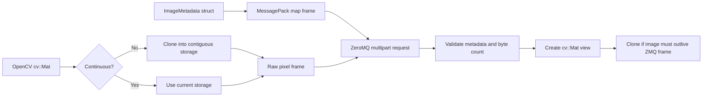

---

# MessagePack structs and OpenCV images

This lesson sends structured image metadata and raw OpenCV pixels between a
REQ client and REP server. The format also works with Python.

## Message layout

Use MessagePack for the small structured part and a separate frame for the
large pixel buffer:

```text
Frame 1: MessagePack metadata map
Frame 2: contiguous raw image bytes
```



This separation avoids embedding a large binary image inside the metadata. It
also prepares the protocol for the later zero-copy lesson.

## Portable metadata

The metadata map contains named fields:

| Field | Type | Meaning |
| --- | --- | --- |
| `version` | `uint32` | Wire-format version; initially `1`. |
| `frame_id` | `uint64` | Image sequence number. |
| `timestamp_ns` | `int64` | Capture or send time in nanoseconds. |
| `width`, `height` | `uint32` | Image dimensions. |
| `channels` | `uint8` | Initially `1` or `3`. |
| `dtype` | string | Initially `uint8`. |
| `encoding` | string | Initially `raw`. |
| `payload_size` | `uint64` | Expected number of pixel bytes. |

The complete C++ definition uses `MSGPACK_DEFINE_MAP`:

```cpp
--8<-- "docs/Programming/cpp/libraries/zmq/serialization/code/image_metadata.hpp"
```

A map is preferable to positional array encoding for interoperability because
Python sees the same field names. The `version` field provides an explicit
place to handle future protocol changes.

## Pack a struct

Start with an ordinary structure:

```cpp
struct Telemetry
{
    std::uint64_t sequence{};
    double temperature{};
    std::string status;

    MSGPACK_DEFINE_MAP(sequence, temperature, status)
};

Telemetry telemetry{7, 22.5, "ready"};

msgpack::sbuffer buffer;
msgpack::pack(buffer, telemetry);
```

`msgpack::sbuffer` owns the encoded bytes. Send those bytes as the first frame:

```cpp
socket.send(zmq::buffer(buffer.data(), buffer.size()),
            zmq::send_flags::sndmore);
```

The receiver unpacks and converts them back to the C++ type:

```cpp
const auto handle = msgpack::unpack(data, size);
Telemetry telemetry;
handle.get().convert(telemetry);
```

The image example applies the same process to `ImageMetadata`.

## Prepare an OpenCV image

This first format supports `CV_8UC1` and `CV_8UC3`. Raw transmission requires
one contiguous pixel region:

```cpp
if (!image.isContinuous())
    image = image.clone();

const auto byte_count = image.total() * image.elemSize();
```

A region of interest may be non-contiguous because rows can contain a stride.
Cloning creates the compact layout promised by this protocol.

Send the pixel data as the final frame:

```cpp
socket.send(zmq::buffer(image.data, byte_count), zmq::send_flags::none);
```

This beginner example uses the normal copying send path. Buffer ownership and
zero-copy sending remain Stage 4.

## Validate before reconstructing

Never trust metadata received from another process. The receiver checks:

- the request contains exactly two frames;
- `version`, `dtype`, and `encoding` are supported;
- dimensions are positive;
- channels are either one or three;
- metadata and actual payload sizes equal `width × height × channels`.

Only then does it create an OpenCV view:

```cpp
const int type = metadata.channels == 1 ? CV_8UC1 : CV_8UC3;
const cv::Mat view{height, width, type, pixel_frame.data()};
const cv::Mat owned_image = view.clone();
```

`view` does not own the ZeroMQ frame. Its pixels become invalid when that frame
is destroyed. `clone()` gives the application an independent image.

## C++ image demo

The sender generates a small BGR test image when no filename is supplied. It
can also load an image from disk.

=== "Sender"

    ```cpp
    --8<-- "docs/Programming/cpp/libraries/zmq/serialization/code/image_sender.cpp"
    ```

=== "Receiver"

    ```cpp
    --8<-- "docs/Programming/cpp/libraries/zmq/serialization/code/image_receiver.cpp"
    ```

## Build and run

Install the packages listed in the [course overview](../index.md#installation),
then build:

```bash
cmake -S code -B code/build
cmake --build code/build
ctest --test-dir code/build --output-on-failure
```

Start the receiver:

```bash
./code/build/image_receiver
```

Send the generated test image:

```bash
./code/build/image_sender
```

Or send an existing grayscale or BGR image:

```bash
./code/build/image_sender input.png
```

The receiver validates the request, saves `received_image.png`, and replies:

```text
OK frame_id=1
```

## Python interoperability

Python decodes the named map and views the second frame as a NumPy array:

```python
metadata = msgpack.unpackb(metadata_frame, raw=False)
image = np.frombuffer(pixel_frame, dtype=np.uint8).reshape(shape)
```

Use the complete receiver:

```python
--8<-- "docs/Programming/cpp/libraries/zmq/serialization/code/python_receiver.py"
```

Run it instead of the C++ receiver, then start the same C++ sender:

```bash
python3 code/python_receiver.py
./code/build/image_sender
```

This confirms that the protocol is defined by field names and byte layout, not
by a private C++ memory representation.

## Raw versus compressed images

Raw pixels are simple and preserve every value, but require
`width × height × channels` bytes. JPEG or PNG reduces bandwidth at the cost of
encoding time and, for JPEG, possible quality loss. Compression is intentionally
left for a later extension so this lesson keeps one clear wire format.

## What to remember

- Serialize metadata; keep large opaque pixels in their own frame.
- Use named MessagePack map fields for C++/Python interoperability.
- Version the protocol and validate all untrusted sizes and types.
- Make non-contiguous OpenCV images contiguous before sending.
- A `cv::Mat` view does not extend a ZeroMQ frame's lifetime.

Next: learn buffer ownership and remove copies only after measuring them.
title: MessagePack Structs and OpenCV Images
tags:
    - zmq
    - cpp
    - msgpack
    - opencv
    - serialization
---
