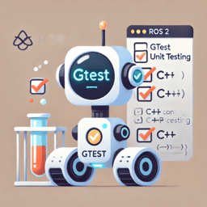
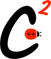

# C++ Testing

Testing frameworks provide assertions and test runners, but the structure of a
good test is independent of GoogleTest or Catch2.

## Arrange, Act, Assert

Arrange, Act, Assert (AAA) separates a test into three clear phases:

| Phase | Purpose |
|---|---|
| Arrange | Create the inputs, initial state, and dependencies needed by the test. |
| Act | Perform the one behavior being tested. |
| Assert | Verify the observable result. |

The test body is the same regardless of the framework; only the assertion
syntax changes:

```cpp
// Arrange
Calculator calculator;

// Act
const int result = calculator.add(2, 3);

// Assert with Catch2
REQUIRE(result == 5);

// Assert with GoogleTest instead
// EXPECT_EQ(result, 5);
```

!!! note "Assert is a test phase"
    The Assert phase means verifying the result. It does not specifically mean
    the C `assert()` macro or any particular testing-framework macro.

Use these rules when designing tests:

- Test one observable behavior at a time.
- Prefer one meaningful Act in each test.
- Name the test after the behavior and expected outcome.
- Test through the module's public interface, not its private implementation.

Framework-specific features such as Catch2 sections and GoogleTest fixtures
belong in their respective tutorials.

## Choose a framework

Choose a C++ testing framework:

<div class="grid-container">
    <div class="grid-item">
        <a href="gtest/">
            
            <p>GoogleTest</p>
        </a>
    </div>
    <div class="grid-item">
        <a href="catch2/">
            
            <p>Catch2</p>
        </a>
    </div>
</div>

The Catch2 artwork comes from the
[official Catch2 repository](https://github.com/catchorg/Catch2/tree/devel/data/artwork).
