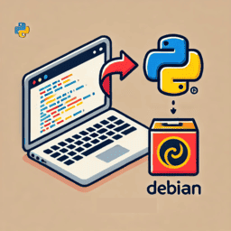
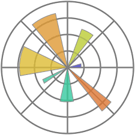

---
tags:
  - python
---

# Python

    

        <a href="dev_env">
        
        
VSCode dev env.

        </a>
    

    

    <a href="python_project">
        
        
python_project

        </a>
    

    

       <a href="python">
        
        
python

        </a>
    

    

       <a href="matplotlib">
        
        
python

        </a>
    

    

## Packages

- [zmq](zmq/index.md)
