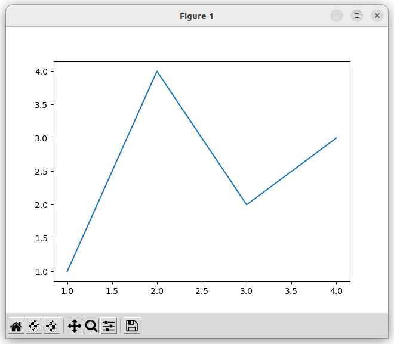
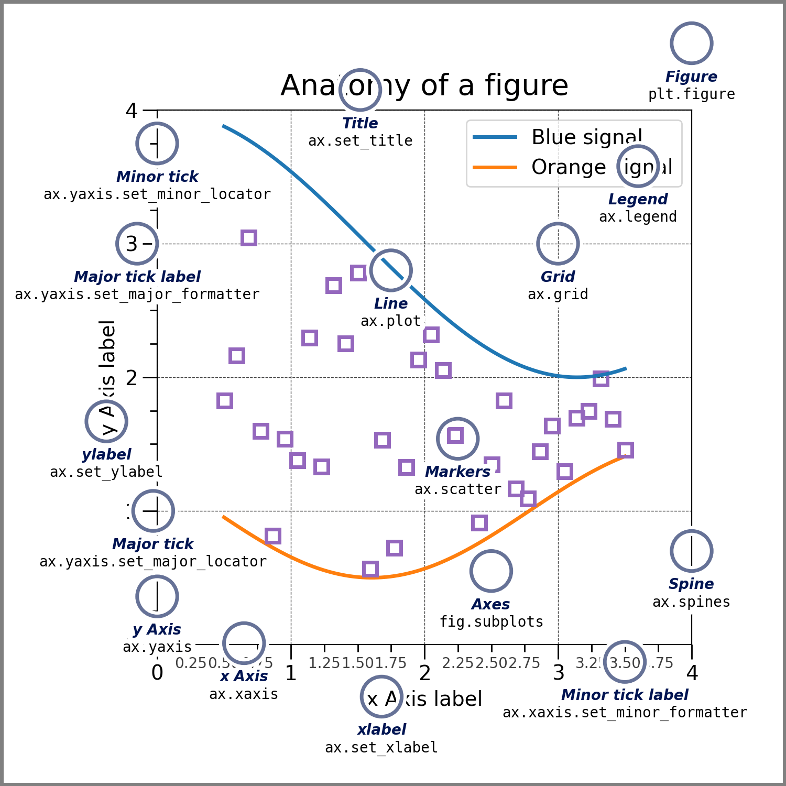
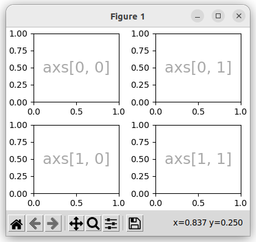
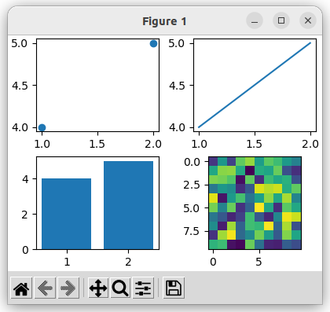

{{ page_folder_links() }}


## Hello matplotlib

```python
--8<-- "docs/Programming/python/matplotlib/code/hello.py"
```



---

## Figure



The whole figure. The Figure keeps track of all the child Axes, a group of 'special' Artists (titles, figure legends, colorbars, etc.), and even nested subfigures.


### Axes

An Axes is an **Artist** attached to a Figure that contains a region for **plotting data**, and usually includes two (or three in the case of 3D) Axis objects

### Axis


### Artist

---

<div class="grid-container">
    <div class="grid-item">
        <a href="3d">
        <!--  -->
        <p>3D plot</p>
        </a>
    </div>
    <div class="grid-item">
       <a href="animation">
        <!--  -->
        <p>Animation</p>
        </a>
    </div>
    <div class="grid-item">
       <a href="gui">
        <!--  -->
        <p>Embedded in QT</p>
        </a>
    </div>
    
</div>

---

### figure and subplots

```python
--8<-- "docs/Programming/python/matplotlib/code/subplots.py"
```




```python
--8<-- "docs/Programming/python/matplotlib/code/subplots_1.py"
```

