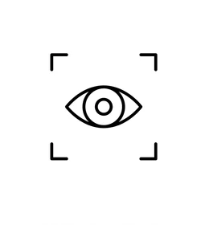

---
tags:
    - vision
---

# Computer Vision

    

        <a href="visual_trackers">
            
            
Visual Trackers

        </a>
    

    

    <a href=opencv>
        
        
OpenCV

        </a>
    

    

    <a href=nvidia>
        
        
nvidia

        </a>
    

     

    <a href=optical_flow>
        
        
Optical Flow

        </a>
    

## Article and post to read
- [Optical Flow (Shi-Tomasi Corner Detection,Sparse(Lucas-kanade, Horn schunck) & Dense(Gunnar Farneback) )-Part I](https://medium.com/@VK_Venkatkumar/optical-flow-shi-tomasi-corner-detection-sparse-lucas-kanade-horn-schunck-dense-gunnar-e1dae9600df)

## Event base camera
- [Event Cameras - Everything you need to know](https://medium.com/@vikramsetty169/event-cameras-everything-you-need-to-know-c5dd4281eb9b)