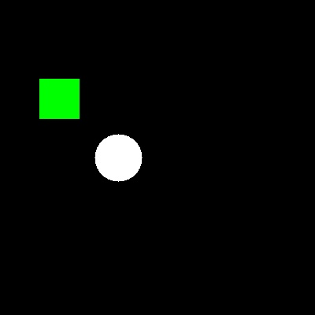
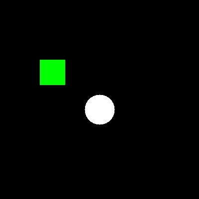
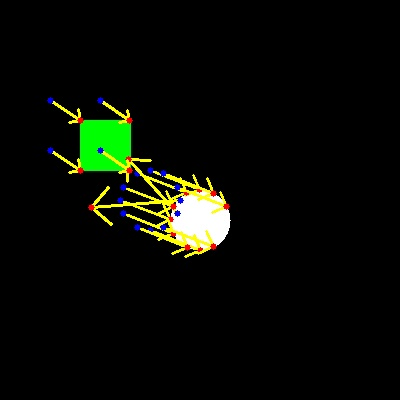

{{ page_folder_links() }}

#TODO:
- API
  - understand error and it's usage

## Demo
- Flow between two frames

<details>
    <summary>LK cpu version</summary>

```python
--8<-- "docs/Programming/vision/opencv/optical_flow/lk/code/simple.py"
```
</details>


| frame_1  | frame_2  | Flow  |
|---|---|---|
|   |   |   |


---

## Demo: Cuda
Create cuda version using pin memory for better performance [check opencv with cuda](Programming/vision/opencv/cuda/)


- `cv2.cuda.createGoodFeaturesToTrackDetector`
- `cv2.cuda.SparsePyrLKOpticalFlow_create`

### API
<details>
    <summary>detect</summary>

```python
d_pts = det.detect(d_gray, mask=None, stream=None)
```

<ul>
    <li><b>d_gray</b>: cv2.cuda_GpuMat, CV_8UC1, grayscale, non-empty.</li>
    <li><b>mask</b> (optional): cv2.cuda_GpuMat (CV_8U), same size; non-zero = allowed region.</li>
    <li><b>stream</b> (optional): cv2.cuda_Stream for async; if your build errors, omit it.</li>
    <li><b>d_pts</b> (return): cv2.cuda_GpuMat (N×1, CV_32FC2), each is (x, y) float32.</li>
  </ul>
  
</details>


<details>
    <summary>calc</summary>
```python
nextPts, status, err = flow.calc(prevImg, nextImg, prevPts, stream=None)
```


<ul>
    <li><b>prevImg, nextImg</b>: cv.cuda_GpuMat grayscale (CV_8UC1)<li>
    <li><b>prevPts</b>: cv.cuda_GpuMat of shape (N,1), type CV_32FC2 (points as (x,y))<li>
    <li><b>returns</b>: nextPts (N×1, CV_32FC2), status (N×1, CV_8U), err (N×1, CV_32F)<li>
</ul>

</details>


### Code
<details>
    <summary>LK cuda version</summary>

```python
--8<-- "docs/Programming/vision/opencv/optical_flow/lk/code/simple_cuda.py"
```
</details>


---

# Demo: Cuda with pin memory and stream

<details>
    <summary>Cuda version with pin memory and stream</summary>

```python
--8<-- "docs/Programming/vision/opencv/optical_flow/lk/code/simple_cuda_stream.py"
```
</details>


---

# Demo: Cuda with Video/Image sequence
- upload new_point back to gpu for next iteration

<details>
    <summary>Cuda version with Image sequence</summary>

```python
--8<-- "docs/Programming/vision/opencv/optical_flow/lk/code/cuda_image_sequence.py"
```
</details>