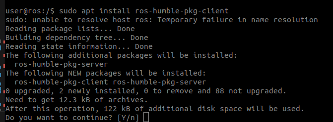

---
tags:
    - ros
    - aptly
    - deb
    - reosdep
    - bloom
    - docker
---

# Using Docker and Aptly to check package installation

## Aptly
Aptly allows you to mirror remote repositories, manage local package repositories and more. [more](https://www.aptly.info/)

!!! warning aptly update
    Download new version 1.6.1 [download](https://github.com/aptly-dev/aptly/releases/download/v1.6.1/aptly_1.6.1_linux_amd64.zip)
    The ubuntu repo version is 1.4.0 isn't support **Zstd compression** that use by `bloom-generate`

    
     
Using aptly to create a custom repository for ROS packages. This is useful when you want to create a custom repository for your ROS packages.

- Create a new repository
- Add packages to the repository
- Publish the repository
- Add the repository to the sources list


### Create a new repository
```bash
aptly -distribution="jammy" -architectures="amd64" \
repo \
create \
my_ros_app_repo
```

#### Add packages to the repository
```bash
aptly repo add my_ros_app_repo \
ros-humble-pkg-client_0.0.0-0jammy_amd64.deb \
ros-humble-pkg-server_0.0.0-0jammy_amd64.deb
```

#### Publish the repository
```bash
aptly -architectures="amd64" -skip-signing=true \
publish repo -architectures="amd64" \
my_ros_app_repo local
```

##### Serve the repository
```bash
aptly serve
# aptly serve -listen=":8081"
```

---

## Docker

Install ROS Package on a docker container
The docker image base on ubuntu 22.04 with ROS humble base

!!! note Dockerfile
     For test the installation i use docker from Allison [github](https://github.com/athackst/dockerfiles/blob/main/ros2/humble.Dockerfile)

     ```bash
     docker build -t humble:dev --target dev .
     ```

```bash
docker run -it --rm \
--net host \
--hostname ros \
--user user \
humble:dev /bin/bash
```

### Add the repository to the sources list

```bash
deb [trusted=true] http://127.0.0.1:8081/local/ jammy main

```

### Check for packages
```bash 
apt update
apt search ros-humble-pkg*
Sorting... Done
Full Text Search... Done
ros-humble-pkg-client/jammy 0.0.0-0jammy amd64
  TODO: Package description

ros-humble-pkg-server/jammy 0.0.0-0jammy amd64
  TODO: Package description

```
### Install

```bash
apt install ros-humble-pkg-client
```



#### Usage and check installation

```bash
source /opt/ros/humble/setup.bash
ros2 launch pkg_client client_server.launch.py
```


