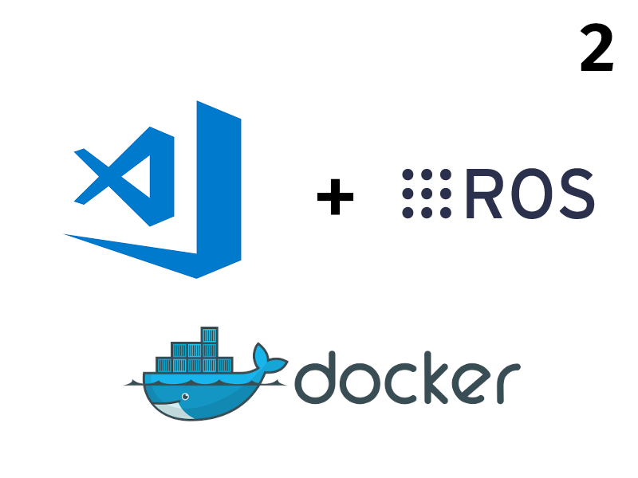

# ROS2 Dev Build Test Environment

<div class="grid-container">
    <div class="grid-item">
        <a href="dev">
        
        <p>Development</p>
        </a>
    </div>
    <div class="grid-item">
    <a href="build">
        
        <p>Build</p>
        </a>
    </div>
    <div class="grid-item">
        <a href="prod">
        
        <p>Prod</p>
        </a>
    </div>
</div>

---

## VSCode devcontainer

```
├── .devcontainer
│   ├── devcontainer.json
│   └── Dockerfile
├── .vscode
│   ├── tasks.json
│   └── settings.json
├── docker-compose.yml
├── .gitignore
├── README.md
├── colcon_defaults.md
├── env.sh
└── src
```

### VSCode files

<details>
<summary>Summary</summary>
```
--8<-- "path/to/file.md"
```
</details>

<details>
<summary>colcon_defaults</summary>

```yaml title="colcon_defaults.yaml"
build:
  # Use symlink install to speed up builds
  symlink-install: true
  # Set build type (e.g., Release or Debug)
  cmake-args:
    - "-DCMAKE_BUILD_TYPE=Release"

test:
  # Run tests in parallel
  parallel-workers: 4

# Additional settings for colcon test and other commands
test-result:
  verbose: true
```
</details>


---

## Project Template
- [ros_gz_project_template](https://github.com/gazebosim/ros_gz_project_template/tree/main){:target="_blank"}
- [jazzy harmonic bridge setup](tutorials/jazzy_harmonic_setup/index.md)
