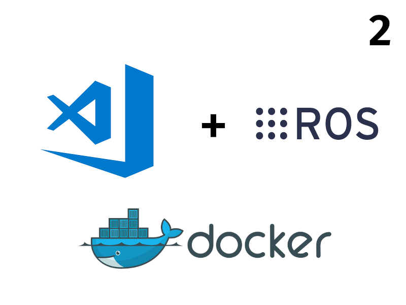

# ROS2 Dev Build Test Environment

<div class="grid-container">
    <div class="grid-item">
        <a href="dev">
        
        <p>Development</p>
        </a>
    </div>
    <div class="grid-item">
    <a href="build">
        
        <p>Build</p>
        </a>
    </div>
    <div class="grid-item">
        <a href="prod">
        
        <p>Prod</p>
        </a>
    </div>
</div>

---

## VSCode devcontainer

```
├── .devcontainer
│   ├── devcontainer.json
│   └── Dockerfile
├── .vscode
│   ├── tasks.json
│   └── settings.json
├── docker-compose.yml
├── .gitignore
├── README.md
├── colcon_defaults.md
├── rc.sh
└── src
```

### VSCode files
- tasks.json
- settings.json
- launch.json


<details>
<summary>colcon build tasks.json </summary>
```json
{
  "tasks": [
    {
      "label": "build workspace",
      "detail": "Build ROS 2 workspace",
      "type": "shell",
      "command": "colcon build",
      "group": {
        "kind": "build",
        "isDefault": true
      },
      "problemMatcher": "$gcc"
    }
  ]
}
```
</details>

#### settings.json

##### python

```json
{
  "python.autoComplete.extraPaths": [
        "/opt/ros/jazzy/lib/python3.12/site-packages/"
    ],
    "python.analysis.typeCheckingMode": "basic",

    "ruff.importStrategy": "fromEnvironment",
    "editor.defaultFormatter": "charliermarsh.ruff",
    "editor.formatOnPaste": true,
    "editor.formatOnSave": true,
    "editor.formatOnSaveMode": "file",
    "editor.codeActionsOnSave": {
        "source.organizeImports": "always",
        "source.fixAll": "always"
    },
    "python.linting.enabled": false,
    }
```

---

### Env file
- colcon_defaults.yaml
- rc.sh

<details>
<summary>colcon_defaults</summary>

```yaml title="colcon_defaults.yaml"
build:
  # Use symlink install to speed up builds
  symlink-install: true
  # Set build type (e.g., Release or Debug)
  cmake-args:
    - "-DCMAKE_BUILD_TYPE=Release",
    - "-DCMAKE_EXPORT_COMPILE_COMMANDS=ON"

test:
  # Run tests in parallel
  parallel-workers: 4

# Additional settings for colcon test and other commands
test-result:
  verbose: true
```
</details>


- Source ros environment 
- Change Prompt
- Add keyboard shortcuts

```bash title="rc.sh"
source /home/user/.bashrc
source /opt/ros/jazzy/setup.bash
source install/setup.bash
echo '🐢 Environment ready!'
# bash key bindings
# replace bringup with full bringup name
bind '"\C-b": "ros2 launch <bringup>"'

# Function to get git branch
parse_git_branch() {
    git branch 2> /dev/null | sed -e '/^[^*]/d' -e 's/* \(.*\)/[\1]/'
}

# Custom PS1 with turtle icon and git branch
export PS1="🐢 \[\033[32m\]\u@\h\[\033[00m\]:\[\033[34m\]\w\[\033[33m\]\$(parse_git_branch)\[\033[00m\]\$ "
```


---

## Project Template
- [ros_gz_project_template](https://github.com/gazebosim/ros_gz_project_template/tree/main){:target="_blank"}
- [jazzy harmonic bridge setup](tutorials/jazzy_harmonic_setup/index.md)
