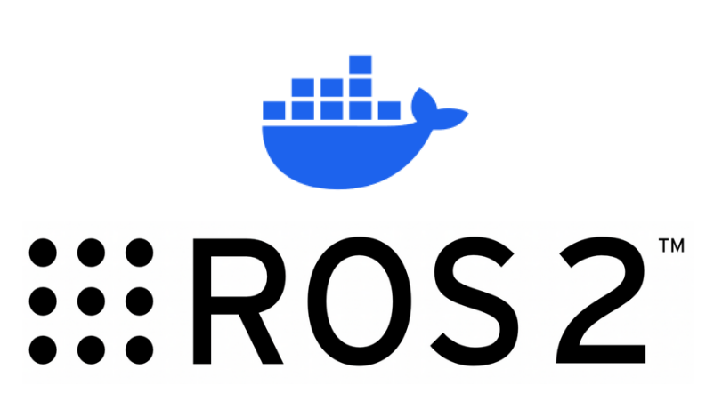

---
tags:
    - ros2
    - docker
---

# Using Docker for ROS2 Development

    

        <a href="docker_images">
        
        
Images

        </a>
    

    

    <a href="docker_devices">
        
        
Devices

        </a>
    

    

        <a href="docker_nvidia">
        
        
Nvidia

        </a>
    

    

