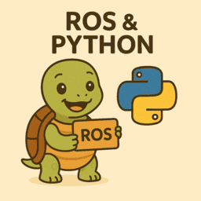
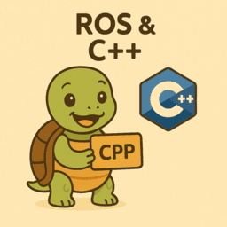
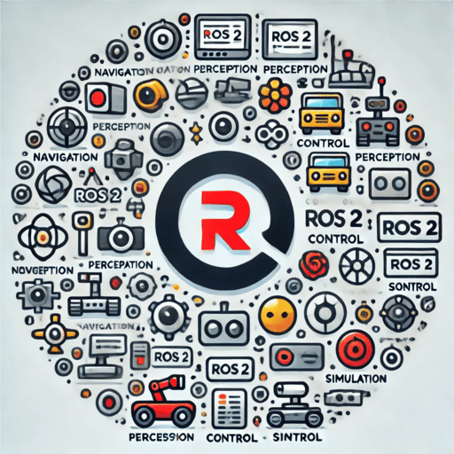
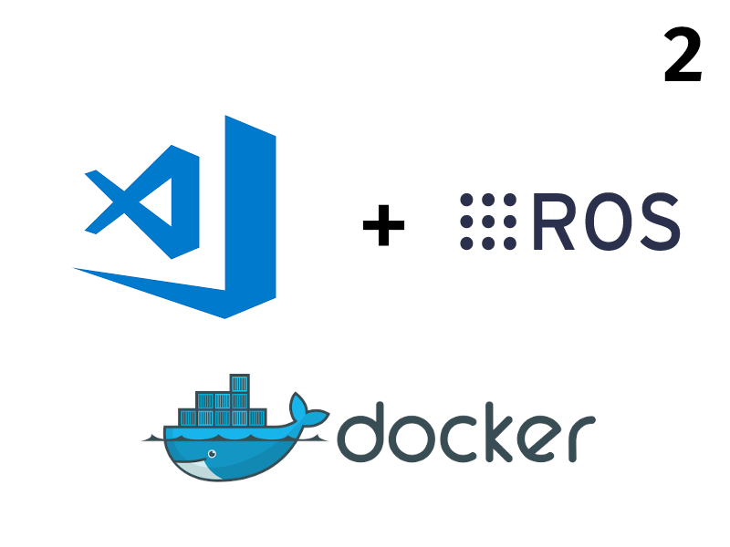
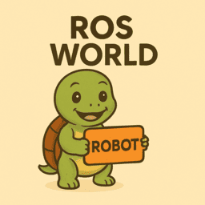
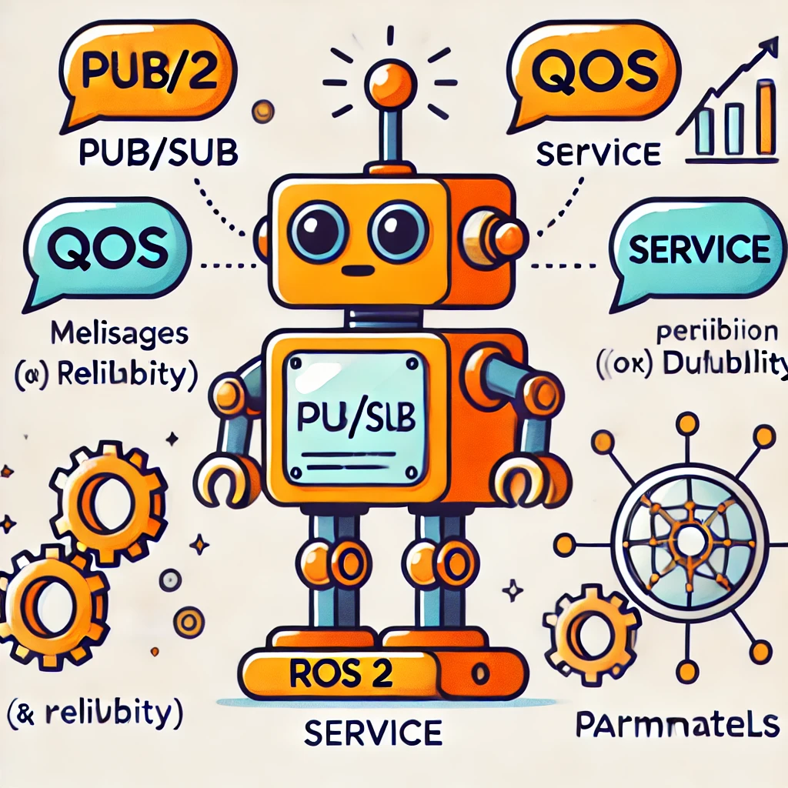
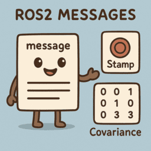

# ROS

    

            <a href="python">
                
                
Python

            </a>
        

        

            <a href="ros_cpp">
                
                
C/CPP

            </a>
        

    

    <a href="ros_eco">
        
            
ROS Eco

            </a>
    

    

    <a href="dev_environment">
        
        
Dev/Build/Deploy Env.

        </a>
    

    

        <a href="ros_world">
        
        
ROS world

        </a>
    

     

        <a href="ros_basic" tooltip="">
        
        
ROS basic

        </a>
    

     

        <a href="ros_eco/urdf_xacro_gz_plugin/gazebo_harmonic" tooltip="">
        
        
ROS and Gazebo harmonic

        </a>
    

    

        <a href="ros2_messages" tooltip="">
        
        
ROS2 Messages

        </a>
    

    

        <a href="ros2_resource" tooltip="">
        
        
Resources

        </a>
    

