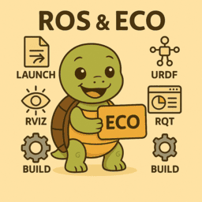

# ROS

    

            <a href="python">
                
                
Python

            </a>
        

        

            
            
C/CPP

        

    

    <a href="ros_eco">
        
            
ROS Eco

            </a>
    

    

    <a href="urdf_xacro">
        
        
URDF and XACRO

        </a>
    

    

        <a href="ros_world">
        
        
ROS world

        </a>
    

    

        <a href="zenoh">
        
        
Zenoh

        </a>
    

