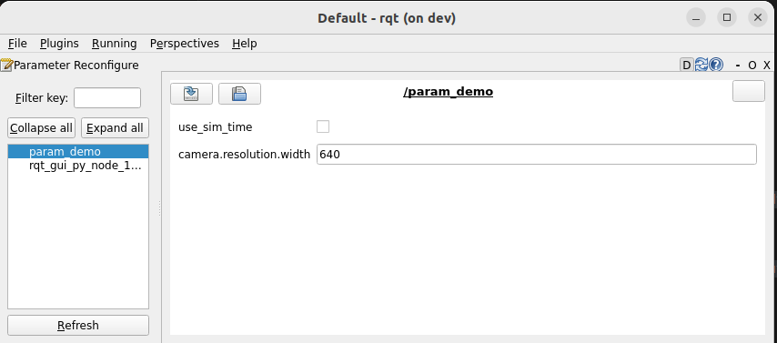

---
tags:
    - ros
    - python
    - parameters
---

# ROS2 parameters

## Parameters Hierarchy
- Declare node with parameters name that using dot(.) to describe the yaml struct
- Create struct yaml file

```yaml title="params.yaml"
/param_demo:
  ros__parameters:
    camera:
      resolution:
        width: 640
    use_sim_time: false
```

```python title="simple_node.py"
--8<-- "docs/ROS/python/ros_python/parameters/simple_parameter_demo.py"
```

```bash title="run node with parameter file"
ros2 run my_package my_node --ros-args --params-file params.yaml
```

### usage




```bash title="update from cli"
ros2 param set /param_demo camera.resolution.width 1200
```


---

!!! tip "update string node with numeric value"
    The failure happens only if we set the parameter value as string numeric (number in Quotation marks)

    ```python 
    # parameter declaration
    self.param1 = self.declare_parameter("param1", value="1")
    ```

    ```bash
    ros2 param set /param_demo param1 "12"
    # 
    Setting parameter failed: Wrong parameter type, expected 'Type.STRING' got 'Type.INTEGER'
    ```

    ```bash
    # use double quotation
    ros2 param set /param_demo param1 '"12"'
    ```
     