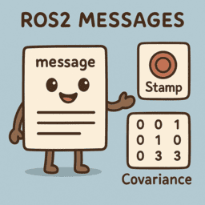

---
tags:
    - ros2
    - messages
    - interface
---

# ROS2 Messages

    

            <a href="message">
                
                
Message with stamped and covariance

            </a>
        

        

            <a href="custom_message">
                
                
Custom interface

            </a>
        

    

        <a href="#">
            
TBD

            </a>
    

