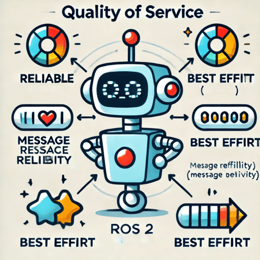
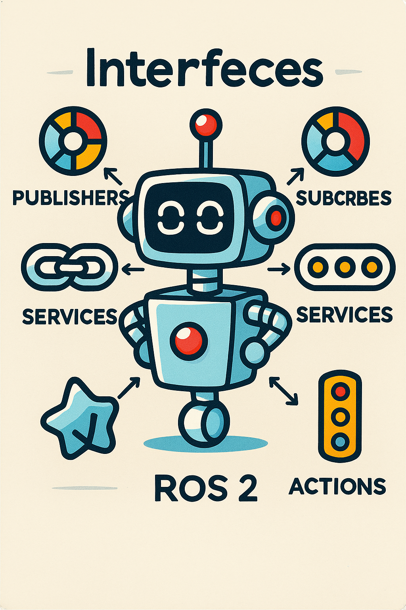

# ROS Basic

    

            <a href="ros_pub_sub">
                
                
Pub/Sub

            </a>
        

        

        <a href="ros_service">
            
            
Services

            </a>
        

    

    <a href="ros_qos">
        
            
QoS

            </a>
    

    

    <a href="ros_interface">
        
            
QoS

            </a>
    

