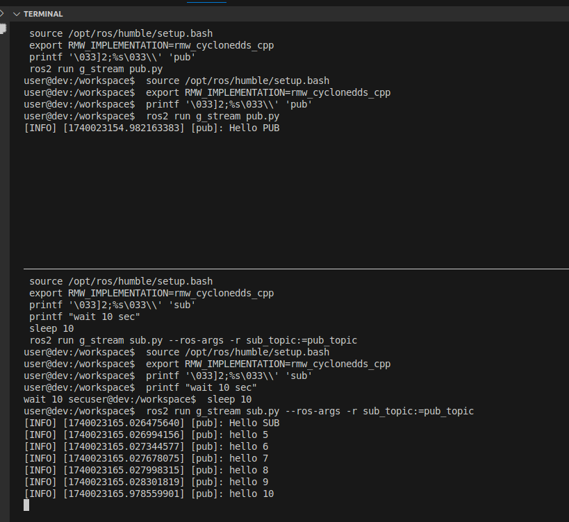
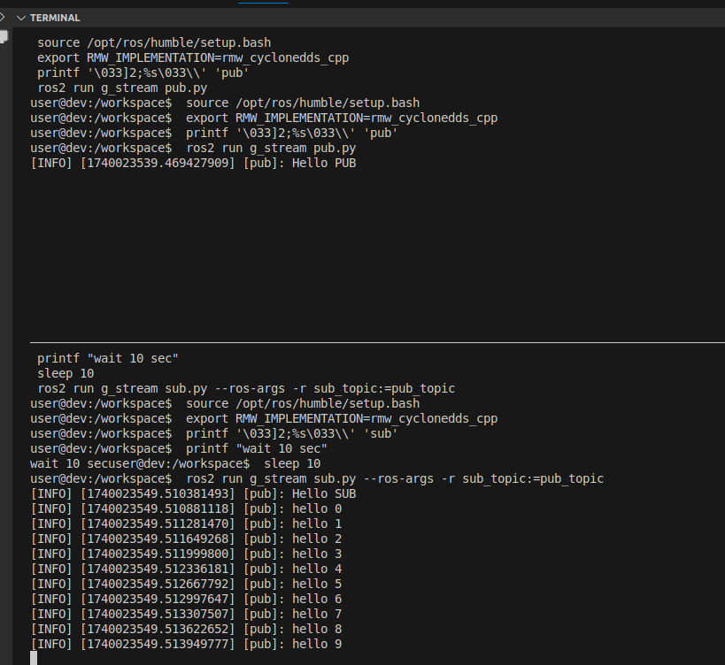

---
tags:
    - ros
    - qos
---

# Playing with ROS QoS


| QoS Parameter | Description | Options|
| ------------  | ----------  | ------ |
| Reliability|	Defines message delivery guarantees	| **RELIABLE** (guaranteed delivery, higher latency)  **BEST_EFFORT** (lower latency, no guarantee) |
| Durability|	Determines if old messages are available to late subscribers |	**VOLATILE** (no history, new subscribers get only new messages)   **TRANSIENT_LOCAL** (stores past messages for late joiners)
| History|	Controls how many messages are stored before being sent	|**KEEP_LAST(N)** (stores last N messages)  **KEEP_ALL** (stores all messages, limited by memory) |
| Depth |	Number of messages to store in KEEP_LAST(N)	| Any positive integer (e.g., 10, 100)|
| Deadline|	Maximum allowed time between consecutive messages	| Duration (e.g., 1s, 500ms); triggers an event if missed|
| Lifespan|	How long messages remain valid before being discarded	| Duration (e.g., 5s, 10s)|
| Liveliness|	Ensures publishers are active| **AUTOMATIC** (system-managed) **MANUAL_BY_TOPIC**  (publisher must assert liveliness)|
| Lease  Duration |	Maximum time a publisher can remain silent before being considered inactive	| Duration (e.g., 2s, 5s)|


## Demos
### Queue Depth message livespan and Durability

**Publisher QOS settings**
The publisher keep 10 messages for late joiners
The subscriber wait 10 sec and then subscriber to topic
It well get only 5 messages because the livespan of the message is set to 5 sec

- Durability: **TRANSIENT_LOCAL** stores past messages for late joiners
- livespan: 5sec pub side settings
- depth: 10
  
**Subscriber QOS settings**
The **queue depth** in the subscriber refer to the number of messages the subscriber can store before processing them
The durability must be transient local because in **VOLATILE** means it **won't receive old message**

- depth: 10
- durability: **TRANSIENT_LOCAL** 
- lifespan: #TODO: from my testing on cyclone it is not influence about the message life time
  
<details><summary>pub sub code</summary>

```python title="pub.py"
--8<-- "docs/ROS/ros_world/qos/pub.py"
```

```python title="sub.py"
--8<-- "docs/ROS/ros_world/qos/sub.py"
```

</details>



#### Publisher livespan
**Publisher QOS settings**

- Durability: **TRANSIENT_LOCAL** stores past messages for late joiners
- livespan: 10sec pub side settings
- depth: 10

```python title="" linenums="1" hl_lines="8"
qos_profile = QoSProfile(
    reliability=ReliabilityPolicy.RELIABLE,  # or BEST_EFFORT
    durability=DurabilityPolicy.TRANSIENT_LOCAL,  # or VOLATILE
    history=HistoryPolicy.KEEP_LAST,  # or KEEP_ALL
    depth=10,  # Queue depth
    liveliness=LivelinessPolicy.AUTOMATIC,  # or MANUAL_BY_TOPIC
)
qos_profile.lifespan = Duration(seconds=10, nanoseconds=0)  # Message lifespan
qos_profile.deadline = Duration(seconds=2, nanoseconds=0)  # Deadline duration
```



---

## TODO: finish qos with deadline register to SubscriptionEventCallbacks

<details><summary>QoS and deadline event</summary>
```
--8<-- "docs/ROS/ros_world/qos/sub_qos_deadline.py"
```
</details>