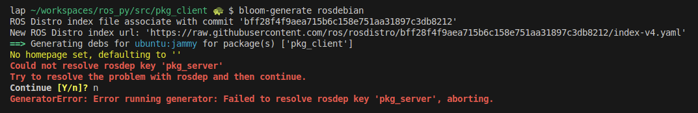

---
tags:
    - ros
    - rosdep
    - bloom
    - package.xml
---

# Package.xml, Rosdep, Bloom and other tools

## Package.xml
It provides metadata about the package, such as its name, version, dependencies, and other important information.

check REP 149 for more details [here](https://www.ros.org/reps/rep-0149.html)

### Dependencies
- **depend**: Specifies dependencies required to build and run the package.  A <depend> tag is equivalent to specifying <build_depend>, <build_export_depend> and <exec_depend>, all on the same package or key. The <depend> tag cannot be used in combination with any of the three equivalent tags for the same package or key name.
- **build_depend**: Specifies dependencies required to build the package (e.g., libraries needed at build time).
- **exec_depend**: Specifies runtime dependencies (e.g., libraries or tools needed when running the package).
- **test_depend**: Specifies dependencies needed for running tests.
doc_depend: Specifies dependencies related to documentation.
- **buildtool_depend**: Specifies build tools required for the package.
  
---

## Rosdep

rosdep is a command-line tool for installing system dependencies [more](https://github.com/ros-infrastructure/rosdep)


```bash title="install"
sudo apt-get install python3-rosdep
```

### commands
[resdep command reference](https://docs.ros.org/en/independent/api/rosdep/html/commands.html)


```bash title="init"
sudo rosdep init
rosdep update
```
- **init**: Download/update rosdep sources to  `/etc/ros/rosdep/sources.list.d/20-default.list`
- **update**: Download databases from the above sources and store them in `~/.ros/rosdep`


#### rosdep install
```bash title="install"
rosdep install --from-paths src --ignore-src -r -y
```

#### rosdep check
  check if the dependencies of package(s) have been met.

```bash title="check"
rosdep check --from-paths src --ignore-src -r
```


#### rosdep keys

list the rosdep keys that the packages depend on.

```bash
rosdep keys --from-path src
#
rqt_gui_py
ament_cmake_pytest
rqt_gui
rosidl_default_runtime
ament_lint_common
diagnostic_updater
rosidl_default_generators
ament_cmake
python3-pyqt5
ament_lint_auto
```

#### rosdep resolve python3-rosdep
resolve `<rosdeps>` to system dependencies

```bash
#rosdep resolve <rosdep>
rosdep resolve diagnostic_updater
#apt
ros-humble-diagnostic-updater
```

!!! note resolve not found
    for example `bluez-hcidump` not defined for `ubuntu` is
    ```bash
    rosdep resolve bluez-hcidump
    #
    WARNING: ROS_PYTHON_VERSION is unset. Defaulting to 3

    ERROR: No definition of [bluez-hcidump] for OS [ubuntu]

    No definition of [bluez-hcidump] for OS [ubuntu]
            rosdep key : bluez-hcidump
            OS name    : ubuntu
            OS version : jammy
            Data:
    debian:
                    - bluez-hcidump
                    fedora:
                    - bluez-hcidump
                    gentoo:
                    - net-wireless/bluez-hcidump
    ```
     

#### rosdep db

generate the dependency database and print it to the console.

```bash title="db"
rosdep db | grep diagnostic
#
diagnostic_msgs -> ros-humble-diagnostic-msgs
diagnostic_aggregator -> ros-humble-diagnostic-aggregator
diagnostic_common_diagnostics -> ros-humble-diagnostic-common-diagnostics
diagnostic_updater -> ros-humble-diagnostic-updater
diagnostics -> ros-humble-diagnostics
...
```

#### rosdep update

 update the local rosdep database based on the rosdep sources.

---

## Custom rosdep yaml file
The **yaml** schema define in [REP-111](https://www.ros.org/reps/rep-0111.html)

!!! note rosdistro
    The rosdistro repository contains the package information for ROS distributions. 
    found in git https://github.com/ros/rosdistro/tree/master
     

!!! note YAML format
     ```yaml
        ROSDEP_NAME:
            OS_NAME1:
                PACKAGE_MANAGER1:
                PACKAGE_ARGUMENTS_A
            OS_NAME2:
                PACKAGE_MANAGER2:
                PACKAGE_ARGUMENTS_A
      ```

      - package_manager: apt, pip
      - os_name: ubuntu, debian

    ```yaml
    adafruit-pca9685-pip:
        ubuntu:
            pip:
            packages: [adafruit-pca9685]
    ```
### Demo: Create custom rosdep yaml file

- Create yaml file named `custom_rosdep.yaml`
- Update rosdep sources
- Run rosdep update
- Check with rosdep resolve

```yaml title="custom_rosdeps.yaml"
# ROSDEP_NAME:
#   OS_NAME1:
#     PACKAGE_MANAGER1:
#       PACKAGE_ARGUMENTS_A

parameters_utils:
  ubuntu:
    path: /workspace/submodules/parameters_utils
    apt: ros-humble-parameters-utils
```

```bash
sudo sh -c 'echo "yaml file:///workspace/custom_rosdep.yaml" > /etc/ros/rosdep/sources.list.d/30-custom.list'
```

#### Update
```bash title="update" linenums="1" hl_lines="9"
rosdep update
#
reading in sources list data from /etc/ros/rosdep/sources.list.d
Hit https://raw.githubusercontent.com/ros/rosdistro/master/rosdep/osx-homebrew.yaml
Hit https://raw.githubusercontent.com/ros/rosdistro/master/rosdep/base.yaml
Hit https://raw.githubusercontent.com/ros/rosdistro/master/rosdep/python.yaml
Hit https://raw.githubusercontent.com/ros/rosdistro/master/rosdep/ruby.yaml
Hit https://raw.githubusercontent.com/ros/rosdistro/master/releases/fuerte.yaml
Hit file:///workspace/custom_rosdep.yaml
```

#### Resolve
```bash title="resolve"
rosdep resolve parameters_utils
#apt
ros-humble-parameters-utils
```

---

## Bloom
A tool for helping release software into git-buildpackage repositories. [more](https://github.com/ros-infrastructure/bloom)

```bash title="install"
sudo apt-get install python3-bloom
sudo apt install python3-rosdep \
    fakeroot \
    debhelper \
    dh-python
```

```bash
bloom-generate rosdebian
```



- Add custom_rosdep.yaml to workspace
- Update rosdep sources
- Run rosdep update

```yaml title="custom_rosdeps.yaml"
pkg_server:
  ubuntu:
    apt: ros-humble-pkg-server
```

```bash title="30-custom.list"
yaml file://<workspace full path to yaml file>/custom_rosdep.yaml
```

```bash
# run again
bloom-generate rosdebian
```


```bash title="build deb"
fakeroot debian/rules binary
```

#### Check deb package
```bash title="dpkg -I"
dpkg -I ros-humble-pkg-client_0.0.0-0jammy_amd64.deb 
#
 new Debian package, version 2.0.
 size 6390 bytes: control archive=1189 bytes.
     233 bytes,     9 lines      control              
    2650 bytes,    27 lines      md5sums              
 Package: ros-humble-pkg-client
 Version: 0.0.0-0jammy
 Architecture: amd64
 Maintainer: user <robo2020@gmail.com>
 Installed-Size: 62
 Depends: ros-humble-pkg-server
 Section: misc
 Priority: optional
 Description: TODO: Package description
```


---

## Tools

!!! note git-buildpackage
    git-buildpackage is a tool that helps you build Debian packages from a git repository. [more](https://honk.sigxcpu.org/piki/projects/git-buildpackage/)

---

## References
- [How to release a ROS 2 binary package](https://www.theconstruct.ai/how-to-release-a-ros-2-binary-package-part-3/)
- [to read](https://discourse.ros.org/t/how-to-create-debian-package-for-ros-2/19673)

## Todo: learn more

