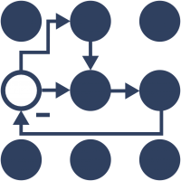

# ROS Eco system

Ros packages and tools that are used in the ROS eco system.

    

        <a href="launch">
            
            
ROS2 launch

        </a>
    

    

        <a href="python">
            
            
ROS2 Control

        </a>
    

    

        <a href="packages">
            
            
ROS2 Packages

        </a>
    

    

    

        <a href="launch">
            
            
launch

        </a>
    

