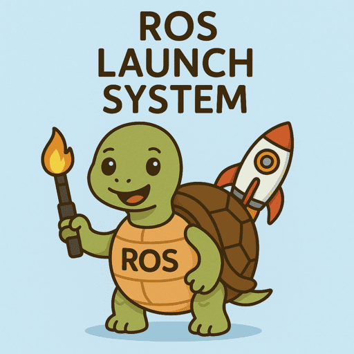

# ROS Eco system

Ros packages and tools that are used in the ROS eco system.

    

        <a href="launch">
            
            
ROS2 launch

        </a>
    

    

        <a href="packages">
            
            
ROS2 Packages

        </a>
    

    

        <a href="ros_bag">
            
            
ROS2 Bag

        </a>
    

   

           <a href="urdf_xacro_gz_plugin">
               
               
URDF, XACRO and Gazebo

               </a>
           

    

           <a href="build_system">
               
               
Build System

               </a>
           

    

           <a href="rviz_rqt">
               
               
rviz, rqt and other tools

               </a>
           

   

        <a href="ros_hardware">
            
            
ROS Hardware

            </a>
    

