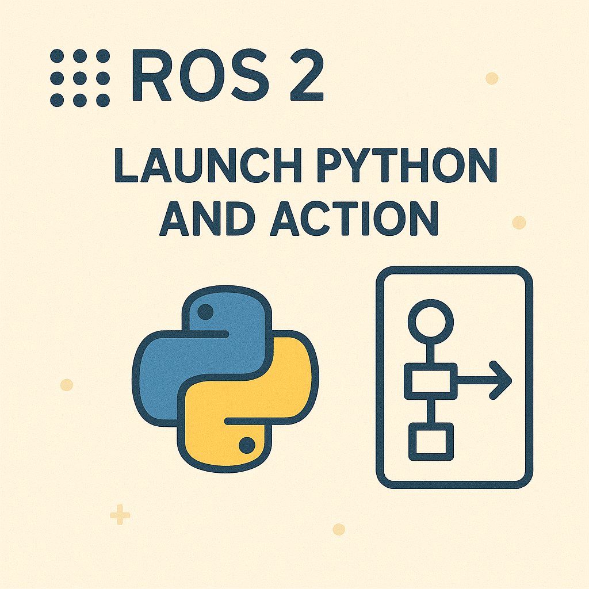
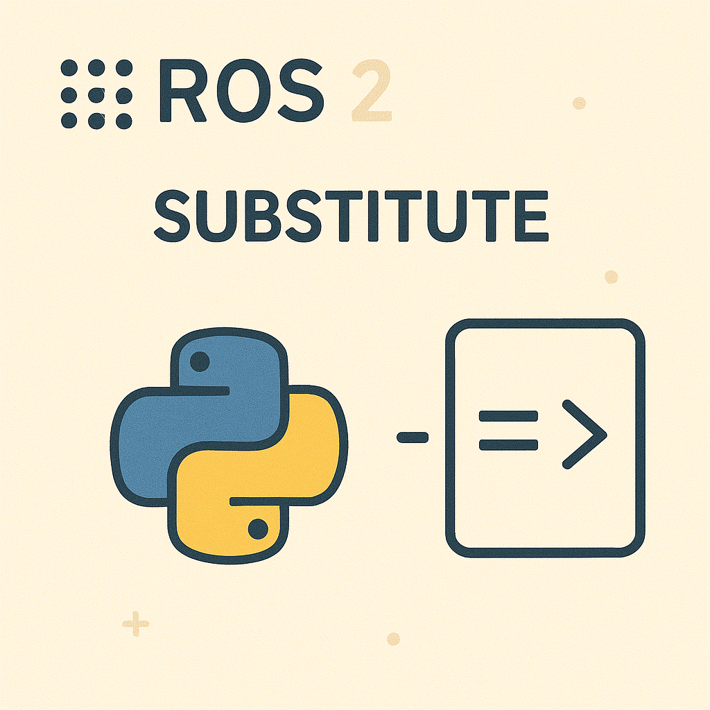
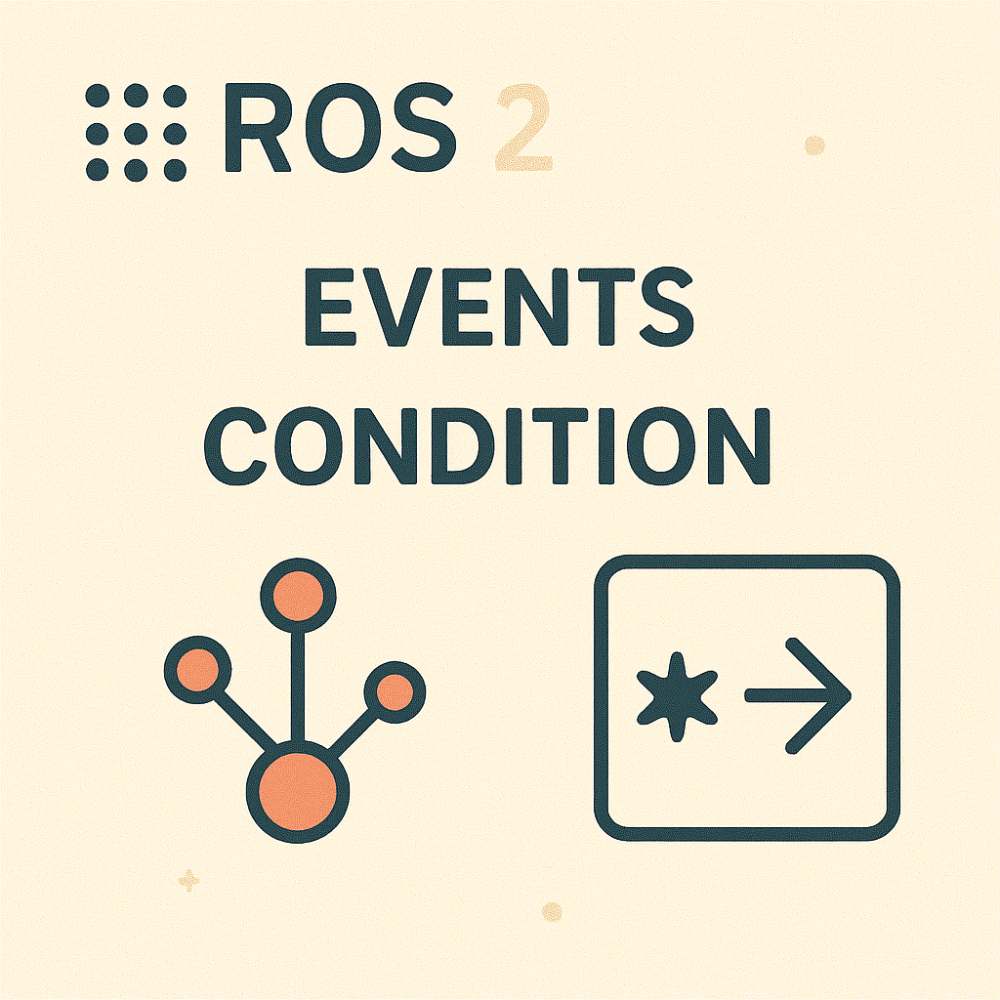

---
tags:
  - ros
  - launch
---
{{ page_folder_links() }}

# ROS2 launch
Launch system is used to start multiple nodes and configure their execution. The Python-based launch system (launch_ros) provides flexibility through Python scripts.


<div class="grid-container">
        <div class="grid-item">
        <a href="launch_actions">
            
            <p>Actions</p>
             </a>
        </div>
    <div class="grid-item">
        <a href="launch_substitute">
        
        <p>Substitute</p>
        </a>
    </div>
    <div class="grid-item">
        <a href="launch_events_and_condition">
        
        <p>Events and condition</p>
        </a>
    </div>
     <div class="grid-item">
        <a href="gazebo">
        <p>Gazebo</p>
        </a>
    </div>

</div>

## Minimal example
```python title="minimal launch file to run ros2 node"
from launch import LaunchDescription
from launch_ros.actions import Node

def generate_launch_description():
    ld = LaunchDescription()

    node = Node(
        package='your_package_name',
        executable='your_node_executable',
        name='your_node_name',
        output='screen'
    )

    ld.add_action(node)
    
    return ld
```

```cmake title="cmake copy launch to share"
install(DIRECTORY launch/
  DESTINATION share/${PROJECT_NAME}/launch
)
```

## ROS2 Launch system API


- **launch.substitutions**: Tools for dynamic values, e.g.:
    - LaunchConfiguration: References launch arguments.
    - TextSubstitution: Inserts static text.
    - PythonExpression: Evaluates Python expressions.
- **launch.conditions**: Conditional execution (e.g., IfCondition, UnlessCondition).

- [DeclareLaunchArgument and LaunchConfiguration](launch_config_and_argument.md)
- [PathJoinSubstitution](launch_path_and_paramfile.md)
- [IncludeLaunchDescription](launch_include_demo.md)
- [EnvironmentVariable](environment_variable.md)
- [Conditions]()
- [events]()