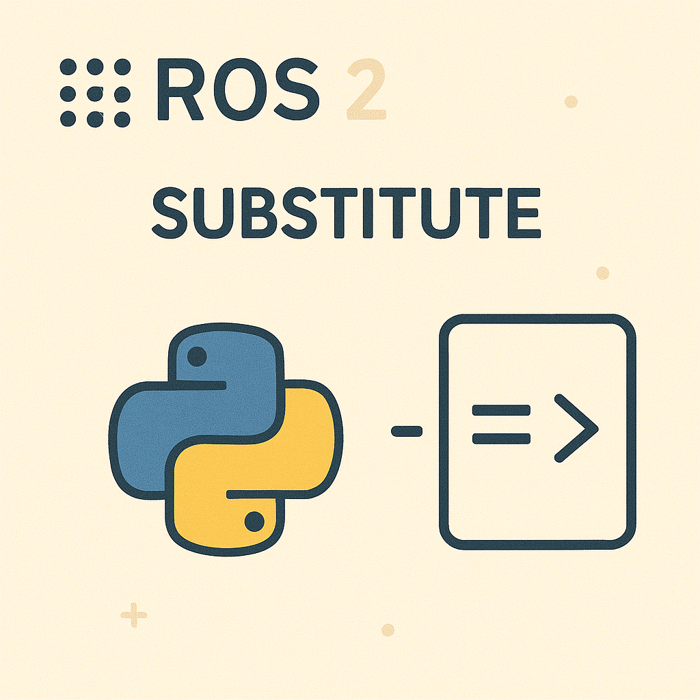

{{ page_folder_links() }}

<div class="grid-container">
        <div class="grid-item">
        <a href="launch_actions">
            
            <p>Actions</p>
             </a>
        </div>
    <div class="grid-item">
        <a href="launch_substitute">
        
        <p>Substitute</p>
        </a>
    </div>
    <div class="grid-item">
        <a href="launch_events_and_condition">
        
        <p>Events and condition</p>
        </a>
    </div>
</div>

## Demos

<div class="grid-container">
     <div class="grid-item">
        <a href="gazebo">
        <p>Gazebo</p>
        </a>
    </div>
    <div class="grid-item">
        <a href="rviz">
        <p>Rviz</p>
        </a>
    </div>
    <div class="grid-item">
        <a href="process">
        <p>Process</p>
        </a>
    </div>

</div>

---

A Python launch file is not a script.
It is a description factory that build **declarative event graph**


1. imports your launch file
2. calls generate_launch_description()
3. builds a graph of actions
4. executes that graph asynchronously

Anything that happens before step 3 is configuration time.
Anything that happens after is launch runtime.


```
Python import
   ↓
generate_launch_description()
   ↓
LaunchDescription created
   ↓
--------------------------------
Runtime starts
   ↓
Actions executed
   ↓
Nodes/processes run
   ↓
Events handled
   ↓
Shutdown

```

---

### Demo: Example of launch life cycle

```python
from launch import LaunchDescription
from launch.actions import DeclareLaunchArgument, LogInfo, RegisterEventHandler
from launch.substitutions import LaunchConfiguration
from launch_ros.actions import Node
from launch.event_handlers import OnProcessExit

def generate_launch_description():
    ld = LaunchDescription()

    # ---- Substitution ----
    node_name_arg = DeclareLaunchArgument(
        'node_name',
        default_value='my_talker'
    )

    node_name = LaunchConfiguration('node_name')

    node = Node(
        package='demo_nodes_cpp',
        executable='talker',
        name=node_name,
        output='screen'
    )

    # ---- Runtime logging ----
    ld.add_action(node_name_arg)
    ld.add_action(LogInfo(msg=['Launching node: ', node_name]))

    # ---- Event handler ----
    ld.add_action(
        RegisterEventHandler(
            OnProcessExit(
                target_action=node,
                on_exit=[
                    LogInfo(msg=['Node exited: ', node_name])
                ]
            )
        )
    )

    ld.add_action(node)
    return ld


```

- Python code → describe
- Actions → do
- Substitutions → resolve at runtime
- Event handlers → react


| Concept                 | What it is                              |
| ----------------------- | --------------------------------------- |
| `Node`                  | An **action** that starts a ROS process |
| `LaunchConfiguration`   | A **runtime placeholder**               |
| `DeclareLaunchArgument` | Makes a substitution configurable       |
| `LogInfo`               | Runtime logging action                  |
| `OnProcessExit`         | Event emitted by launch                 |
| `RegisterEventHandler`  | Reaction to an event                    |
