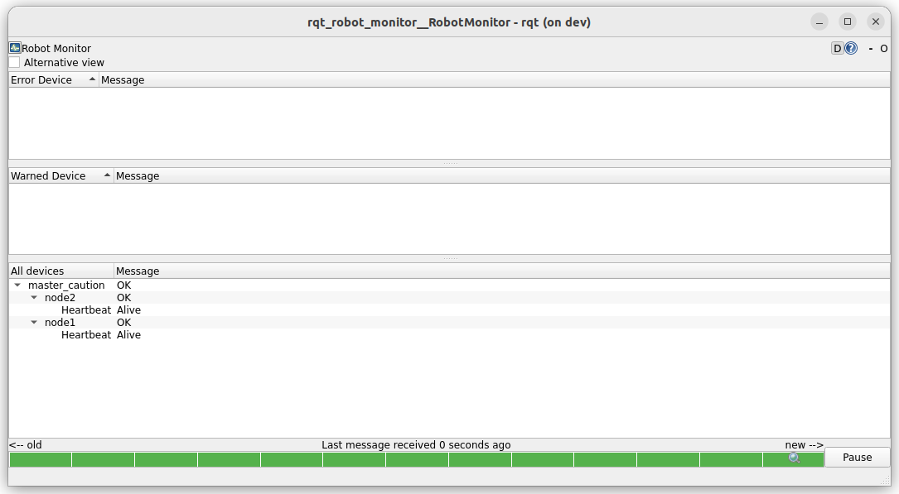
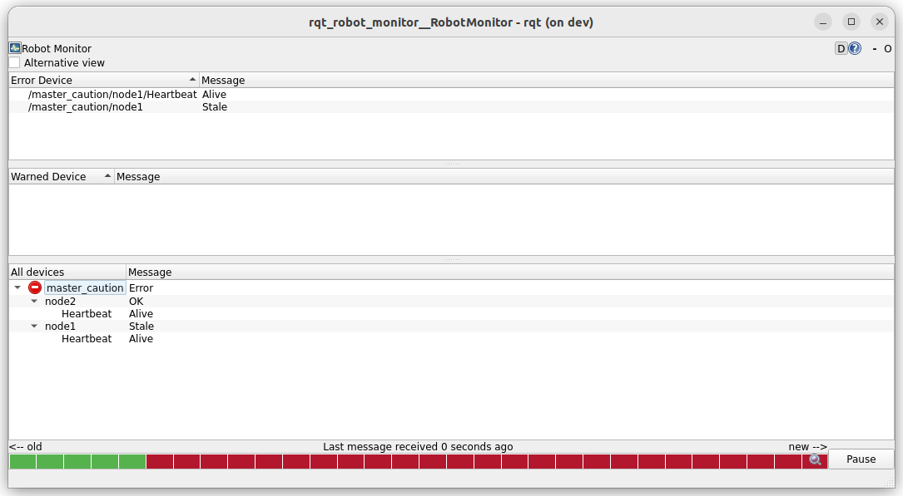
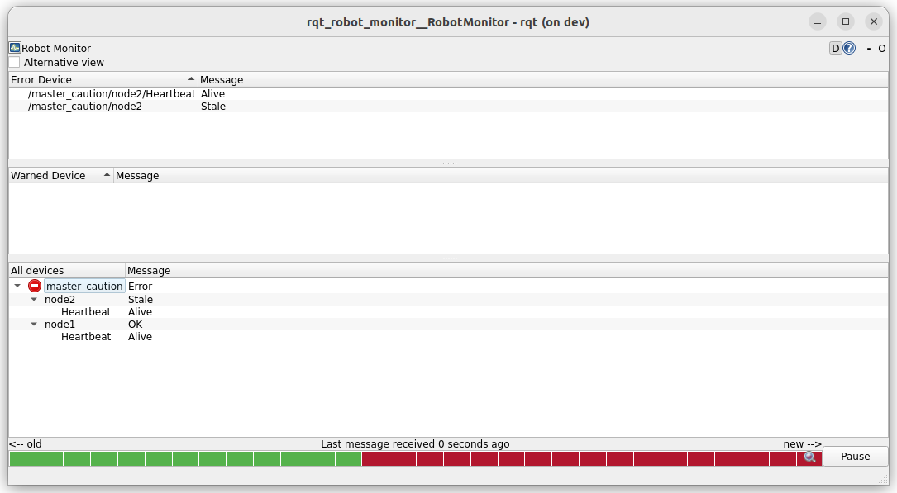
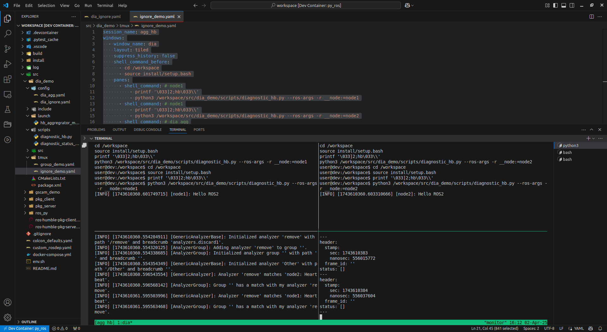

---
tags:
    - ros
    - diagnostic
    - aggregator
---

# Diagnostic aggregator

The Diagnostic Aggregator in ROS 2 is a tool designed to organize and categorize diagnostic messages efficiently. It helps in monitoring system health by grouping diagnostic messages into a structured hierarchy, making it easier to analyze the status of different components. it's subscribe to `/diagnostic` topic and publish to `/diagnostic_agg` topic.

```yaml
diagnostic_aggregator:
  ros__parameters:
    analyzers:
     
      sensors:
        type: "diagnostic_aggregator/GenericAnalyzer"
        path: "Sensors"
        startswith: ["/sensors"]
        expected: ["/sensors/camera", "/sensors/lidar"]
      
      motors:
        type: "diagnostic_aggregator/GenericAnalyzer"
        path: "Motors"
        startswith: ["/motors"]
        expected: ["/motors/left_wheel", "/motors/right_wheel"]
      
      system:
        type: "diagnostic_aggregator/GenericAnalyzer"
        path: "System"
        contains: ["temperature", "battery"]
```

- **path**: Defines the category name in the aggregated output.
- **startswith**: Groups diagnostics messages that start with a certain prefix.
- **expected**: Lists expected diagnostic topics (useful for error checking).
- **contains**: Groups messages that contain a specific word.

### expected

The expected parameter in the aggregator checks for the presence of specific name values inside the messages published to /diagnostics.

!!! note "stale"
    In diagnostic_aggregator, stale severity is the severity level assigned to a diagnostic status when a message is not received within the configured timeout. This helps in detecting missing diagnostics.
     
--- 

## Demo: Stale HB message

- Run node with heartbeat diagnostic
- Run Aggregator
- Run Monitor
- When stop the heartbeat , the aggregator alert on staled message


<details>
  <summary>heartbeat node</summary>

```python
--8<-- "docs/ROS/ros_eco/packages/diagnostics/diagnostic_tasks/code/diagnostic_heartbeat_demo.py"
```
</details>

```bash title="terminal1: heartbeat node1"
python3 /workspace/src/dia_demo/scripts/diagnostic_hb.py --ros-args -r __node:=node1
```

```bash title="terminal2: heartbeat node2"
python3 /workspace/src/dia_demo/scripts/diagnostic_hb.py --ros-args -r __node:=node2
```

```bash title="terminal3: diagnostics aggregator"
ros2 run diagnostic_aggregator aggregator_node --ros-args --params-file /workspace/src/dia_demo/config/dia_agg.yaml
```

```bash title="terminal4: monitor"
ros2 run rqt_robot_monitor rqt_robot_monitor
```

[downaload tmuxp script to run all above terminals](code/demo1_tmux_launch.yaml)

---

<details>
  <summary>Aggregator config</summary>

```yaml title="config/dia_agg.yaml"
analyzers:
  ros__parameters:
    analyzers:
      master_caution:
        type: 'diagnostic_aggregator/AnalyzerGroup'
        path: master_caution
        analyzers:
          node_hb:
            type: diagnostic_aggregator/GenericAnalyzer
            path: node1
            find_and_remove_prefix: ["node1: "]
            expected: [ 'node1: Heartbeat']
            timeout: 2.0
          node2:
            type: diagnostic_aggregator/GenericAnalyzer
            path: node2
            find_and_remove_prefix: ["node2: "]
            expected: [ 'node2: Heartbeat']
            timeout: 2.0
```
</details>




- Node 1 stop running


- Node 2 stop running



---

## Demo: Ignore messages

- Use to heartbeat from previous demo
- Run with new configuration
- Echo topic `diagnostics_agg`

<details>
  <summary>config</summary>

```yaml
analyzers:
  ros__parameters:
    analyzers:
      discard1:
        type: diagnostic_aggregator/DiscardAnalyzer
        path: "remove"
        startswith:
          - "node1"
          - "node2"

```
</details>


### usage

[Download tmuxp script to run the demo](code/demo_tmux_discard.yaml)





!!! tip "empty diagnostic_agg topic"
     


