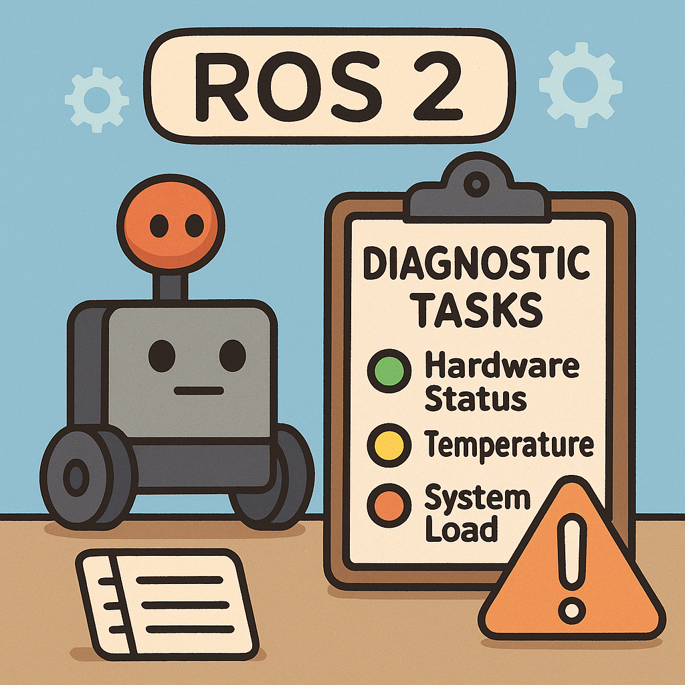
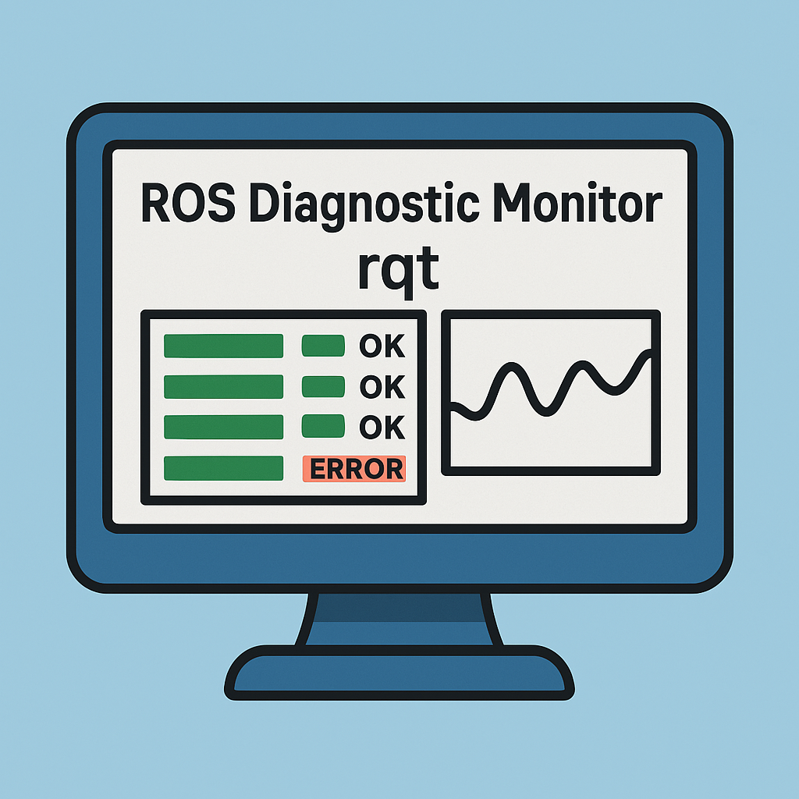
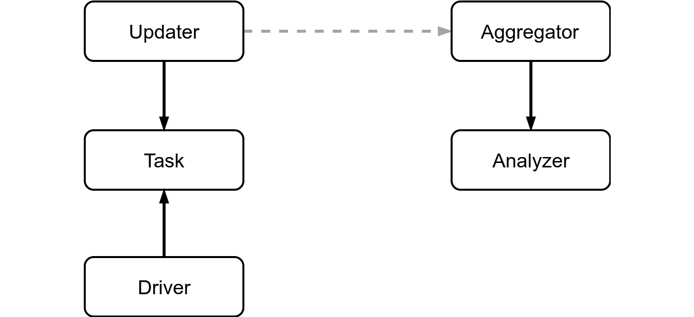
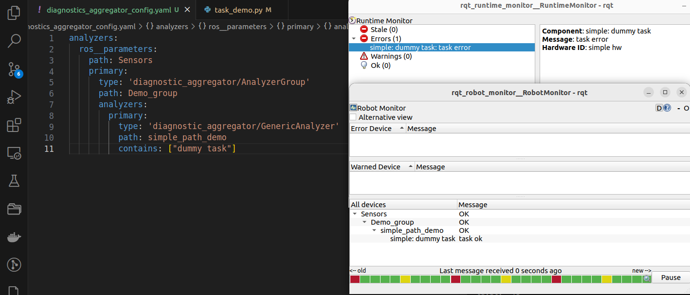

---
tags:
    - ros
    - diagnostics
---

# ROS diagnostics

ROS diagnostics gives you the ability to monitor your system. There are two components in its architecture:

- **diagnostic_updater**
- **diagnostic_aggregator**
  
  The **diagnostic_updater** publishes diagnostic status messages on the `/diagnostics` topic, and the **aggregator** listens to these statuses, aggregates them, and publishes the results on the `/diagnostics_agg` topic.

## diagnostic_updater
Provide an easy way to publish diagnostic information from node 

## diagnostic_aggregator
The aggregator collects, categorizes, and groups the statuses from all the system components. You can take a look at what is being published on the /diagnostics and /diagnostics_agg topics with the rqt_runtime_monitor and rqt_robot_monitor tools

<div class="grid-container">
     <div class="grid-item">
            <a href="diagnostic_tasks">
            
            <p>Diagnostic Tasks</p></a>
        </div>
    <div class="grid-item">
       <a href="diagnostic_aggregator">
            
            <p>Diagnostic aggregator</p></a>
    </div>
    <div class="grid-item">
        <a href="diagnostic_monitor">
            
            <p>Diagnostic monitor</p></a>
    </div>
   </div>

## install

```bash
sudo apt update
sudo apt install -y \
  ros-humble-diagnostic-updater \
  ros-humble-diagnostic-aggregator \
  ros-humble-diagnostic-msgs \
  ros-humble-diagnostic-common-diagnostics

# rqt
sudo apt install ros-humble-rqt-robot-monitor
sudo apt install ros-humble-rqt-runtime-monitor
```

### diagnostics_msg

- [DiagnosticStatus.msg](https://docs.ros2.org/foxy/api/diagnostic_msgs/msg/DiagnosticStatus.html)
- [DiagnosticArray](https://docs.ros2.org/foxy/api/diagnostic_msgs/msg/DiagnosticArray.html)

```
octet OK=0
octet WARN=1
octet ERROR=2
octet STALE=3
octet level
string name
string message
string hardware_id
diagnostic_msgs/msg/KeyValue[] values
```

### diagnostic_aggregator
Aggregator is a node that subscribes to `/diagnostics`, processes it and republishes aggregated data on `/diagnostics_agg`.

The aggregator creates a series of analyzers to handle incoming `DiagnosticStatus`

[API](https://docs.ros.org/en/humble/p/diagnostic_aggregator/generated/classdiagnostic__aggregator_1_1Aggregator.html#class-documentation)





---



---

## Demos
- [Diagnostic status function - - minimal implementation as diagnostic function](diagnostic_status_function.md)
- [DiagnosticTask class - minimal implementation as diagnostic task class](diagnostic_task_demo.md)
- [Builtin tasks (FrequencyStatus)](diagnostic_builtin_demo.md)
- [Remove task](diagnostic_remove_task_demo.md)
- [Composite task](diagnostic_composite.md)

---
# Reference
- [REP-107 Diagnostic System for Robots Running ROS](https://www.ros.org/reps/rep-0107.html)
- [ros diagnostic](https://nlamprian.me/blog/software/ros/2018/03/21/ros-diagnostics/)
- [wiki](https://wiki.ros.org/diagnostics)
- [python example](https://github.com/ros/diagnostics/blob/ros2/diagnostic_updater/diagnostic_updater/example.py)
### projects to check
- [rviz_2d_overlay_plugins](https://github.com/teamspatzenhirn/rviz_2d_overlay_plugins))

