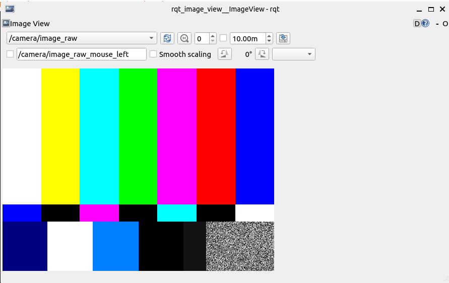

---
tags:
    - ros
    - gscam
    - gstreamer
---

# GSCAM

ROS Package for broadcasting `gstreamer` video stream via ROS2 camera API, publish video as `sensors_msgs/Image` with frame_id and timestamp

## Demo

!!! note "gstreamer pipe"
    input gstreamer pipe can set by environment variable `GSCAM_CONFIG` or ros parameter `gscam_config`
     
```bash
export GSCAM_CONFIG="videotestsrc ! video/x-raw,width=640,height=480,framrate=10/1 ! videoconvert"

#
ros2 run gscam gscam_node

# 
ros2 run rqt_image_view rat_image_view
```



---

### More control

#### QOS
Run with parameter `use_sensor_data_qos:=true` to publish as `best_effort` qos

```bash
ros2 run gscam gscam_node --ros-args \
-p use_sensor_data_qos:=true \
-p gscam_config:="videotestsrc pattern=basll ! video/x-raw,width=640,height=480,framrate=10/1 ! videoconvert"

```
     
---     

### Camera info
gscam using `camera_info_manager` package to control `camera_info` topic , we can change the data using `set_camera_info` service

The init `camera_info` can control by parameter `camera_info_url`

```bash
ros2 run gscam gscam_node --ros-args \
-p use_sensor_data_qos:=true \
-p camera_info_url:=file:///<absolute>/gscam_demo/config/uncalibrated_parameters.ini

```

<details>
<summary>camera calibration file</summary>
```
--8<-- "docs/ROS/ros_eco/packages/gscam/uncalibrated_parameters.ini"
```
</details>

[Download ini file](uncalibrated_parameters.ini)


#### update service
The `/set_camera_info` service is part of [camera_info_manager](http://wiki.ros.org/camera_info_manager)


!!! note 
    The service update/save the data to source ini file
     

```python
--8<-- "docs/ROS/ros_eco/packages/gscam/camera_info_set_node.py"
```


