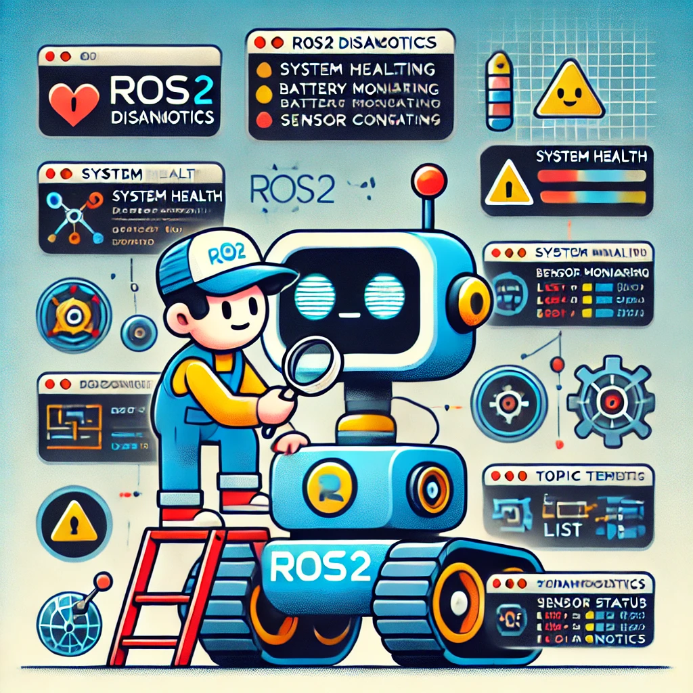

---
tags:
    - ros
    - packages

---
{{ render_nav_path }}
# ROS Eco system

Ros packages and tools that are used in the ROS eco system.

    

        <a href="diagnostics">
            
            
Diagnostics

        </a>
    

    

        <a href="generate_parameter_library">
            
            
parameters generate

        </a>
    

    

        
TBD

    

    

        <a href="mavros">
            
            
Mavros

        </a>
    

    

        
TBD

    

    

        
TBD

    

---

## Gscam
ROS Package for broadcasting gstreamer video stream via ROS2 camera API,
[more](gscam)

---

## Message_filters
Message_filters is a collection of message "filters" which take messages in. and may or may not output the message at some time in the future, depending on a policy defined for that filter. [more](ros_package_message_filter.md)

---

## topic_tools
Tools for directing, throttling, selecting, and otherwise manipulating ROS 2 topics at a meta-level. These tools do not generally perform serialization on the streams being manipulated, instead acting on generic binary data using rclcpp's GenericPublisher and GenericSubscription
[ros_packages_topic_tools](topic_tools)