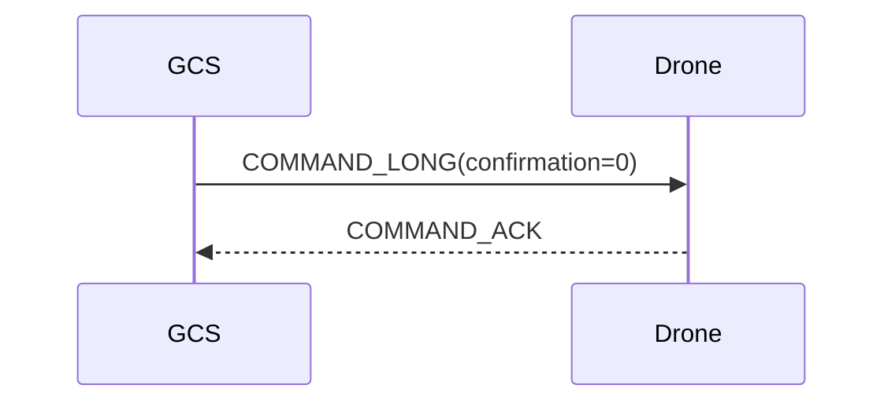

{{ page_folder_links() }}

Expose mavlink [command_long(76)](https://mavlink.io/en/messages/common.html#COMMAND_LONG) and [command_int(75)](https://mavlink.io/en/messages/common.html#COMMAND_INT), and wrap multiple service that use this command like

- arming
- set_home
- takeoff
- land
- trigger_control
- trigger_interval
- vtol_transition
- land_local
- takeoff_local

This service send the command and wait for acknowledge

---

## Mavlink ()
Check [mavlink command protocol](https://mavlink.io/en/services/command.html)

### Command_ACK (77)
Report status of a command. Includes feedback whether the command was executed.

for example

- 0: Command accept (success)
- 3: unsupported command
- 4: failed

check [MAV_RESULT](https://mavlink.io/en/messages/common.html#MAV_RESULT) for more result values

---

    

        <a href="set_home">
            
set_home

        </a>
    

    

        <a href="do_set_servo">
            
do_set_servo

        </a>
    

