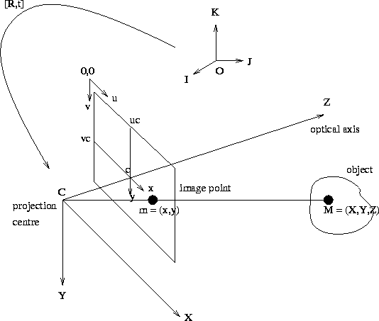

---
tags:
    - ros
    - mavros
    - gimbal
---

{{ page_folder_links() }}


## MAvlink (gimbal protocol v2)
[The gimbal protocol](https://mavlink.io/en/services/gimbal_v2.html)  allows MAVLink control over the attitude/orientation of cameras (or other sensors) mounted on the drone

- Gimbal Device: the actual gimbal device, hardware and software.
- Gimbal Manager: software to deconflict gimbal messages and commands from different sources, and to abstract the capabilities of the Gimbal Device from gimbal users.

|   |   |   |
|---|---|---|
| GIMBAL_DEVICE_ATTITUDE_STATUS  | ~/device/attitude_status  | Send out its attitude and status at a regular rate, e.g. 10 Hz This message is a meant as broadcast |
| GIMBAL_MANAGER_STATUS  |   | Current status about a high level gimbal manager. This message should be broadcast at a low regular rate (e.g. 5Hz).  |
| GIMBAL_DEVICE_INFORMATION  |   | Information about a low level gimbal. This message should be requested by the gimbal manager or a ground station using MAV_CMD_REQUEST_MESSAGE.  |
| GIMBAL_MANAGER_INFORMATION  |   | Information about a high level gimbal manager. This message should be requested by a ground station using `MAV_CMD_REQUEST_MESSAGE`.  |
| GIMBAL_DEVICE_SET_ATTITUDE  |   | Low level message to control a gimbal device's attitude. This message is to be sent from the gimbal manager to the gimbal device component.  |
| GIMBAL_MANAGER_SET_ATTITUDE  |   | High level message to control a gimbal's attitude.   |
| GIMBAL_MANAGER_SET_PITCHYAW  |   | High level message to control a gimbal's pitch and yaw angles.   |


### GIMBAL_MANAGER_SET_ATTITUDE (282) 
[Mavlink](https://mavlink.io/en/messages/common.html#GIMBAL_MANAGER_SET_ATTITUDE)

| Field Name           | Type      | Units   | Values                      | Description                                                                                                                                                                             |
|----------------------|-----------|---------|------------------------------|-----------------------------------------------------------------------------------------------------------------------------------------------------------------------------------------|
| target_system        | uint8_t   |         |                              | System ID                                                                                                                                                                               |
| target_component     | uint8_t   |         |                              | Component ID                                                                                                                                                                            |
| flags                | uint32_t  |         | GIMBAL_MANAGER_FLAGS         | High level gimbal manager flags to use.                                                                                                                                                 |
| gimbal_device_id     | uint8_t   |         |                              | Component ID of gimbal device to address (or 1–6 for non-MAVLink gimbal), 0 for all gimbal device components. Send command multiple times for more than one gimbal (but not all).     |
|                      |           |         |                              | Messages with same value are from the same source (instance).                                                                                                                           |
| q                    | float[4]  |         |                              | Quaternion components: w, x, y, z. (1 0 0 0 is the null-rotation. The frame depends on whether the flag `GIMBAL_MANAGER_FLAGS_YAW_LOCK` is set)                                        |
| angular_velocity_x   | float     | rad/s   | invalid:NaN                  | X component of angular velocity. Positive is rolling to the right. `NaN` means ignore.                                                                                                  |
| angular_velocity_y   | float     | rad/s   | invalid:NaN                  | Y component of angular velocity. Positive is pitching up. `NaN` means ignore.                                                                                                           |
| angular_velocity_z   | float     | rad/s   | invalid:NaN                  | Z component of angular velocity. Positive is yawing to the right. `NaN` means ignore.                                                                                                   |


## Ardupilot
[Control a Gimbal / Camera Mount](https://ardupilot.org/dev/docs/mavlink-gimbal-mount.html)

```bash title="Running SITL with GIMBAL"
./arducopter --model quad --speedup 1 --slave 0 --default default.param --sim-address 127.0.0.1 -I0 --gimbal
```

### Params
Ardupilot support two gimbals 

| parameter  | default/setting  | description  |
|---|---|---|
| MNTx_ROLL_MAX/ MNTx_ROLL_MIN  |   |   |
| MNTx_PITCH_MAX/ MNTx_PITCH_MIN  |   |   |
| MNTx_YAW_MAX/ MNTx_YAW_MIN  |   |   |
| MNTx_RETRACT_X/Y/Z  |   |   |
| MNTx_NEUTRAL_X/Y/Z  |   |   |
|   |   |   |
|   |   |   |


### Gimbal Mode vs Control Mode

- **Gimbal Mode** = how the gimbal interprets the world (lock/follow/stabilize)
- **Control Mode** = how you command it (MAVLink, RC, ROI, scripts)

| Feature         | **Stabilize**                                     | **Lock**                                                    |
| --------------- | ------------------------------------------------- | ----------------------------------------------------------- |
| What it does    | Cancels out drone motion (vibrations, tilt)       | Maintains a fixed orientation in world coordinates          |
| Frame reference | Relative to **vehicle**                           | Relative to **world**                                       |
| Example usage   | Keeps video stable while drone moves              | Keeps camera pointed north even if drone turns              |
| Input source    | Uses IMU/gyro feedback to cancel motion           | Uses attitude + world frame input (e.g., target quaternion) |
| Updates?        | Still follows pilot commands / RC / MAVLink pitch | Ignores movement unless new command is sent                 |
| Use case        | Smooth footage                                    | Survey, inspection, target tracking                         |


---

!!! tip "SITL"
    ArduPilot uses the FLU frame for mount/gimbal orientation

    - Pitch = -90° → camera pitches upward (toward +Z, up)
    - Pitch = +90° → camera pitches downward (toward -Z, down)


### Camera centric coordinate system


#### Axis 
| Axis  | Direction (when facing forward through the lens) |
| ----- | ------------------------------------------------ |
| **X** | Right                                            |
| **Y** | Down (often, or up in some variants)             |
| **Z** | Forward (out of the lens)                        |


#### Rotational Axes
| Rotation  | Around Axis | Positive Direction                     |
| --------- | ----------- | -------------------------------------- |
| **Yaw**   | Z           | Turn right (CW when viewed from above) |
| **Pitch** | X           | Tilt up                                |
| **Roll**  | Y           | Tilt right                             |

### SITL(FLU) / HARDWARE(Camera-Centric)

| Aspect             | Camera-Centric               | FLU (Vehicle-Centric)                             |
| ------------------ | ---------------------------- | ------------------------------------------------- |
| Pitch +            | Camera tilts **up**          | Vehicle nose tilts **up** (camera looks **down**) |
| Used by            | Gimbal manufacturers, vision | ArduPilot SITL, PX4 internals                     |
| Orientation origin | Camera lens                  | Vehicle body center                               |
| Application        | Imaging, targeting           | Navigation, control                               |


---

- GIMBAL_DEVICE_ATTITUDE_STATUS (3hz)
- GIMBAL_MANAGER_STATUS(1hz)

---

## More terms

### Nadir and zenith


## Mavros

```
# add gimbal_control plugin
/mavros/**:
  ros__parameters:
    plugin_denylist:
      # common
      - '*'

    plugin_allowlist:
      - sys_time
      - sys_status
      - command
      - gimbal_control
```

|   |   |   |
|---|---|---|
| ~/device/get_info  | GIMBAL_DEVICE_INFORMATION  |   |
| ~/manager/get_info  | command_long  | Trigger manager/info  `/mavros/gimbal_control/manager/info`|
| ~/manager/configure  |   |   |
| ~/manager/pitchyaw  |   |   |
| ~/manager/set_roi  |   |   |
| ~/manager/camera_track  |   |   |
|   |   |   |


## GIMBAL_MANAGER_SET_ATTITUDE
Mavlink [GIMBAL_MANAGER_SET_ATTITUDE (282) ](https://mavlink.io/en/messages/common.html#GIMBAL_MANAGER_SET_ATTITUDE) High level message to control a gimbal's attitude. This message is to be sent to the gimbal manager , rate can be ignore by sending NaN.


---

## Code snippet to be move from here

```python
# Image point (u, v), image size, and camera intrinsics (fx, fy, cx, cy)
x_cam = (u - cx) / fx
y_cam = (v - cy) / fy
z_cam = 1.0

# 3D ray in camera frame
ray_camera = np.array([x_cam, y_cam, z_cam])
ray_camera /= np.linalg.norm(ray_camera)

# Convert to FLU/world frame (if needed)
ray_world = camera_to_world @ ray_camera  # If using TF or known pose

quat = look_at_quaternion(ray_world)

```

```
import numpy as np
from scipy.spatial.transform import Rotation as R

def look_at_quaternion(forward_target, up=np.array([0, 0, 1])):
    # Normalize direction
    z = forward_target / np.linalg.norm(forward_target)

    # Compute orthogonal axes
    x = np.cross(up, z)
    if np.linalg.norm(x) < 1e-5:
        # up and forward are aligned → default right vector
        x = np.array([1, 0, 0])
    x /= np.linalg.norm(x)
    y = np.cross(z, x)

    rot_matrix = np.vstack((x, y, z)).T  # FLU: forward=Z
    return R.from_matrix(rot_matrix).as_quat()  # [x, y, z, w]
```


```
you can interpolate quaternions with SLERP to smooth the motion
```

## This is the code i need

```
from geometry_msgs.msg import Quaternion
from scipy.spatial.transform import Rotation as R
import numpy as np

def correct_gimbal_quaternion(q_current, u, v, cx, cy, fx, fy):
    # Calculate angular error
    dx = (u - cx) / fx
    dy = (v - cy) / fy

    yaw_error = -dx
    pitch_error = -dy

    # Convert errors to rotation delta
    error_rot = R.from_euler('zy', [yaw_error, pitch_error])
    q_current_rot = R.from_quat(q_current)  # [x, y, z, w]

    q_new = q_current_rot * error_rot
    return q_new.as_quat()  # [x, y, z, w]

```