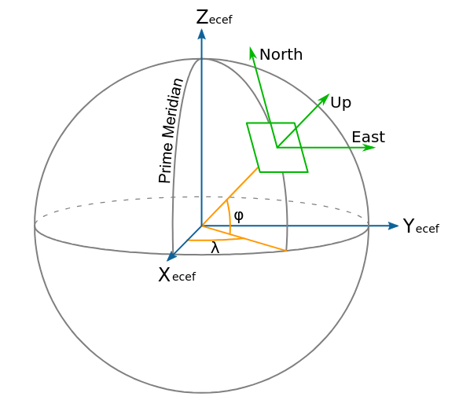
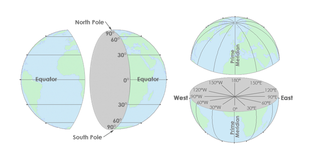
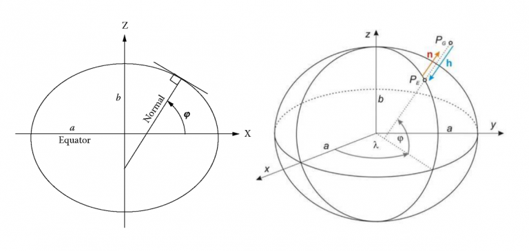

{{ page_folder_links() }}

!!! tip "ECEF Coordinate system"
    Earth-Centered, Earth-Fixed

    - **Origin**: Earth center of mass
    - **X-axis**: 
    - **Y-axis**
    - **Z-axis**: Point to the north pole
    - **latitude (ϕ)**:
    - **longitude (λ)** 
    
     

## Topics

### Publisher

| topic  |   |  |
|---|---|----|
| gp_lp_offset |
| gp_origin | GPS_GLOBAL_ORIGIN | 
| compass_hdg |
| rel_alt | | altitude above home position |
| local | GLOBAL_POSITION_INT | odometry |
| global | GLOBAL_POSITION_INT | NavSetFix |
| /raw/satellites |
| /raw/gps_vel | GPS_RAW_INT |
| /raw/fix | GPS_RAW_INT |


### Subscribers

| topic  |   |
|---|---|
| home_position/home |
| set_gp_origin |


## Mavlink

| mavlink                     | mavros topic(message) |
| --------------------------- | --------------------- |
| GLOBAL_POSITION_INT (33)   |   | 
| GPS_GLOBAL_ORIGIN (49) |  |
| GPS_RAW_INT (24)|  |
| LOCAL_POSITION_NED_SYSTEM_GLOBAL_OFFSET (89)| gp_lp_offset  |
| 


## 

```bash
# GLOBAL_POSITION_INT
ros2 service call /mavros/set_message_interval mavros_msgs/srv/MessageInterval "{\"message_id\": 33, \"message_rate\": 2 }"

#GPS_GLOBAL_ORIGIN
ros2 service call /mavros/set_message_interval mavros_msgs/srv/MessageInterval "{\"message_id\": 49, \"message_rate\": 2 }"
```


---

## Latitude, Longitude and Coordinate system



**Latitude (ϕ)** lines run east-west and are parallel to each other but measure north-north. So if you go north, latitude values increase. Finally, latitude values (Y-values) range between -90 and +90 degrees.

**Longitude (λ)** lines run north-south and measure east-west. They converge at the poles. And its X-coordinates are between -180 and +180 degrees.



---

### Demo

```
lat, lon
Tel Aviv → (32.0853° N, 34.7818° E)
```


!!! tip "bearing_deg"
    The bearing_deg is the direction of travel, measured in degrees clockwise from North:

    0° → North

    90° → East

    180° → South

    270° → West
     

#### Calc next point

```python title="calc next point using distance and bearing"
--8<-- "docs/ROS/ros_eco/packages/mavros/global_position/code/next_point.py"
```

```python title="calc distance and bearing between two points"
--8<-- "docs/ROS/ros_eco/packages/mavros/global_position/code/haversine.py"
```

---

## Datum
A datum in geodesy and mapping is a reference framework that defines the shape, size, and position of the coordinate system used to describe locations on Earth.

**WGS84** (World Geodetic System 1984) is one of the most important modern datums, is use by GPS navigation system.