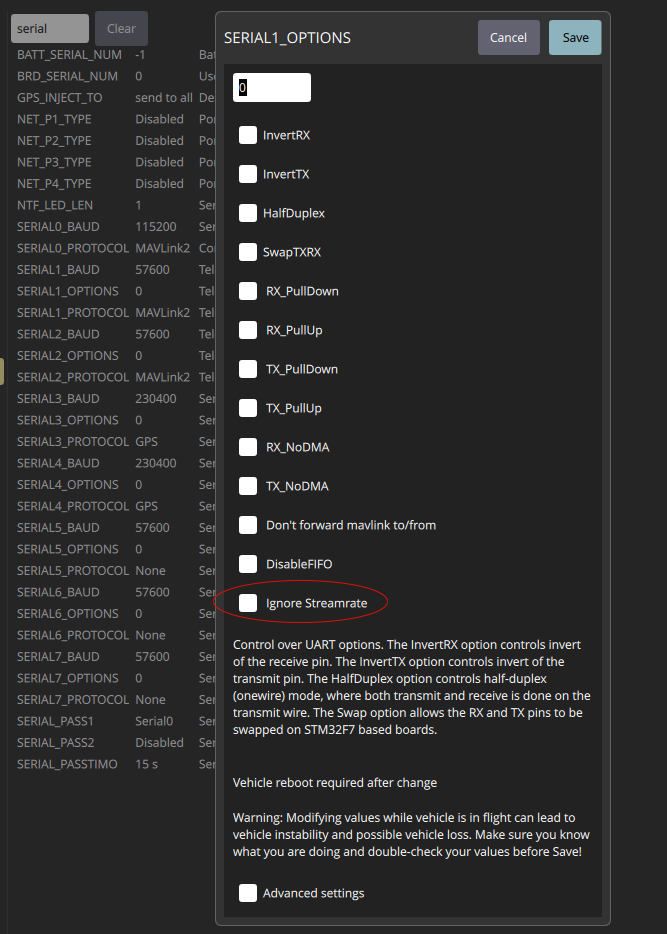
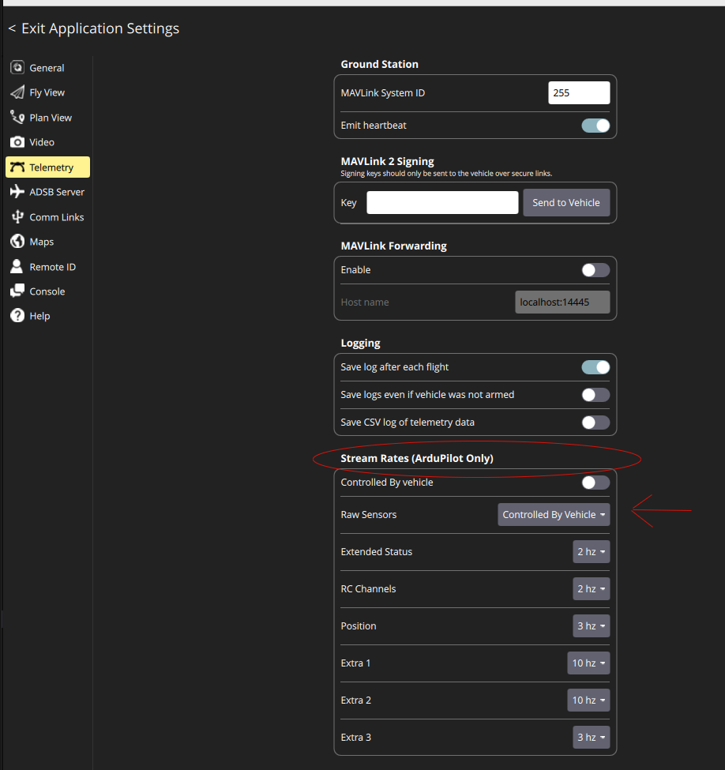

{{ page_folder_links() }}

MAVLink extendable communication node for ROS2.


## Connections url

- **Serial**: /path/to/serial/device[:baudrate]
- **Serial**: serial:///path/to/serial/device[:baudrate][?ids=sysid,compid]
- **UDP**: udp://[bind_host][:port]@[remote_host[:port]][/?ids=sysid,compid]
- **TCP** client: tcp://[server_host][:port][/?ids=sysid,compid]

```bash title="ardupilot connection"
ros2 launch mavros apm.launch fcu_url:=tcp://localhost:5760 gcs_url:=udp://@localhost:14550

```

```bash title="using node.launch connect to APM SITL and control pluginlist and config"
ros2 launch mavros node.launch \
fcu_url:=tcp://0.0.0.0:5760@ \
gcs_url:=udp://@127.0.0.1:14560 \
tgt_system:=1 \
tgt_component:=1 \
pluginlists_yaml:=plugins.yaml \
config_yaml:=config.yaml
```

```bash title="using node.launch connect to APM HW and control pluginlist and config"
ros2 launch mavros node.launch \
fcu_url:=/dev/ttyACM1:115200 \
gcs_url:=udp://@127.0.0.1:14560 \
tgt_system:=1 \
tgt_component:=1 \
pluginlists_yaml:=/workspace/src/ardupilot_bringup/config/plugins.yaml \
config_yaml:=/workspace/src/ardupilot_bringup/config/config.yaml
```

## Plugins

### sys_state

!!! tip "command plugin"
    sys_state depend on command plugin to get ardupilot version and 
    set_message_interval service 

| mavlink  | id  | description  |
|---|---|---|
| HEARTBEAT  | 0  | The heartbeat message shows that a system or component is present and responding.  |
| EVENT  | 410  |   |
| SYS_STATUS  | 1  | [mavlink common](https://mavlink.io/en/messages/common.html#SYS_STATUS)  |
| STATUSTEXT  | 253  | [mavlink common](STAhttps://mavlink.io/en/messages/common.html#STATUSTEXTTUSTEXT)  |
| BATTERY_STATUS  | 147  | [mavlink common](https://mavlink.io/en/messages/common.html#BATTERY_STATUS)  |
| ESTIMATOR_STATUS  | 230  | [mavlink common](https://mavlink.io/en/messages/common.html#ESTIMATOR_STATUS)  |
| REQUEST_DATA_STREAM  | 66  | [mavlink common](https://mavlink.io/en/messages/common.html#REQUEST_DATA_STREAM)  use by set_stream_rate service |

#### Parameters

| name  | default  | description  |
|---|---|---|
|conn_timeout |  10.0  | if no heartbeat for `conn_timeout` mavros set connection to **false** |
|disable_diag |  false  | Disabled node diagnostics (batt, system, mem , hw and sw)  |
|heartbeat_mav_type |  onboard_controller  | set heartbeat MAV_TYPE to FCU  |
|heartbeat_rate | 1.0   | control heartbeat rate to FCU  |
|min_voltage | vector   | Set minimal voltage to alert use in diagnostics  |
|qos_overrides./parameter_events.publisher.depth |    | TBD: ROS2 related  |
|qos_overrides./parameter_events.publisher.durability |    | TBD: ROS2 related  |
|qos_overrides./parameter_events.publisher.history |    | TBD: ROS2 related  |
|qos_overrides./parameter_events.publisher.reliability |    | TBD: ROS2 related  |
|start_type_description_service |    | TBD: ROS2 related service   |

#### Service

| mavlink  | default  | description  |
|---|---|---|
| set_mode  |   |   |
| set_stream_rate  |   |   |
| set_message_interval  |   | use command plugin  |
| vehicle_info_get  |   |   |


!!! tip "Streaming"
    We can control mavlink message RATE by group or by message id
    **set_stream_rate** service set rate for group for example: STREAM_RAW_SENSORS (1) STREAM_EXTRA1 (10) STREAM_EXTRA2(11) for complete list [Ardupilot](https://ardupilot.org/dev/docs/mavlink-requesting-data.html)

     






#### Mavlink messages send by plugin
##### Heartbeat
- Send heartbeat to FCU the rate control by `heartbeat_rate` parameter (0 disabled sending) , mavros send heartbeat with MAV_TYPE `ONBOARD_CONTROLLER` as default control by `heartbeat_mav_type` parameter

---
## 
- [Clock/Time Synchronisation](clock_time_sync.md)
- [Command](command.md)