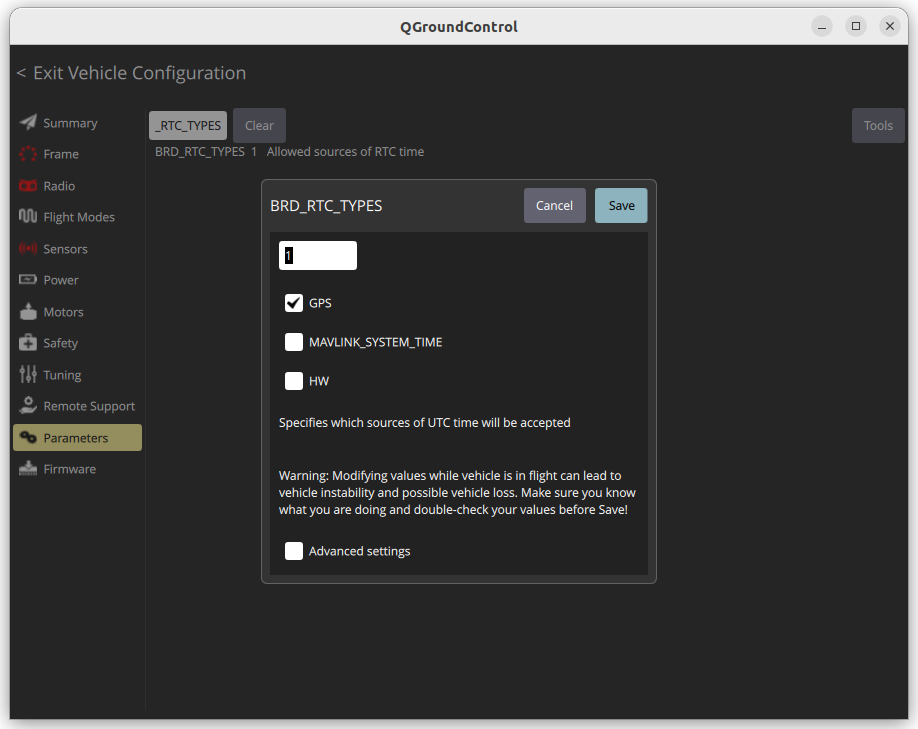

{{ page_folder_links() }}

The flight controller and companion computer clocks can be synchronised using MAVLink’s SYSTEM_TIME and TIMESYNC messages. This is important so that each side can blend data from the other side into its EKF.

- [SYSTEM_TIME](https://mavlink.io/en/messages/common.html#SYSTEM_TIME)
- [TIMESYNC](https://mavlink.io/en/messages/common.html#TIMESYNC)

## SYSTEM_TIME (2)

The system time is the time of the master clock. The message send both way and the master clock set by `BRD_RTC_TYPES` in ardupilot

| Field Name       | Type       | Description                                                                |
| ---------------- | ---------- | -------------------------------------------------------------------------- |
| `time_unix_usec` | `uint64_t` | Unix time in microseconds (UTC). 0 if unknown.                             |
| `time_boot_ms`   | `uint32_t` | Time since system boot in milliseconds. Starts at 0 on every system reset. |

Autopilots (e.g., PX4, ArduPilot) may set time_unix_usec based on GPS time once available .

The message publish by the **fcu** if no gps the time_unix_usec are zero (1/1/1970)

!!! warning "TM: Wrong FCU time."
if pixhawk has no time source like gps, and his unix data < Sat Feb 14 02:31:30 MSK 2009 mavros not publish `SYSTEM_TIME` to topic `/mavros/time_reference` and we got `[WARN] [] [mavros.time]: TM: Wrong FCU time.`

### BRD_RTC_TYPES parameter

In Ardupilot we can control the time source using [BRD_RTC_TYPES](https://ardupilot.org/sub/docs/parameters.html#brd-rtc-types) parameter



- GPS (0): Time init from GPS
- MAVLINK_SYSTEM_TIME(1): for example mavros send system time implement from [sys_time plugin](https://github.com/mavlink/mavros/blob/ros2/mavros/src/plugins/sys_time.cpp) the rate control by `system_time_rate` 0 disabled sending
- HW(2): Using external hardware like `DS3231` or `RV3028` there is no driver implementation, i [read](https://discuss.ardupilot.org/t/unsupported-sensors-try-arduino-lua/86814) about LUA driver implementation

---

## TIMESYNC (111)

The MAVLink TIMESYNC message is used to synchronize time between two systems — typically between a companion computer and an autopilot (FCU) like Pixhawk.

| Field | Description                              |
| ----- | ---------------------------------------- |
| `tc1` | Remote system’s time in **microseconds** |
| `ts1` | Local system’s time in **microseconds**  |

### Sync sequence

```mermaid
sequenceDiagram
    participant Companion
    participant FCU

    Note right of Companion: Companion initiates timesync
    Companion->>FCU: TIMESYNC (tc1 = 0, ts1 = T_local_send)

    Note right of FCU: FCU receives and replies with its own time
    FCU-->>Companion: TIMESYNC (tc1 = T_fcu_now, ts1 = T_local_send)

    Note right of Companion: Companion receives response
    Note right of Companion: Computes RTT = T_local_recv - ts1
    Note right of Companion: Computes offset = tc1 + RTT/2 - T_local_recv

    Note over Companion, FCU: Repeat periodically to refine offset

```

### pymavlink code example

<details>
    <summary>demo code</summary>

```python
from pymavlink import mavutil
import time

# Connect to MAVLink
# master = mavutil.mavlink_connection('udp:localhost:14550')
master = mavutil.mavlink_connection('/dev/ttyACM0', baud=115200)

def current_time_us():
    """Return current time in microseconds"""
    return int(time.time() * 1_000_000)

print("Waiting for heartbeat...")
master.wait_heartbeat()
print("Heartbeat received")

# Send initial TIMESYNC message to start sync loop (optional)
master.mav.timesync_send(0, current_time_us())

while True:
    msg = master.recv_match(type='TIMESYNC', blocking=True, timeout=5)
    if msg is None:
        print("No TIMESYNC message received")
        continue

    print(f"Received TIMESYNC: tc1={msg.tc1}, ts1={msg.ts1}")

    if msg.tc1 == 0:
        # Autopilot is requesting time sync — reply with our time
        master.mav.timesync_send(0, current_time_us())
        print("Responded with timesync")
    else:
        # Autopilot responded to our request, calculate offset
        now = current_time_us()
        rtt = now - msg.ts1
        offset = msg.tc1 + rtt // 2 - now
        print(f"RTT: {rtt} µs, Time offset estimate: {offset} µs")

```

</details>

---

## MAVROS

### Parameters

| name             | default        | description |
| ---------------- | -------------- | ----------- |
| time_ref_source  | fcu            |  just a string for source filed in sensor_msgs::msg::TimeReference message (SYSTEM_TIME)           |
| timesync_mode    | mavlink        |  - none, passthrough, mavlink, onboard           |
| system_time_rate | 0.0 (disabled) |  send SYSTEM_TIME rate from CC to FCU           |
| timesync_rate    | 0.0 (disabled)  |  send timesync rate , sync mode control by  timesync_mode       |


#### timesync_mode
- **mavlink**: Send time sync request tc1=0, tc2=CC time
- **onboard**: Run time sync on board (TODO: explain more)
---

## Reference

- [Ardupilot clock/time sync](https://ardupilot.org/dev/docs/ros-timesync.html)
