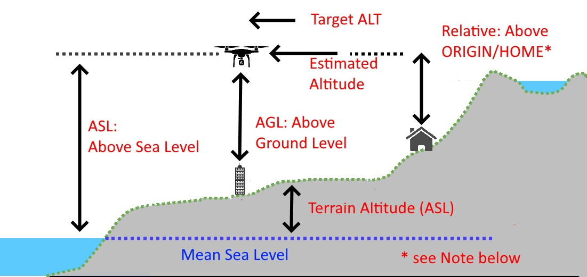

---
tags:
  - ros
  - mavros
  - terrain
---

{{ page_folder_links() }}

## SRTM

terrain altitude data

## Plugin

Publish terrain data as message stream

| Topic  | Msg  |  |
|---|---|---|
| report  | TerrainReport  |   |


!!! warning "Set message rate"
    Don't forget to set message rate

    ```bash
    ros2 service call /mavros/set_message_interval mavros_msgs/srv/MessageInterval "{\"message_id\": 136, \"message_rate\": 2 }"
    ```
     

### Message explain



```
header:
  stamp:
    sec: 1752417366
    nanosec: 28968923
  frame_id: terrain
latitude: -35.363262
longitude: 149.1652373
spacing: 100
terrain_height: 583.843994140625
current_height: 0.23602294921875
pending: 0
loaded: 504
```

| Field  | unit  | desc |
|---|---|--- |
| terrain_height | m |Terrain height MSL  |
| current_height |	m	| Current vehicle height above lat/lon terrain height


---


## Mavlink

| Mavlink  |   |  |
|---|---|---|
| TERRAIN_REPORT (136) |   |   |


## Ardupilot parameters

| parameter  | value  |  |
|---|---|---|
| TERRAIN_SPACING  |   |   |
| # TODO: explain all terrain parameters  |   |   |


## Loading terrain into SD card

### Ardupilot


---

## Reference

- [ardupilot terrain](https://ardupilot.org/copter/docs/terrain-following.html#terrain-following)
- [Terrain Following (plane)](https://ardupilot.org/plane/docs/common-terrain-following.html#common-terrain-following)
- [Mavlink terrain protocol](https://mavlink.io/en/services/terrain.html)
