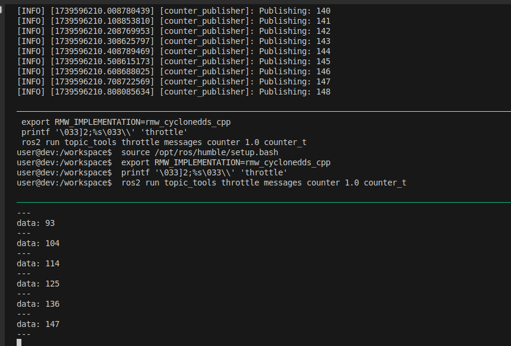

---
tags:
    - ros
    - package
    - topic
    - tools
    - throttle
---

# Topic Tools
Tools for directing, throttling, selecting, and otherwise manipulating ROS 2 topics at a meta-level. These tools do not generally perform serialization on the streams being manipulated, instead acting on generic binary data using rclcpp's GenericPublisher and GenericSubscription

[github](https://github.com/ros-tooling/topic_tools)

- Relay: Subscribes to a topic and republishes to another.
- RelayField: Republishes data in a different message type.
- Transform: Manipulates a topic or a field and outputs data on another topic.
- [Throttle](#throttle): Republishes data with bandwidth or rate limit.
- Drop: Republishes by dropping X out of every Y incoming messages.
- [Mux](#mux): Multiplexes incoming topics to an output.
- Delay: Delays and republishes incoming data.

---

## Throttle
Throttle is ROS 2 node that subscribes to a topic and republishes incoming data to another topic, either at a maximum bandwidth or maximum message rate.

### Rate (throttle message)

```bash
ros2 run topic_tools throttle messages <in topic> <msgs_per_sec> [out topic]
```

#### Demo
Decrease incoming topic rate

- Node that publish counter data at 10hz
- topic tool throttle republish message at 1hz
- Topic echo to view to throttle output

```python title="counter_publisher.py"
--8<-- "docs/ROS/ros_eco/packages/topic_tools/counter_publisher.py"
```

```yaml title="topic_throttle.yaml"
--8<-- "docs/ROS/ros_eco/packages/topic_tools/tmux_ros_topic_throttle.yaml"
```

##### output




---

## Mux

Mux is a ROS2 node that subscribes to a set of incoming topics and republishes incoming data from one of them to another topic

```bash
ros2 run topic_tools mux <outopic> <intopic1> [intopic2...]
```

#### Demo
Subscribe to multiple (two) image source and select between them using MuxSelect service
Using `gscam` package to create image source

!!! note Mux expose services
    - list
    - add
    - delete
    - select

```yaml title="topic_mux.yaml"
--8<-- "docs/ROS/ros_eco/packages/topic_tools/ros_topic_mux.yaml"
```
     
---

# TODO: check transform and implement it in cpp using exprTk library
