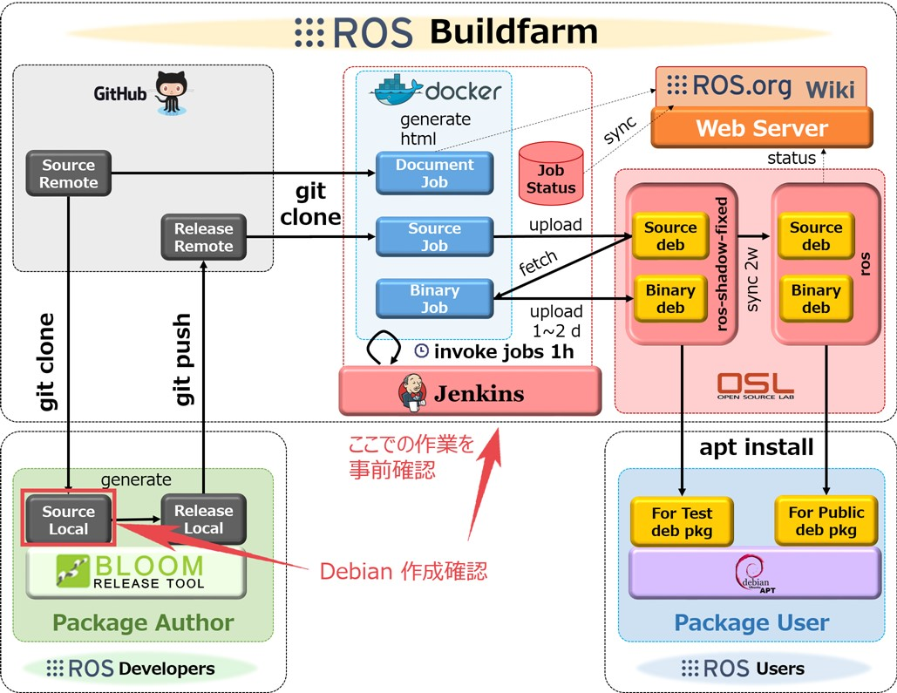

---
tags:
    - ros
    - rosdep
    - bloom
---

# Rosdep Bloom and other tools

## Rosdep

rosdep is a command-line tool for installing system dependencies [more](https://github.com/ros-infrastructure/rosdep)

!!! note git-buildpackage
    git-buildpackage is a tool that helps you build Debian packages from a git repository. [more](https://honk.sigxcpu.org/piki/projects/git-buildpackage/)


```bash title=install
sudo apt-get install python3-rosdep
```

```bash title=init
sudo rosdep init
rosdep update
```

```bash title=install
rosdep install --from-paths src --ignore-src -r -y
```

```bash title=check
rosdep check --from-paths src --ignore-src -r
```

```bash title=keys
rosdep keys
```

```bash title=resolve
rosdep resolve python3-rosdep
```

```bash title=db
rosdep db
```

```bash title=update
rosdep update
```

```bash title=where_defined
rosdep where-defined python3-rosdep
```

```bash title=where_used
rosdep where-used python3-rosdep
```

---

## Bloom
A tool for helping release software into git-buildpackage repositories. [more](https://github.com/ros-infrastructure/bloom)

```bash title=install
sudo apt-get install python3-bloom
```


---

## References
- [How to release a ROS 2 binary package](https://www.theconstruct.ai/how-to-release-a-ros-2-binary-package-part-3/)
## Todo: learn more

