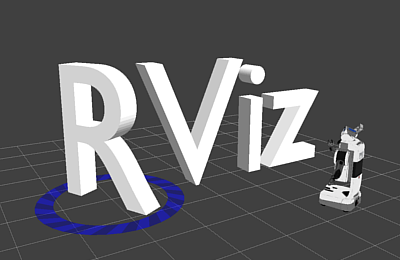
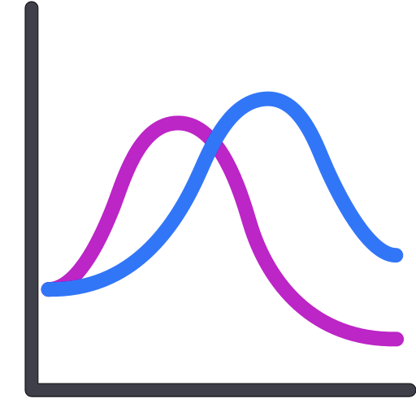

---
tags:
    - ros
    - rviz
    - rqt
---

# Rviz RQT and other ROS tools

    

        <a href="rqt">
        
        
rqt

        </a>
    

    

    <a href="rviz">
        
        
rviz

        </a>
    

    

    <a href="plotjuggler">
        
        
plotjuggler

        </a>
    

    

